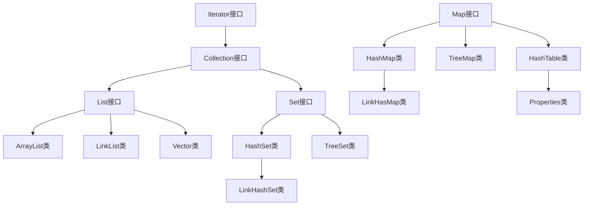
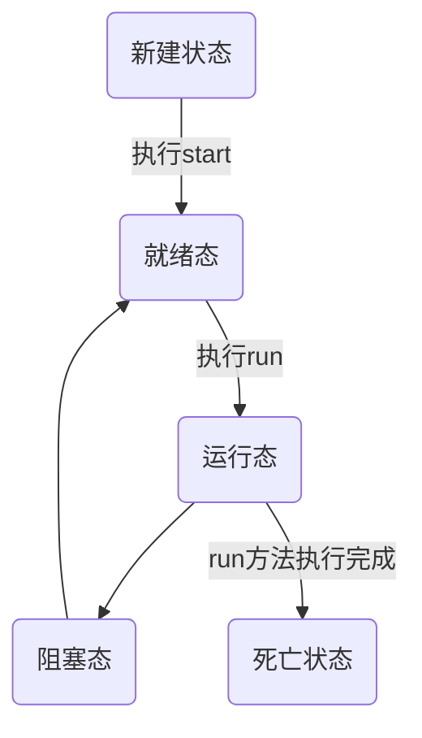

# Java 编程基础

## 日期函数

### SimpleDateFormat 

1. 可以将一个日期对象装换为特定的字符串形式

   - ```java
     Date date = new Date(2156-11-19);
     
     SimpleDateFormat simpleDateFormat = new SimpleDateFormat("yyyy-MM-dd");
     String formatDate = simpleDateFormat.format(date);
     //parse()方法为反向转换
     
     System.out.println(formatDate);
     
     将输出 --> 2156-11-19
     ```

     

   

## 集合框架

### 类图



### Iterator 迭代器

1. 在创建迭代器之后, 除非通过迭代器自身的remove方法或add方法从结构上对列表进行修改,否则以任何方式对列表进行修改都会抛出 ConcurrentModificationException,迭代器内部记录了对集合修改的次数和通过迭代器对集合修改的次数,如果两个值不相等,就会抛异常
2. Iterator 是工作在一个独立的线程中，并且拥有一个 mutex 锁。 Iterator 被创建之后会建立一个指向原来对象的单链索引表，当原来的对象数量发生变化时，这个索引表的内容不会同步改变，所以当索引指针往后移动的时候就找不到要迭代的对象，所以按照 fail-fast 原则 Iterator 会马上抛出 java.util.ConcurrentModificationException 异常。
   所以 Iterator 在工作的时候是不允许被迭代的对象被改变的。但你可以使用 Iterator 本身的方法 remove() 来删除对象， Iterator.remove() 方法会在删除当前迭代对象的同时维护索引的一致性

### Collection 接口

### 1. Arrays.asList获得的List使用时需要注意什么

1. asList 得到的只是一个 Arrays 的内部类，一个原来数组的视图 List，因此如果对它进行增删操作会报错
2. 用 ArrayList 的构造器可以将其转变成真正的 ArrayList

### 2. Collection如何迭代

Collection的迭代有很多种方式：

1、通过普通for循环迭代

2、通过增强for循环迭代

3、使用Iterator迭代

4、使用Stream迭代

```java
List<String> list = ImmutableList.of("Hollis", "hollischuang");

// 普通for循环遍历
for (int i = 0; i < list.size(); i++) {
    System.out.println(list.get(i));
}

//增强for循环遍历
for (String s : list) {
    System.out.println(s);
}

//Iterator遍历
Iterator it = list.iterator();
while (it.hasNext()) {
    System.out.println(it.next());
}

//Stream 遍历
list.forEach(System.out::println);

list.stream().forEach(System.out::println);
```

#### Set接口

##### HashSet 类

1. **HashSet 底层是 HashMap**
   
   1. ```
      1. HashSet 底层维护了一个数组+链表
      2. HashSet 创建了一个 PRESENT 的 object 类,用来占位Map中的Value
      ```
2. **HashSet 添加元素过程:**
   
   1. ```
      1. 添加一个元素时,会根据元素的哈希值确定元素在数组中的索引值
      2. 找到存储数据表看索引位置是否有元素
      3. 若位置为空则直接添加新元素(会同时保存元素哈希值,未树华前一个数据结点有四个数据,hash,key,value,next)
      4. 若该位置已经有元素,比较 Hash 值, 哈希值不相同链接后面, 若哈希值相同, 调用 equals() 方法比较两个元素,若返回值为 false ,将新元素链接到原来位置的元素后面***,若原来位置后面有元素,则依次与后面元素执行上述过程,直到末尾或中途判断相等返回 true 停止添加
      5. 在 Java8 中,如果一条链的**元素达到8个,并且 table 的大小超过64,就会进行树化,若table大小<64,则先对表进行扩容(2倍)
      ```
   
3. **HashSet** **扩容机制**:
   
   1. ```
      1. HashSet 底层是 HashMap,第一次添加时，Table 数组( HashMap$Node )扩容到16，临界值 (threshold) 16 * 加载因子 (loadFactor) 0.75 = 12
      2. 如果table数组使用达到了临界值12,就会扩容到16 * 2= 32,新的临界值就是32 * 0.75 = 24,依次类推
      3. 在Java8中,如果一条链表的元素个数到达TREEIFY THRESHOLD(默认是8),并且table的大小>=
         MIN TREEIFY CAPACITY(默认64),这条链就会进行树化(红黑树)，否则仍然采用数组扩容机制
      ```
   
      

##### **LinkHashSet**类

1. ```
   1. 继承于HashSet
   2. 底层依然是 HashMap
   3. LinkHashSet 底层维护了数组+双向链表,使得遍历过程看起来有序
   4. 添加元素机制等同于 HashSet
   5. HashMap$Node[]存放的是 LinkHashMap$Entry 元素(继承关系,子类元素可以存放在父类数组里)
   ```

   

##### ***TreeSet 类***

1. ```
   1. 底层是 TreeMap
   2. TreeSet 实现了 Compartartor 接口 ,构造器 TreeSet(Comparator comparator) 提供 comparator 可以排序
   3. 或在类内部实现 Comparable 接口,重写 CompareTo() 方法
   4. 放进 TreeSet 的类必须实现了 Comparable 接口 ，或在 TreeSet 构造器里提供 Comporator  匿名子类，底层源码需要比较入集
   ```

   

### **Map 接口**

#### Map 实现类的特点(JDK 8.0)

  1. ```
         1. Map 和 Collection 并列存在, 保存具有映射关系的数据 key -- value(双列元素)
         2. key 和 value 可以保持任意类型的数据, 会封装到 HashMap$Node 对象中
         3. Map 中的 Key  不允许重复, 添加相同的 key 会替换原来的 value
         4. Map 中的 value 可以有多个值
         5. Map 中的 Key 和 value 可以为 null ,同理 Key只能有一个, value可以有多个
         6. k-v 最后是 HashMap$Node node = newNode(hash,key,value,null) 值存在 HashMap$Node 里面
     ```

     

#### Map 常用方法

  1. ```
         1. Object put(Object key,Object value)：将指定 key-value 添加到(或修改)当前 map 对象中
         2. void putAll(Map m)：将m中的所有 key-value 对存放到当前 map 中
         3. Object remove(Object key)：移除指定 key 的 key-value 对，并返回 value
         4. void clear()：清空当前 map 中的所有数据
         5. Object get(Object key):获取指定 key 对应的 value
         6. boolean containsKey(Object key)：是否包含指定的 key
         7. boolean containsValue(Object value)：是否包含指定的 value
         8. int size()：返回 map 中 key-value 对的个数
         9. boolean isEmpty()：判断当前 map 是否为空
         10. boolean equals(Object obj)：判断当前 map 和参数对象 obj 是否相等
         11. Set keySet()：返回所有key构成的Set集合
         12. Collection values()：返回所有value构成的Collection集合
         13. Set entrySet()：返回所有key-value对构成的Set集
              1. 为了方便遍历, 我们还会调用 enptySet() 方法创建 enptySet 集合, 存放 Enpty 元素, Enpty对象有 key -- value
              2.其实EnptySet 里面存放的仍然是 HashMap$Node node 指针指向( HashMap$Node  实现了  Enpty )
              3. 为什么要放到 Enpty 里呢 ?(实际是指向地址) 因为当把 HashHap$Node 对象存放到 EntrySet 就方便我们的遍历, 因为 Map. Entry 提供了重要方法 K getKey();  V getValue();
     ```

     

#### HashMap类

  1. **HashMap 底层机制**
        1. ```
            1. 扩容机制  等同于 HashSet
            2. 底层: 数组 + 链表 + 红黑树
            3. 数据存在Table数组里,Table数组由 HashMap 的内部类 Node 组成,( HashMap的内部类 Node 实现了 Map.Enpty 接口) 
            4. 若某条链的元素达到8个, 并且Table数组的容量大于64, 该条链进化为红黑树
            ```
        
            

#### HashTable类

  1. **HashTable特性**
     
        1. ```
            1. 不能存放 null 数据
            2. 线程安全 ( HashMap 线程不安全 )
            3. 使用方法基本等同于 HashMap
            ```
        
  2. **HashTable底层**
     
        1. ```
            1. 底层数组 HashTable$Entry[] 初始容量为 11 ,临界值 11 * 0.75 = 8
            2. 按自己扩容机制扩容
            3. 执行 addEntry() 方法
            ```
        
            

#### Propertise类

  1. ```
         1. 继承于 HashTable 类
         2. 不能存放 null 类型
         3. TreeMap 类
         4. 类似于 TreeSet
     ```

     

### 总结

1. #### 对集合的选择

        1. 一组对象 [单列] :Collection 接口
        
              1. 
                 1. 允许重复 : List
                    2. 增删多:LinkedList [底层维护了一个双向链表]
                    3. 改查多: ArrayList [底层维护Object类型的可变数组]
                 2. 不允许重复 : Set
                    1. 无序 : HashSet [底层是HashMap，维护了一个哈希表即(数组 + 链表 + 红黑树)]
                    2. 排序 : TreeSet
                    3. 插入和取出顺序一致 :  LinkedHashSet，维护数组 + 双向链表
    


​      

```
  2. 一组键值对[双列] : Map
	1. 键无序 : HashMap [底层是:哈希表 jdk7: 数组+链表，jdk8:数组+链表+红黑树]
	2. 键排序 : TreeMap
	3. 键健插入和取出顺序一致 : LinkedHashMap
	4. 读取文件 : Propertie
```


​                 

2. #### ***java*** 提供了 ***Collections*** 工具类供我们对 ***Collection*** 集合进行操作

## 泛型

### 为什么要使用泛型程序设计

1. ```
   1. Java 泛型（generics）是 JDK 5 中引入的一个新特性, 泛型提供了编译时类型安全检测机制，该机制允许程序员在编译时检测到非法的类型。
   
   2. 泛型的本质是参数化类型，也就是说所操作的数据类型被指定为一个参数。
   
      > 假定我们有这样一个需求：写一个排序方法，能够对整型数组、字符串数组甚至其他任何类型的数组进行排序，该如何实现？
      >
      > 答案是可以使用 Java 泛型。
      >
      > 使用 Java 泛型的概念，我们可以写一个泛型方法来对一个对象数组排序。然后，调用该泛型方法来对整型数组、浮点数数组、字符串数组等进行排序。
   ```

   

### 泛型类

1. 泛型类的声明和非泛型类的声明类似，除了在类名后面添加了类型参数声明部分，如：***Pair<T>***

2. 泛型类的类型参数声明部分包含一个或多个类型参数，参数间用逗号隔开。一个泛型参数，也被称为一个类型变量，是用于指定一个泛型类型名称的标识符。因为他们接受一个或多个参数，这些类被称为***参数化的类或参数化的类型(类型变量)***。

3. ***E***：集合的元素类型     ***K/V*** : 键/值类型     ***T*** : 任意类型  ***U/S*** : 任意类型

4. 实例:

   - ```java
     public class Box<T> {
        
       private T t;
         
       public Box(T t) {
             this.t = t;
         }
         
       public T get() {
         return t;
       }
      public static void main(String[] args) {
      
          Box<Integer> integerBox = new Box(10);
          Box<String> stringBox = new Box("这是个字符串");
       
         System.out.printf("整型值为 :%d\n\n", integerBox.get());
         System.out.printf("字符串为 :%s\n", stringBox.get());
       }
     }
     
     ```

5. 注:

   1. ```
      不能用 static 修饰类型变量: 静态和非静态之分就在于静态是编译时类型，动态是运行时类型。T 代表未知类型，如果可以用于静态申明，因为是未知类型，系统没法指定初始值，手动赋值也不行，因为不知道啥类型，只有运行时才可以指定。而泛型存在的意义就是为了动态指定具体类型，增强灵活性和通用性，所以用于静态声明违背了使用原则。为什么实例变量和实例方法可以使用呢？因为当你使用实例变量或者方法时，就说明对象存在了，即代表泛型参数也指定了。未指定具体类型默认是 Object 类型。
      ```
   
      

### 泛型方法

1. 泛型方法可以定义在普通类或泛型类中,定义方法如下: 类型变量放在修饰符后,返回值类型之前如: ***public static <T>T get(T t)***

2. ```
   //返回值之前定义泛型 <T> 就表示当前方法可以使用泛型了
   public static <T> T sdss(T t){
           return t;
       }
   public <T> String sdss(T t){
           return "ss";
       }
   public <T> String s(String ss){
   		return ss;
   	}
   ```

   

2. 泛型方法的泛型和类的泛型没有关系

   - ```java
     class ArrayAlg{
         public static <T>T getMiddleElem(T... a){
     		return a[a.length/2];
         }
     }
     ```

3. ###### 实例:

### 类型变量的限定

1. 有时候类或方法需要对类型变量加以约束, 例如泛型方法要进行排序操作,但对于没有实现***Comparator*** 接口的类来说是无法完成排序的,这时候我们可以对泛型方法进行限定

   ```
   public static <T extends Comparator> T sort(T[] t)
   ```

### 泛型类型的继承规则

1. 若 **A** 是 **B** 的父类, **G<A>** 和 **G<B>** 没有子父类关系

   - ```java
     G<Employee> g = new G<Manager> //ERROR//ERROR//ERROR//ERROR
     ```

### 通配符类型

1. 如前面讲到的不能将G<B>赋给G<A>,但通配符可以解决这个问题

   - 如下两种方式

   - 

     > ```mermaid
     > classDiagram
     > 	G <|.. GA
     > 	G <|.. GB
     > 	A <|-- B
     > 	class G{
     > 			<<interface>>
     > 			<? extendsA>
     > 	}
     > 	class GA{
     > 	<A>
     > 	}
     > 	class GB{
     > 	<B>
     > 	}
     > 	
     > 	class S{
     > 	<<interface>>
     > 	<? superA>
     > 	}
     > 	class SA1{
     > 	<A1>
     > 	}
     > 	class SB1{
     > 	<B1>
     > 	}
     > 	S <..SA1
     > 	S <..SB1
     > 	B1<|--A1
     > 	
     > 	
     > ```

2. ###### 有限制条件的通配符的使用

   - ```
     - ？extends Object     小于等于（子类或实现类）
     - ？super Object    大于等于当前类型（父类或实现的接口）
     - 带有父类限定的通配符允许写入一个泛型对象
     - 带有子类限定的通配符允许读取一个泛型数对象
     ```

     

3. ###### 无限定通配符

   1. <?>

4. ###### 使用情景：

   1. ```
      通配符只有在修饰一个变量或参数的时候会用到，在定义 泛型类 或 泛型方法 的时候是不能使用通配符的。
      ```
   
      

## I/O

### I/O流概述

- ```
  在 Java API 中，可以从中读入一个字节序列的对象叫做输入流而可以向其中写入一个字节序列的对象叫做输出流，这些字节序列的来源可以是文件、网络连接、内存块（通常是文件）。抽象类 InputStream 和 OutputStream 构成了 I/O 流的层次结构基础
  ```

  

### File 类的使用

1. #### ***File*** 概述

   - ```
     - 的一个对象代表一个文件 或 文件目录（俗称：文件夹）
     - File 类声明在 java.io 包下
     ```

1. **MultiPartFile**

   方法说明： 这个类一般是用来接收前台传过来的文件；

   | 返回值类型 | 方法说明 |
   | ---------- | -------- |
   |    byte[]         | getBytes() 将文件内容转化成一个byte[] 返回 |
   | String | getContentType() 返回文件的内容类型 |
   | inputstream | getInputStream() 返回InputStream读取文件的内容 |
   | String | getName() 返回参数的名称 |
   | Long | getSize() 返回文件大小 以字节为单位 |
   | Boolean | isEmpty() 判断是否为空，或者上传的文件是否有内容 |
   | Void | transferTo(File dest) 用来把 MultipartFile 转换换成 File |


1. ##### ***File*** 实例的创建

   1. ###### 路径

      - 相对路径

        ```java
         File file = new File("Hello.txt");//相对于当前Module
        ```

        

      - 绝对路径

        ```java
         File file1 = new File("D:\\A.code\\Java.code\\JavaSenior.code\\I_O\\Helllo.txt");
        ```

      - 路径分隔符

        - ```
          路径分隔符和系统有关:
          Windows 和 DOS 系统默认使用 “ \\ ” 来表示 UNIX 和 URL 使用 “ / ” 来表示
          Java程序支持跨平台运行，因此路径分隔符要慎用。为了解决这个隐患，File 类提供了一个常量:
          public static final String separator根据操作系统，动态的提供分隔符。
          ```
          
          ```java
          //实例
          File file1 = new File("D:" + File.separator + "A.code" + File.separator + "Java.code" + File.separator + "JavaSenior.code" + File.separator + "I_O" + File.separator + "Helllo.txt")
          ```

   1. ###### 构造器

      1. ```
         1. 第一种构造器如上述路径中两例  --  File ( String pathname )
         1. 第二种构造器 -- File ( String parentPath , String childPath ) 
         1. 第三种构造器 -- File ( File parentFile , String childPath )
         1. 注：此时只是在内存层面构造了对象，还未涉及真正的文件，文件是否存在不影响此时的构造
         ```
      
         

1. ##### File 类的常用方法

   1. File 类的**获取**功能

      - ```
        - public String getAbsolutePath () :    获取绝对路径
        - public String getPath () :    获取路径
        - public String getName () :    获取名称
        - public String getParent () :    获取上层文件目录路径。若无，返回 null
        - public long length () :    获取文件长度(即:字节数)，不能获取目录的长度。
        - public long lastModified () :   获取最后一次的修改时间，毫秒值
        - public String[] list () :    获取 指定目录下的所有文件或者文件目录的 名称数组
        - public File[] listFiles() :    获取 指定目录下的所有文件或者文件目录的 File数组
        ```

        

   1. File 类文件**重命名**
      - ```
        - public boolean renameTo(File dest) : 把文件重命名为指定的文件路径
        
        - dest 文件不能在硬盘中真实存在，否则会重命名失败
        ```
      
        
      
   1. File 类的**判断**功能

      - ```
        - public boolean isDirectory() :    判断是否是文件目录(得真实存在才可能true，以下方法都是)
        - public boolean isFile() :    判断是否是文件
        - public boolean exists() :    判断是否存在
        - public boolean canRead() :    判断是否可读
        - public boolean canWrite() :    判断是否可写
        - public boolean isHidden() :    判断是否隐藏
        ```

   1. File 类的**创建**功能

      - ```
        -  public boolean createNewFile() : 创建文件。若文件存在，则不创建，返回 false
        -  public boolean mkdir() : 创建文件目录。如果此文件目录存在，就不创建了。如果此文件目录的上层目录不在在，也不创建。
        -  public boolean mkdirs() :创建文件目录。如果上层文件目录不存在，一并创建
        ```

        

   1. File 类的**删除**功能

      - ```
        public boolean delete() : 如果是文件目录，文件目录里没有文件才能删除成功，即表示，只能删除最底一层的文件
        ```

        

   1. 注：**File** 类涉及了文件或文件目录的相关操作，但并未涉及到文件内容，对文件内容的操作必须使用I/O流，后续 File 类的对象常作为参数传递到流的构造器中

### 输入与输出

#### I/O流的原理及其分类

##### 原理

```
 我们站在程序（内存）立场，从磁盘，光盘等外部存储设备读取数据叫做输入，将程序（内存）数据输出到磁盘，光盘等外部存储设备叫输出
```

##### 分类

- ```
  - 按数据单位不同分为：字节流（byte 8bit），字符流（char 16bit）
  
  - 按流向不同分为：输入流 ， 输出流
  
  - 按角色不同分为：节点流 ，处理流
  ```

  

1. | 抽象基类（abstract） | 字节流（byte） | 字符流（char） |
   | -------------------- | -------------- | -------------- |
   | 输入流               | InputStream    | Reader         |
   | 输出流               | OutputStream   | Witer          |

   - I/O 流的类都是从如上四个基类中派生的，都以其父类名作为后缀

#### I/O 流体系图

- | 分类       | 字节输入流           | 字节输出流            | 字符输入流        | 字符输出流         |
  | :--------- | -------------------- | --------------------- | ----------------- | ------------------ |
  | 抽象基类   | InputStream          | OutputStream          | Reader            | Writer             |
  | 访问文件   | FileInputStream      | FileOutputStream      | FileReader        | FileWriter         |
  | 访问数组   | ByteArrayInputStream | ByteArrayOutputStream | CharArrayReader   | CharArrayWriter    |
  | 访问管道   | PipedInputStream     | PipedOutputStream     | PipedReader       | PipedWriter        |
  | 访问字符串 |                      |                       | StringReader      | StringWriter       |
  | 缓冲流     | BufferedInputStream  | BufferedOutputStream  | BufferedReader    | BufferedWriter     |
  | 转换流     |                      |                       | InputStreamReader | OutputStreamWriter |
  | 对象流     | ObjectInputStream    | ObjectOutputStream    |                   |                    |
  |            | FilterInputStream    | FilterOutputStream    | FilterReader      | FilterWriter       |
  | 打印流     |                      | PrintOutputStream     |                   | PrintWriter        |
  | 推回输入流 | PushbackInputStream  |                       | PushbackReader    |                    |
  | 特殊流     | DataInputStream      | DataOutputStream      |                   |                    |

  其中，访问文件的类为节点流（直接处理文件），其余均为处理流

#### 具体实现

##### 字符文件输入流

1. 实例化 File 对象

   ```java
   File file1 = new File("Hello.txt");
   ```

1. 提供具体的流

   ```java
   FileReader fr = new FileReader(file1);
   ```

1. 数据的读入

   ```java
   int data = fr.read(char[] buffer);//读入一个字符，返回字符的int值，指针后移一位，若到末尾返回-1
   ```

1. 流的关闭操作( **java** 垃圾回收机制对物理连接无能为力 )

   ```java
   fr.close();
   ```

1. 注：

   - - ```
       - 上面四步中1，4步是每个IO流的基本操作，不能流的2，3步会有所不同
       
       - 异常处理使用 try catch finally 因为 fr.close 必须执行
       - 读入操作文件必须真实存在
       ```

       

     

1. ***read()*** 方法 

   1. 无参的上面已经演示过

   2. ***read( char[] cbuf )*** : 返回每次读入到 cbuf 数组中的字符个数（除了最后一次可能小于数组长度或指针到末尾返回-1，其余都是数组长度），如果达到文件末尾返回-1

      - 常用输出字符到控制台的方式

        ```java
          			char[] cbuf = new char[5];
        			int len;
           方式一：
                   while ((len = fr.read(cbuf)) != -1) {
                       for (int i =0 ; i < len;i++){
                           System.out.print(cbuf[i]);//逐个输出字符数组字符
                       }
                    }
           方式二：
                    while ((len = fr.read(cbuf))!=-1){
                        String str = new String(cbuf,0,len);//将字符数组转换为字符串
                        System.out.print(str);
                    }
        ```

        

   3. ***read( char[] cbuf  , int off , int len )*** ：返回每次 读入数组的字符个数，最多 ***len*** 个，从 ***off***  开始给数组读入

##### 字符文件输出流

1. 实例化 File 对象

   ```java
   File file1 = new File("Hello.txt");
   ```

1. 提供写出的对象（FileWriter）

   ```java
   FileWriter fw = new FileWriter(file1);
   ```

1. 写出的操作 ,若原文件不存在则创建文件再写入

   - 若原文件存在
     1. ***FileWriter( File file ，true)***  原文件后追加
     1. ***FileWrite( File file , false )***  覆盖原文件
     1. 默认 ***boolean append*** 为 ***false***

   ```java
    fw.write("我是写入的数据-----\n");
    fw.write("我还是写入的数据-----");
   ```

1. 流的关闭操作( **java** 垃圾回收机制对物理连接无能为力 )

   ```java
   fw.close();
   ```

1. 注：

   - 文件可以不存在

1. write() 方法

   - ***write( char[] cbuf  , int off , int len )*** 写入数组，下标***off*** 开始，读入 ***len*** 个

##### 字节文件输入流

1. 实例化 File 对象

   ```java
   File file1 = new File("Hello.txt");
   ```

1. 提供输入的流（ FileInputStream ）

   ```java
    FileInputStream finput = new FileInputStream(file1);
   ```

1. 数据的读入

   ```java
   int data = finput.read();//读入一个字节，返回字符的int值，指针后移一位，若到末尾返回-1
   ```

1. 流的关闭操作( **java** 垃圾回收机制对物理连接无能为力 )

   ```java
   finput.close();
   ```

1. 注：

1. ***read()*** 方法 

   1. 无参的上面已经演示过

   2. ***read( byte[] buffer )*** : 返回每次读入到 buffer 数组中的字节个数（除了最后一次可能小于数组长度或指针到末尾返回-1，其余都是数组长度），如果达到文件末尾返回-1

      - 常用输出字符到控制台的方式

        ```java
          			byte[] buffer = new byte[5];
        			int len;
           方式一：
                   while ((len = finput.read(buffer)) != -1) {
                       for (int i =0 ; i < len;i++){
                           System.out.print(buffer[i]);//逐个输出字节数组字节
                       }
                    }
           方式二：
                    while ((len = finput.read(buffer))!=-1){
                        String str = new String(buffer,0,len);//将字节数组转换为字符串
                        System.out.print(str);
                    }
        ```

##### 字节文件输出流

##### 文件流小结:

###### 文件流的选择

```
1.对于文本文件(  .txt, .java, .c, .cpp )，使用字符流处理
2．对于非文本文件(  .jpg,.mp3 , .mp4, .avi, .doc, .ppt, . . .)，使用字节流处璃
```


###### 实例：文件复制函数

```java
    public void copyFile(String srcPath , String desPath){
        File file1 = new File(srcPath);
        File file2 = new File(desPath);

        FileInputStream finput = null;
        FileOutputStream foutput = null;
        try {
            finput = new FileInputStream(file1);
            foutput = new FileOutputStream(file2);

            byte[] buffer = new byte[1024];
            int len;
            while ((len = finput.read(buffer)) != -1) {
                foutput.write(buffer, 0, len);
            }
        } catch (IOException e) {
            e.printStackTrace();
        } finally {
            try {
                if (finput != null) {
                    finput.close();
                }

            } catch (IOException e) {
                e.printStackTrace();
            }

            try {
                if (foutput != null) {
                    foutput.close();
                }

            } catch (IOException e) {
                e.printStackTrace();
            }
        }
    }
```


##### 缓冲流（处理流的一种）

###### ***缓冲流的四个类***

1. 字节（ ***byte*** ） 
   - ```
     - BufferedInputStream  
     - BufferedOutputStream 
     ```
   
     
   
2. 字符 （***char*** ）
   - ```
     - BufferedReader  
     - BufferedWriter
     ```
   
     

###### 缓冲流的作用

- ##### 提升读写速度,处理的对象是<u>流</u>

###### 缓冲流的使用

1. 实现字节文件的复制

   1. 造文件

      ```java
      File file1 = new File("我是电影.mp4");
      File file2 = new File("我是复制来的电影。mp4")
      ```

   1. 造字节流

      ```java
      FileInputStream finput = new FileInputStream(file1);
      FileOutputStream foutput = new FileOutputStream(file2);
      ```

   1. 造缓冲流

      ```java
      BufferedInputStream binput = new BufferedInputStream(finput);
      BufferedOutputStream boutput = new BufferedOutputStream(foutput);
      ```

   1. 数据的读入与写出类似与上面文件输入输出流的读入与写出，只是流的对象换为缓冲流，这里不在描述

   1. 资源关闭

      1. 先关外层在关内层

      1. 在关外层时，内层的流会自动关闭，可以省略关内层的操作

         ```java
          binput.close();
          boutput.close();  
         ```

1. 字符文件的缓冲流处理：类似于字节文件用缓冲流处理

###### ***提高速度的原因*** 

- 内部提供了一个缓冲区，字节文件先存在缓冲区内，达到指定容量后在写入磁盘里

###### 复制函数实例

```java
public class BufferStream {
    @Test
    public void copyBufferStreamTest(){
        long start = System.currentTimeMillis();
        copyFileBufferedStream("我是电影.mp4","我是复制来的电影.mp4");
        long end = System.currentTimeMillis();
        System.out.println("复制成功，用时为"+(double)(end-start)/1000.0+"秒");
    }

    public void copyFileBufferedStream(String srcFilePath,String desFilePath){

        File file1 = new File(srcFilePath);
        File file2 = new File(desFilePath);

        BufferedInputStream binput = null;
        BufferedOutputStream boutput = null;
        try {
            FileInputStream finput = new FileInputStream(file1);
            FileOutputStream foutput = new FileOutputStream(file2);

            binput = new BufferedInputStream(finput);
            boutput = new BufferedOutputStream(foutput);

            byte[] buffer = new byte[1024];
            int len;
            while (( len = binput.read(buffer))!=-1){
                boutput.write(buffer,0,len);
            }
        } catch (IOException e) {
            e.printStackTrace();
        } finally {
            try {
                if (binput!=null)
                    binput.close();
            } catch (IOException e) {
                e.printStackTrace();
            }
            try {
                if (boutput!=null)
                    boutput.close();
            } catch (IOException e) {
                e.printStackTrace();
            }

        }
    }
}
```

###### 缓冲流的一些方法：

1. ```
   1. **flush  刷新缓冲区，将缓冲区内数据写入磁盘内**
   1. **BufferReader  有个 readLine() 方法，一次读取并返回一行字符，不读取换行符，没字符返回 null**
   ```

   

##### 转换流（处理流的一种）

###### 转换流的两个类 

- ```
  - InputStreamReader ： 将字节输入流转换为字符输入流
  - OutputStreamWriter  ： 将字节输出流转换为媳妇输出流 
  ```

  

###### 编码和解码

- ```
  - 编码：字节，字节数组 --> 字符，字符数组 *：* 转换流（字节流—>字符流）<u>让计算机能看懂的过程</u>
  - 解码：字符，字符数组 --> 字节，字节数组 *：*字节流就能实现 <u>让人能看懂的过程</u>
  ```

  

- 字符集：
  - - ```
      - ASCII : 美国标准信息交换码。用一个字节的7位可以表示。
      - IS08859-1:拉丁码表。欧洲码表，用一个字节的8位表示。
      - GB2312 : 中国的中文编码表。最多两个字节编码所有字符
      - GBK : 中国的中文编码表升级，融合了更多的中文文字符号。最多两个字节编码
      - Unicode   : 国际标准码，融合了目前人类使用的所有字符。为每个字符分配唯一的字符码，所有的文字都用两个字节来表示。
        - <u>Unicode</u> 字符集只是定义了字符的集合和唯一编号，Unicode编码，则是对UTF-8、ucS-2/UTF-16等具体编码方案的统称而已，并不是具体的编码方案。
      - UTF-8 : 变长的编码方式，可用1-4个字节来表示一个字符。
      - <u>ANSI编码</u>，通常指的是平台的默认编码，例如英文操作系统中是ISO-8859-1，中文系统是GBK
      ```
  
      
  
    

###### InputStreamReader 

- 构造器：***InputStreamReader( InputStream inputStream，String <u>charsename</u> )***;   
- 参数 ***charsename***：字符集，字节转换为字符的对应方式，根据存文件的字符集格式确定 如：**UTF-8**

```java
InputStreamReader reader = new InputStreamReader(finput);//使用系统默认的字符集
```

1. 其使用类似前面的类，直接附上代码

   ```java
   /**
    * 以下的函数，用UTF-8编码格式读入Hello.txt转换字节文件为字符文件，再以GBK编码格式将文件写入Hello(2).txt中。
    *
    */
   public void Test() throws IOException {
           File file = new File("Hello(1).txt");
           File file1 = new File("Hello(2).txt");
   
           FileInputStream finput = new FileInputStream(file);
           FileOutputStream foutput = new FileOutputStream(file1);
   
           InputStreamReader toReader = new InputStreamReader(finput,"UTF-8");
           OutputStreamWriter toWriter = new OutputStreamWriter(foutput,"GBK");
   
           char[] cbuf = new char[10];
           int len;
           while ((len = toReader.read(cbuf))!=-1){
               toWriter.write(cbuf,0,len);
           }
   
           toReader.close();
           toWriter.close();
       }
   ```

   

##### 其他流

###### 标准输入输出流

1. **System.in** : 标准输入流，默认**键盘输入** （ ***InputStream in = System.in;*** ）

1. ***System.out*** : 标准输出流，默认控制台输出

1. **System类的 setIn (InputStream istream)  /  setOut(PrintStream ostream**) 方式**重新指定输入和输出的流**。

1. 例题：从键盘输入字符串，要求将读取到的整行字符串转成大写输出。然后继续进行输入操作，直至当输入 <u>"e”</u> 或者 <u>“exit”</u> 时，退出程序（用 ***System.in*** 实现 ）

   ```java
    public static void main(String[] args) throws IOException {
   
           InputStreamReader isreader = new InputStreamReader(System.in, "UTF-8");
           BufferedReader bufferedReader = new BufferedReader(isreader);
           while (true) {
               System.out.println("请输入字符串：");
               String data = bufferedReader.readLine();
               if (!"exit".equals(data) && !"e".equals(data)) {
                   String toUpper = data.toUpperCase();
                   System.out.println(toUpper);
               } else {
                   System.out.println("程序结束...");
                   break;
               }
           }
           bufferedReader.close();
       }
   ```

   

1. 实现自己的Scanner类

   ```java
   import java.io.BufferedReader;
   import java.io.IOException;
   import java.io.InputStreamReader;
   
   /**
    * @author sunbo
    * @create 2021-10-11-19:48
    */
   public class MyScanner {
   
       /**
        * @return
        * @throws IOException
        */
       public String readString() throws IOException {
           String str = read();
           if (str == null || str.length() == 0) {
               return null;
           }
           return str;
       }
   
       /**
        * 从键盘读取字符并返回
        *
        * @return
        * @throws Exception
        */
       public char readChar() throws Exception {
           String str = read();
           char data = ' ';
           if (str == null || str.length() == 0) {
               return data;
           }
           if (str.length() > 1) {
               throw new Exception("类型错误");
           }
   
           data = str.charAt(0);
           return data;
       }
   
       /**
        * 从键盘读入boolean并返回
        *
        * @return
        * @throws IOException
        */
       public boolean readBoolean() throws IOException {
           String str = read();
           boolean data = false;
           if (str == null || str.length() == 0) {
               return data;
           }
           data = Boolean.parseBoolean(str);
           return data;
       }
   
       /**
        * 从键盘读入一个double并返回
        *
        * @return
        * @throws IOException
        */
       public double readDouble() throws IOException {
           String str = read();
           double data = 0.0f;
           if (str == null || str.length() == 0) {
               return data;
           }
           data = Double.parseDouble(str);
           return data;
       }
   
       /**
        * 从键盘读入一个float并返回
        *
        * @return
        * @throws IOException
        */
       public float readFloat() throws IOException {
           String str = read();
           float data = 0.0f;
           if (str == null || str.length() == 0) {
               return data;
           }
           data = Float.parseFloat(str);
           return data;
       }
   
       /**
        * 从键盘读入一个int型数字并返回
        *
        * @return
        * @throws IOException
        * @throws Exception
        */
       public int readInt() throws IOException, Exception {
           String str = read();
           int data = 0;
           if (str == null || str.length() == 0) {
               return data;
           }
           char[] judge = str.toCharArray();
           for (int i = 0; i < judge.length; i++) {
               if (judge[i] < '0' || judge[i] > '9') {
                   throw new Exception("输入类型错误");
               }
           }
           data = Integer.parseInt(str);
           return data;
       }
   
       /**
        * 从键盘读入short并返回
        *
        * @return
        * @throws IOException
        */
       public short readShort() throws IOException {
           String str = read();
           short data = 0;
           if (str == null || str.length() == 0) {
               return data;
           }
           data = Short.parseShort(str);
           return data;
       }
   
       /**
        * 从键盘读入byte并返回
        *
        * @return
        * @throws IOException
        */
       public byte readByte() throws IOException {
           String str = read();
           byte data = 0;
           if (str == null || str.length() == 0) {
               return data;
           }
           data = Byte.parseByte(str);
           return data;
       }
   
       /**
        * 从键盘读入一行字符串并返回
        *
        * @return
        * @throws IOException
        */
       private String read() throws IOException {
           String data = null;
           InputStreamReader isreader = new InputStreamReader(System.in, "UTF-8");//System.in 是字节输入流,先将其转换为字符输入流
           BufferedReader breader = new BufferedReader(isreader);//要使用BufferedReader的readLine方法
           data = breader.readLine();
           breader.close();
           return data;
       }
   }
   
   ```

   核心代码

   ```java
     		//System.in 是字节输入流,先将其转换为字符输入流
   		InputStreamReader isreader = new InputStreamReader(System.in, "UTF-8");
           BufferedReader breader = new BufferedReader(isreader);//要使用BufferedReader的readLine方法
           data = breader.readLine();
           breader.close();
   ```


###### 打印流

1. PrintStream
1. PrintWriter

###### 数据流

1. 为了方便 Java 语言中的基本数据类型和 ***String*** 可以用数据流，作用:用于读取或写出基本数据类型的变量或字符串

1. ```java
   //读取文件顺序要和写入文件顺序一致
   DataInputStream datain = new DataInputStream(new FileInputStream("Hello.txt"));
   String str = datain.readUTF();
   int data = datain.readInt();
   datain.close();
   ```

   

1. ```java
   //数据输出流，
    DataOutputStream dataout = new DataOutputStream(new FileOutputStream("Hello(3).txt"));
    dataout.writeUTF("数据流");
    dataout.flush();//刷新立即存入
    dataout.write(2);
    dataout.flush();
    dataout.writeChar('a');
    dataout.flush();
    dataout.close();
   ```

###### 对象流

1. 用于存储和读取基本数据类型数据或对象的处理流。它的强大之处就是可以把 Java 中的对象写入到数据源中，也能把对象从数据源中还原回来。

   - ```
     - 序列化: 用 ObjectOutputStream 类<u>保存</u>基本类型数据或对象的机制
     - 反序列化: 用 ObjectInputStream 类<u>读取</u>基本类型数据或对象的机制
     - ObjectOutputStream 和 ObjectInputStream 不能序列化 static 和 transient 修饰的成员变量
     ```

     

1. 对象的序列化机制

   - 机制：

     - ```
       对象序列化机制允许把内存中的 Java 对象转换成平台无关的二进制流，从而允许把这种二进制流持久地保存在磁盘上，或通过网络将这种二进制流传输到另一个网络节点。当其它程序获取了这种二进制流，就可以恢复成原来的 Java 对象
       ```

   - - ```
       必须实现两个接口之一：
       - Serializable ： 当前类提供一个全局常量 : serialVersionUID（未定义 serialVersionUID 系统默认UID，可能会不能反序列化）
       - Externalizable ： 
       ```
     
       

1. 序列化（存对象到文件）

   ```java
    ObjectOutputStream objoutput = null;
           try {
               objoutput = new ObjectOutputStream(new FileOutputStream("Hello.dat"));
   //        objoutput.writeObject(new Person("sunbo", 21));
               objoutput.writeObject(new String("aabbccd"));
               objoutput.flush();
           } catch (IOException e) {
               e.printStackTrace();
           } finally {
               try {
                   if (objoutput != null) {
                       objoutput.close();
                   }
               } catch (IOException e) {
                   e.printStackTrace();
               }
           }
   
       }
   ```

1. 反序列化（从文件读取对象）

   ```java
           ObjectInputStream objinput = null;
           try {
               objinput = new ObjectInputStream(new FileInputStream("Hello.dat"));
               Object o = objinput.readObject();
               System.out.println((String) o);
           } catch (IOException e) {
               e.printStackTrace();
           } catch (ClassNotFoundException e) {
               e.printStackTrace();
           } finally {
   
               try {
                   if (objinput != null) {
                       objinput.close();
                   }
               } catch (IOException e) {
                   e.printStackTrace();
               }
           }
   ```

###### 随机存取文件流

1. 特性

   - 直接继承于 ***Object*** ，实现了***DataInput*** 和 ***DataOutput*** 接口
   -  构造器 ***RandomAccessFile( "Hello.txt" , "rw" );***  （***r*** ：只读， ***rw*** ：读写  ） 

1. 实例（为便于观察，未进行try/catch/ finally）

   ```java
   public class RamdomAccessFileTest {
       public static void main(String[] args) {
           RandomAccessFile randomFile1 = new RandomAccessFile(new File("爆炸菇.jpg"),"r");
           RandomAccessFile randomFile2 = new RandomAccessFile("爆炸菇copy.jpg","rw");
           
           byte[] bytes = new byte[1024];
           int len;
           while ((len = randomFile1.read(bytes))!=-1){
               randomFile2.write(bytes,0,len);
           }
           randomFile1.close();
           randomFile2.close();
       }
   }
   
   ```

1. ***seek(int index)*** 方法：移动指针

## 网络编程

### 网络编程中有两个主要的问题:

- 如何准确地定位网络上一台或多台主机;定位主机上的特定的应用2.找到主机后如何可靠高效地进行数据传输

### 网络编程中的两个要素:

- 对应问题一: ***IP*** 和 ***端口号***
- 对应问题二:提供网络通信协议:TCP/IP参考模型（应用层、传输层、网络层、物理+数据链路层）

### ***IP*** 和 端口：

1. 用来唯一的标识互联网上的一台主机

1. ***inetAddress*** ***<u>单例模式</u>*** 不能 <u>*new*</u>

1. 域名：www.baidu.com 

1. 实例化 ***InetAddress***

   - 

   ```java
     InetAddress ip = InetAddress.getByName("192.50.10.32");
     InetAddress ip = InetAddress.getByName("www.baidu.com");//会解析域名得到ip地址
   ```

   - 

   ```java
   //获取本机ip地址
   //方法一：
     InetAddress ipLocal = InetAddress.getByName("127.0.0.1");
   //方法二：
     InetAddress ipLocal =  InetAddress.getLocalHost();
   ```

1. 端口号：端口号标识正在计算机上运行的进程（程序)不同的进程有不同的端口号，被规定为一个16位的整数O~65535。

1. ***端口号*** 与 ***IP地址*** 的组合得出一个网络套接字: ***Socker***

1. TCP/UDP

   1. TCP协议:
      - ```
        - 使用 TCP 协议前，须先建立TCP连接，形成传输数据通道传输前，采用“三次握手”方式，点对点通信，是可靠的>TCP协议进行通信的两个应用进程:客户端、服务端。在连接中可进行大数据量的传输传输完毕，需释放已建立的连接，效率
        - 关闭四次握手
        ```
      
   1. UDP协议:
      - ```
        将数据、源、目的封装成数据包，不需要建立连接>每个数据报的大小限制在64K内
        发送不管对方是否准备好，接收方收到也不确认，故是不可靠的可以广播发送
        发送数据结束时无需释放资源，开销小，速度快
        ```


### ***TCP*** 网络编程

1.  上代码

   ```java
   
   package inetAddressTest;
   
   import org.junit.Test;
   
   import java.io.ByteArrayOutputStream;
   import java.io.IOException;
   import java.io.InputStream;
   import java.io.OutputStream;
   import java.net.InetAddress;
   import java.net.ServerSocket;
   import java.net.Socket;
   
   /**
    * @author sunbo
    * @create 2021-10-17-21:40
    */
   public class TPC {
       @Test
       public void client()  {
           //客户端
           Socket socket = null;//创建socket对象,指明服务端的IP地址和端口号
           OutputStream outputStream = null;//获得一个字节输出流,用于输出数据
           try {
               InetAddress ipName = InetAddress.getByName("192.168.4.232");//获得服务端ip,向服务端发送数据（类比于new File("Hello.txt")）
               socket = new Socket(ipName, 6677);
               outputStream = socket.getOutputStream();
               outputStream.write("你好，我是客户端".getBytes());
           } catch (IOException e) {
               e.printStackTrace();
           } finally {
               try {
                   if (outputStream!=null)
                   outputStream.close();//资源关闭
               } catch (IOException e) {
                   e.printStackTrace();
               }
               try {
                   if (socket!=null)
                   socket.close();
               } catch (IOException e) {
                   e.printStackTrace();
               }
           }
   
   
       }
       @Test
       public void server() {
           //服务端
           ServerSocket serverSocket = null;//创建ServerSocket,指明自己的端口号
           Socket socket  = null;//调用accept方法,表示接受来自客户端的socket
           InputStream inputStream = null;//获得一个输入流,用于输入数据
           ByteArrayOutputStream baos = null;
           try {
               serverSocket = new ServerSocket(6677);
               socket = serverSocket.accept();
               inputStream = socket.getInputStream();
   //        不建议
   //        byte[] bytes = new byte[1024];
   //        int len;
   //        while ((len=inputStream.read(bytes))!=-1){
   //            String str = new String(bytes,0,len);
   //            System.out.println(str);
   //        }
               //方式二:转换为字符流
   //        InputStreamReader isread = new InputStreamReader(inputStream);
   //        char[] buch = new char[10];
   //        int len;
   //        while ((len = isread.read(buch))!=-1){
   //            System.out.println(buch.toString());
   //        }
               baos = new ByteArrayOutputStream();
               byte[] buffer = new byte[100];
               int len;
               while ((len = inputStream.read(buffer))!=-1){
                   baos.write(buffer);
               }
               System.out.println(baos.toString());
           } catch (IOException e) {
               e.printStackTrace();
           } finally {
               try {
                   if (baos!=null)
                   baos.close();
               } catch (IOException e) {
                   e.printStackTrace();
               }
               try {
                   if (inputStream!=null)
                   inputStream.close();
               } catch (IOException e) {
                   e.printStackTrace();
               }
               try {
                   if (socket!=null)
                   socket.close();
               } catch (IOException e) {
                   e.printStackTrace();
               }
               try {
                   if (serverSocket!=null)
                   serverSocket.close();
               } catch (IOException e) {
                   e.printStackTrace();
               }
           }
   
   
       }
   }
   
   ```

   

1. 例二:

   ```java
   package inetAddressTest;
   
   import org.junit.Test;
   
   import java.io.*;
   import java.net.InetAddress;
   import java.net.ServerSocket;
   import java.net.Socket;
   import java.nio.charset.StandardCharsets;
   
   /**
    * 实现TCP的网络编程
    * 例子2：客户端发送文件给服务端，保存到内存中,并反馈给客户端发送成功的消息
    *
    * @author shkstart
    * @create 2019 下午 3:30
    */
   public class TpcTest2{
   
       //客户端
       @Test
       public void client()  {
           Socket socket = null;
           OutputStream os = null;
           FileInputStream fileInputStream = null;
           InputStream inputStream;
           try {
               //1.创建Socket对象，指明服务器端的ip和端口号
               InetAddress inet = InetAddress.getByName("192.168.4.232");
               socket = new Socket(inet,8899);
               //2.获取一个输出流，用于输出数据
               os = socket.getOutputStream();
               //3.写出数据的操作
               fileInputStream = new FileInputStream(new File("爆炸菇copy.jpg"));
               byte[] buf = new byte[1024];
               int len;
               while ((len = fileInputStream.read(buf))!=-1){
                   os.write(buf);
               }
               socket.shutdownOutput();//宣布结束传输数据
   
               inputStream = socket.getInputStream();
               byte[] buff = new byte[1024];
               int len1 ;
               while ((len1=inputStream.read(buff))!=-1){
                   String str = new String(buff,0,len1);
                   System.out.println(str);
               }
   
           } catch (IOException e) {
               e.printStackTrace();
           } finally {
               //4.资源的关闭
               try {
                   fileInputStream.close();
               } catch (IOException e) {
                   e.printStackTrace();
               }
               if(os != null){
                   try {
                       os.close();
                   } catch (IOException e) {
                       e.printStackTrace();
                   }
   
               }
               if(socket != null){
                   try {
                       socket.close();
                   } catch (IOException e) {
                       e.printStackTrace();
                   }
   
               }
   
           }
   
   
   
       }
       //服务端
       @Test
       public void server() {
   
           ServerSocket ss = null;
           Socket socket = null;
           InputStream is = null;
   //        ByteArrayOutputStream baos = null;
           FileOutputStream fileOutputStream = null;
           OutputStream OutputStream1 = null;
           try {
               //1.创建服务器端的ServerSocket，指明自己的端口号
               ss = new ServerSocket(8899);
               //2.调用accept()表示接收来自于客户端的socket
               socket = ss.accept();
               //3.获取输入流
               is = socket.getInputStream();
               fileOutputStream = new FileOutputStream("boomMushroom1.jpg");
               //不建议这样写，可能会有乱码
   //        byte[] buffer = new byte[1024];
   //        int len;
   //        while((len = is.read(buffer)) != -1){
   //            String str = new String(buffer,0,len);
   //            System.out.print(str);
   //        }
               //4.读取输入流中的数据
   //            baos = new ByteArrayOutputStream();
               byte[] buffer = new byte[5];
               int len;
               while((len = is.read(buffer)) != -1){
                   fileOutputStream.write(buffer);
               }//等待着客户端的结束传输通知
   
               OutputStream1 = socket.getOutputStream();
               OutputStream1.write("已收到文件,放心!!!".getBytes(StandardCharsets.UTF_8));
   //            System.out.println(baos.toString());
   
   
   
           } catch (IOException e) {
               e.printStackTrace();
           } finally {
               if (OutputStream1!=null){
                   try {
                       OutputStream1.close();
                   } catch (IOException e) {
                       e.printStackTrace();
                   }
               }
   //            if(baos != null){
   //                //5.关闭资源
   //                try {
   //                    baos.close();
   //                } catch (IOException e) {
   //                    e.printStackTrace();
   //                }
   //            }
               if(is != null){
                   try {
                       is.close();
                   } catch (IOException e) {
                       e.printStackTrace();
                   }
               }
               if(socket != null){
                   try {
                       socket.close();
                   } catch (IOException e) {
                       e.printStackTrace();
                   }
               }
               if(ss != null){
                   try {
                       ss.close();
                   } catch (IOException e) {
                       e.printStackTrace();
                   }
               }
   
           }
   
       }
   
   }
   
   ```

   

### ***UDP*** 网络编程

1. ```java
   package UDPTest;
   
   import org.junit.Test;
   
   import java.io.IOException;
   import java.net.*;
   import java.nio.charset.StandardCharsets;
   
   /**
    * @author sunbo
    * @create 2021-10-21-10:37
    */
   public class UDPTest1 {
       @Test
       public void sender() {
           DatagramSocket datagramSocket = null;
           try {
               datagramSocket = new DatagramSocket();
   
               String str="我是UDP发送的导弹";
               byte[] buff = str.getBytes(StandardCharsets.UTF_8);
               InetAddress inetAddress=InetAddress.getLocalHost();
               //把数据放在datagramPacket里面，如果在客户端，则指明接收端的ip和端口号
               //相当于创建了一个背包，背包里面放数据，数据要通过datagramSocket发送出去（已经指明了ip端口号），接受				端的datagramSocket调用receive接受到了来自发送端socket发送的背包，把背包的数据放在接受端的背包里
               DatagramPacket datagramPacket = new DatagramPacket(buff,0,buff.length,inetAddress,9090);
   
               datagramSocket.send(datagramPacket);
           } catch (IOException e) {
               e.printStackTrace();
           } finally {
               datagramSocket.close();
           }
   
       }
       @Test
       public void receiver() throws IOException {
           DatagramSocket datagramSocket = new DatagramSocket(9090);
   //        datagramSocket.receive();//还没有背包，数据接受了没地方放
   //       创建背包
           byte[] buff = new byte[100];
           DatagramPacket datagramPacket = new DatagramPacket(buff, 0, buff.length);
           datagramSocket.receive(datagramPacket);
    //getData() 获取接受到的byte数据
           System.out.println(new String(datagramPacket.getData(),0,datagramPacket.getLength()));
           datagramSocket.close();
       }
   
   }
   
   ```

   

### ***URL*** 

1. ```
   ●URL(Uniform Resource Locator):统一资源定位符，它表示Internet上某资源的地址。
   ·它是一种具体的URI，即URL可以用来标识一个资源，而且还指明了如何locate这个资源。
   ·通过URL我们可以访问Internet 上的各种网络资源，比如最常见的 www，ftp站点。浏览器通过解析给定的URL可以在网络上查找相应的文件或其他资源。URL的基本结构由5部分组成:(I
   <传输协议>:/<主机名>:<端口号><文件名> #片段名? 参数列表>例如:
   http://192.168.1.100:8080/helloworld/index.jsp#a?username=shkstart&password=12>#片段名:即锚点，例如看小说，直接定位到章节 参数列表格式:参数名=参数值&参数名=参数值....
   ```
   
   1. | 序号 | 方法描述                                          |
      | ---- | ------------------------------------------------- |
      | 1    | public String getProtocol() 	获取该URL的协议名 |
      | 2    | public String getHost() 	获取该URL的主机名     |
      | 3    | public String getport()	获取该URL的端口号      |
      | 4    | public String getpath()	获取该URL的文件路径    |
      | 5    | public String getFile()	获取该URL的文件名      |
      | 6    | public String getQuery()	获取该URL的查询名     |

## 反射

### Java反射机制概述

1. ***Java Reflection***（反射）

   ```
   被视为动态语言的关键，反射机制允许程序在执行期借助于 Reflection API 取得任何类的内部信息，并能直接操作任意对象的内部属性及方法。
   加载完类之后，在堆内存的方法区中就产生了一个 Class 类型的对象（一个类只有一个 Class 对象) 这个对象就包含了完整的类的结构信息。我们可以通过这个对象看到类的结构。这个对象就像一面镜子，透过这个镜子看到类的结构，所以，我们形象的称之为  反射。
   ```

1. ***动态语言***
   1. 含义：
      
      ```
      是一类在  运行时可以改变其结构的语言: 例如新的函数、对象、甚至代码可以被引进，已有的函数可以被删除或是其他结构上的变化。通俗点说就是在 运行时代码可以根据某些条件改变自身结构。 
      主要动态语言: Object-C、C#、JavaScript、PHP、Python、Erlang。
      ```
      
   1. 静态语言：
   
      ```
      与动态语言相对应的，运行时结构不可变的语言就是静态语言。如 Java、C++。
      ```
   
   1. ```
      Java不是动态语言，但 Java 可以称之为“准动态语言”。即 Java 有一定的动态性，我们可以利用反射机制、字节码操作获得类似动态语言的特性。Java的动态性让编程的时候更加灵活!
      ```
   
1. ***Java反射机制提供的功能：***
   - ```
     - 在运行时判断任意一个对象所属的类
     - 在运行时构造任意一个类的对象
     - 在运行时判断任意一个类所具有的成员变量和方法
     - 在运行时获取泛型信息
     - 在运行时调用任意一个对象的成员变量和方法
     - 在运行时处理注解
     - 生成动态代理
     ```
   
     
   
1. ***反射相关的主要API***
   - ```
     - java.lang.Class : 代表一个类
     - java.lang.reflect.Method : 代表类的方法
     - java.lang.reflect.Field : 代表类的成员变量
     - java.lang.reflect.Constructor : 代表类的构造器
     ```
   
     

### <u>理解Class类并获取Class实例</u>

#### ***Class*** 类

##### 关于java.Lang.cLass类的理解

1. 类的加载过程:
   
   ```
   程序经过 javac.exe 命令以后，会生成一个或多个字节码文件( .class 结尾 )
   ```
   
1. 运行时类：

   ```
   接着我们使用 java.exe 命令对某个字节码文件进行解释运行。相当于将某个字节码文件加载到内存中。此过程就称为类的加载。加载到内存中的类，我们就称为运行时类.
   ```

1. ```
    此运行时类，就作为CLass的一个实例。
    换句话说 ： Class 的实例就对应着一个 运行时类。
   ```

##### 获取 ***Class*** 类的实例

1. 调用运行时类的属性 .Class

   ```java
   Class class1 = Person.class;
   ```

1. 通过运行时类的对象

   ```java
   Class class2 = p1.getClass();
   ```

1. 通过 Class 的静态方法

   ```java
   Class class3 = Class.forName("reflection.Person");
   Class class4 = Class.forName("java.util.Scanner");
   ```

***Class*** 可以表示任意结构

1. 表示数组时，维度相同的数组是同一个 ***Class***

### 类的加载与ClassLoader的理解

#### 类的加载

1. ```
   加载  生成 Class 对象
   连接  设置默认变量系统初始值
   初始化 执行类构造器方法过程，赋值
   ```

   

#### 类加载器的作用:

```
将 class 文件字节码内容加载到内存中，并将这些 静态数据 转换成 方法区的运行时数据结构，然后在堆中生成一个代表这个类的 java.lang.Class 对象，作为方法区中类数据的访问入口。
类缓存 : 标准的 JavaSE 类加载器可以按要求查找类，但一旦某个类被加载到类加载器中，它将维持加载(缓存）一段时间。不过 JVM 垃圾回收机制可以回收这些 Class 对象
```

#### propertise 

1. 

```java
 @Test
    public void propertise() throws IOException {
        Properties properties = new Properties();//映射
        //读取配置文件方式一：
        FileInputStream finput = new FileInputStream("password.properties");
        properties.load(finput);// 将properties文件输入到properties对象里
        
        //读取配置文件的方式二:使用cLassLoader//配置文件默认识别为:当前module的src下
		CLassLoader cLassLoader = CLassLoaderTest.class.getClassLoader();
		InputStream is = classLoader.getResourceAsStream("jdbc1.properties");
        properties.Load(is);
		/////////////////////
        String user = properties.getProperty("user");//类比 map 的get方法
        String password = properties.getProperty("password");
        System.out.println("user: " + user + "  password: " + password);
        finput.close();
    }
```


### <u>创建运行时类的对象</u>

#### ***Class.newInstance()*** 方法：

1. 调用要实例化的类的***空参构造器( public )*** ，创建对象。如果类没有空参构造器将报错

```java
Class class3 = Class.forName("Person"); 
Person person1 = (Person) class3.newInstance();
```

1. 体会一下，创建运行时类的对象

   ```java
   public class RandomInstance {
       public static void main(String[] args){
           Random random = new Random();
           int num = random.nextInt(3);
           String classPath = null;
           switch (num) {
               case 0:
                  classPath = "java.util.Date";
                   break;
               case 1:
                   classPath ="java.lang.Object";
                   break;
               case 2:
                   classPath ="reflection.Person";
                   break;
           }
           Object obj = null;
           try {
               obj = getInstance(classPath);//到底创建什么实例，在运行时才会决定
           } catch (ClassNotFoundException e) {
               e.printStackTrace();
           } catch (InstantiationException e) {
               e.printStackTrace();
           } catch (IllegalAccessException e) {
               e.printStackTrace();
           }
           System.out.println(obj);
       }
   
       public static Object getInstance(String pathOfClass) throws ClassNotFoundException, InstantiationException, IllegalAccessException {
           Class class1 = Class.forName(pathOfClass);
           return class1.newInstance();
       }
   }
   
   ```

   

### 获取运行时类的完整结构

#### 方法图

##### Filed

1. | 序号 | Class 类的Filed方法                                          |
   | ---- | ------------------------------------------------------------ |
   | 1    | ***public Field[] getFields()*** : 获取当前运行时类及其父类中的所有 **public** 权限的属性 |
   | 2    | ***public Field[] getDeclaredFileds()*** : 获取当前运行时类的所有权限属性（不包括父类属性） |
   | 3    | ***public Filed getField(“FieldName”)*** : 获取当前运行类的 FieldName 属性（ ***public*** 权限） |
   | 4    | ***public Filed getDeclaredField(“FieldName”)*** : 获取当前运行类的 FieldName 属性 |

   1. ###### Field 类方法

      | 序号 | Field 类方法                                                 |
      | ---- | ------------------------------------------------------------ |
      | 1    | ***public int getModifiers()*** : 获取属性的权限, ***Modifier.toString(int UID)*** |
      | 2    | ***public Class getType()*** : 获取属性数据类型   ***getType().getName()*** |
      | 3    | ***public String getName()*** : 获取属性名称                 |
      | 4    | ***public void set()***                                      |

##### Method

1. | 序号 | Class类的Method方法                                          |
   | ---- | ------------------------------------------------------------ |
   | 1    | public Method[] getMethods() :                               |
   | 2    | public Method[] getDeclaredMethods() :                       |
   | 3    | public Method getMethod( String methodName, Class xingcan) : |
   | 4    | public Method getDeclaredMethod( String methodName, Class xingcan) : |

   1. ###### Method 方法

      | 序号 | Method方法                                                   |
      | ---- | ------------------------------------------------------------ |
      | 1    | ***public int getModifiers()*** : 获取属性的权限, ***Modifier.toString(int UID)*** |
      | 2    | ***public Class getReturnType()*** : 获取返回值类型   *** method.getReturnType().getName()*** |
      | 3    | ***public String getName()*** : 获取方法名                   |
      | 4    | ***public Class[] getPararleterTypes()*** : 获取形参列表     |
      | 5    | ***public Class[] getExceptionTypes()** :* 获取异常情况      |

##### Constructor

1. | 序号 | Class类的Constructor方法                                     |
   | ---- | ------------------------------------------------------------ |
   | 1    | public Constructor[] getConstructors() :   获取当前运行时类中的所有 **public** 权限的构造器 |
   | 2    | public Constructor[] getDeclaredConstructors() :   获取当前运行时类中的所有权限的构造器 |
   | 3    | public Constructor getConstructor( Class xingcan) :   获取当前运行时类中特定形参的 **public** 权限的构造器 |
   | 4    | public Constructor getDeclaredConstructor(Class xingcan) :   获取当前运行时类特定形参的构造器 |


#### 获取运行时类的带泛型的父类的泛型

```java
public void test4(){
Class clazz = Person.class;
 
Type genericSuperclass = clazz.getGenericSuperclass();//
ParameterizedType paramType = (ParameterizedType) genericSuperclass;//获取泛型类型
Type[] actualTypeArguments = paramType.getActualTypeArguments; //  

//System.out.println(actualTypeArguments[0].getTypeName());
System.out.println(((Class)actualTypeArguments[0]).getName());
```

#### 获取运行时类的接口

```java
Class class1 = forName("Person");
Class[] interfaces = class1.getInterface();
//Super Interface
Class[] interfacesOfSuper = class1.getSuperclass().getInterface();
```

#### 获取运行时类的包

```java
Class class1 = forName("Person");
Package package1 = class1.getPackage(); 
```

#### 获取运行时类的注解

```java
Class class1 = forName("Perosn");
Annotation[] annotations = class1.getAnnotation();
```


### <u>调用运行时类的指定结构</u>

#### <u>***Field 的get/set;***</u>

1. ```JAVA
   	    Person person1 = new Person();
            		Person person2 = new Person();
           Class class1 = Class.forName("reflection.Person");
           Field name = class1.getDeclaredField("name");
           name.setAccessible(true);//使当前属性可访问
           name.set(person1,"sunbo");
           String nameOfPerson1 = (String)name.get(person); 
           System.out.println(person);
   ```

#### <u>***Method***</u>

```java
        Person person1 = new Person();
		Person person2 = new Person();
        Class class1 = Class.forName("reflection.Person");
        Method showNation = class1.getDeclaredMethod("showNation", String.class);
        showNation.setAccessible(true);
        showNation.invoke(person1,"中国");//invoke方法的返回值即为调用方法的返回值

//静态方法
		Method shows = class1.getDeclaredMethod("shows");
        shows.invoke(Person.class);//void 返回值为null//也可写为shows.invoke(null);
```

#### ***Constructor*** 

1. ```java
   	    Person person1 = new Person();
           Person person2 = new Person();
           Class class1 = Class.forName("reflection.Person");
           Constructor declaredConstructor = class1.getDeclaredConstructor(String.class);
           declaredConstructor.setAccessible(true);
           Object o = declaredConstructor.newInstance("sunbo");
   ```

   

### 反射的应用:动态代理


#### 实现动态代理，需要解决的问题

- ​		问题一 : 如何根据加载到内存中的被代理类，动态的创建一个代理类及其对象。


- ​		问题二 : 当通过代理类的对象调用方法时，如何动态的去调用被代理类中的同名方法。
- ​        反射可以绕过泛型约束,不被束缚, 因为同一个类只有一个Class对象

#### 实例:在代理类里面可以在被代理类方法执行前对它进行一些操作,但不用直接去改动被代理类,例如AOP等

1. ```java
   interface Human {
       String getBelief();
   
       void eat(String food);
   }
   
   class SuperMan implements Human {
       @Override
       public String getBelief() {
           return "I believe i can fly";
       }
   
       @Override
       public void eat(String food) {
           System.out.println("I like eat" + food);
       }
   }
   /*******************************重点***********************************/
   class proxyFactory {
   
       //返回一个代理类的对象
       public static Object getProxyFactory(Object obj) {//obj 为被代理类的对象，返回值是代理类对象
           MyInvocationHandler myInvocationHandler = new MyInvocationHandler();//
           myInvocationHandler.setObj(obj);//
           return Proxy.newProxyInstance(obj.getClass().getClassLoader(),  					                                             obj.getClass().getInterfaces(), myInvocationHandler);
   //返回一个实现了同种接口的代理类
       }
   }
   
   class MyInvocationHandler implements InvocationHandler {
       private Object obj;//要使用时赋值
   
       public void setObj(Object obj) {
           this.obj = obj;
       }
   
       //  当我们通过代理类的对象，调用方法a时，就会自动的调用如下的方法: invoke()
       @Override
       public Object invoke(Object proxy, Method method, Object[] args) throws Throwable {
           //method 即为代理类对象调用的方法，此方法作为被代理类要调用的方法；
           Object returnObject = method.invoke(obj, args);
           return returnObject;
       }
   }
   /*******************************重点***********************************/
   public class DynamicTest {
       public static void main(String[] args) {
           SuperMan superMan = new SuperMan();
           Human human =(Human) acting.dynamic.proxyFactory.getProxyFactory(superMan);
           human.eat("paomo");
           String str = human.getBelief();
           System.out.println(str);
       }
   }
   
   ```

   

## 多线程

### 并发

1. ```
   并发执行不受限于CPU数目，操作系统为每个进程分配CPU时间片，给人并行处理的感觉
   ```

   

### 多线程：

- ```
  多线程在更低一层扩展了多任务概念，单个程序看起来在同时完成多个任务。每个任务在一个线程 thread 中执行，线程是控制线程的简称。如果一个程序可以同时运行多个线程，则称这个程序是多线程的。
  ```

  

### 线程的状态

#### 导图




#### 新建状态:

```
使用 new 关键字和 Thread 类或其子类建立一个线程对象后，该线程对象就处于新建状态。它保持这个状态直到程序 start() 这个线程。
```


#### 就绪状态:

```
当线程对象调用了start()方法之后，该线程就进入就绪状态。就绪状态的线程处于就绪队列中，要等待JVM里线程调度器的调度。
```


#### 运行状态:

```
如果就绪状态的线程获取 CPU 资源，就可以执行 run()，此时线程便处于运行状态。处于运行状态的线程最为复杂，它可以变为阻塞状态、就绪状态和死亡状态。
```


#### 阻塞状态:

如果一个线程执行了sleep（睡眠）、suspend（挂起）等方法，失去所占用资源之后，该线程就从运行状态进入阻塞状态。在睡眠时间已到或获得设备资源后可以重新进入就绪状态。可以分为三种：

##### **<u>*等待状态：*</u>**

- ```
  运行状态中的线程执行 wait() / jion() 方法，使线程进入到等待阻塞状态。(wait 等待 notify, 在a线程里执行b.join ,a等待b执行完, )
  ```

  

##### **<u>*同步阻塞：*</u>**

- ```
  线程在获取 synchronized 同步锁失败 (因为同步锁被其他线程占用.(等待锁被释放 )
  ```

  

##### **<u>*计时等待 (timed waiting)*</u>**

- ```
  通过调用线程的 sleep(), 计时版 wait() 和 计时版的 join() 发出了 I/O 请求时，线程就会进入到计时阻塞状态。当 sleep() ,join() /计时版 wait() 等待超时或收到适当通知，线程重新转入就绪状态。
  ```

  

#### 死亡状态:

- ```
  一个运行状态的线程完成任务或者其他终止条件发生时，该线程就切换到终止状态。
  ```

  

### 创建一个线程

#### 三种创建线程的方法：

- ```
  - 通过实现 Runnable 接口；
  - 通过继承 Thread 类本身；
  - 通过 Callable 和 Future 创建线程。
  ```

  

#### 实现 Runnable 接口创建

1. 创建一个线程，最简单的方法是创建一个实现 Runnable 接口的类。

2. 为了实现 Runnable，一个类只需要执行一个方法调用 run()，声明如下：

   ```java
   public void run()
   ```

   - ```
     - 可以重写该方法，重要的是理解的 run() 可以调用其他方法，使用其他类，并声明变量，就像主线程一样。
     
     - 在创建一个实现 Runnable 接口的类之后，你可以在类中实例化一个线程对象。
     
     - Thread 定义了几个构造方法，下面的这个是我们经常使用的：
     
     - new Thread ( Runnable threadOb , String threadName );
     
     - 这里，threadOb 是一个实现 Runnable 接口的类的实例，并且 threadName 指定新线程的名字。
     
     - 新线程创建之后，你调用它的 start() 方法它才会运行。
     ```
   
     

     ```java
     void start();
     ```
   
   - 实例:
   
     ```java
     class RunnableDemo implements Runnable {
        private Thread t;
        private String threadName;
        
        RunnableDemo( String name) {
           threadName = name;
           System.out.println("Creating " +  threadName );
        }
        @Override
        public void run() {
           System.out.println("Running " +  threadName );
           try {
              for(int i = 4; i > 0; i--) {
                 System.out.println("Thread: " + threadName + ", " + i);
                 // 让线程睡眠一会
                 Thread.sleep(50);
              }
           }catch (InterruptedException e) {
              System.out.println("Thread " +  threadName + " interrupted.");
           }
           System.out.println("Thread " +  threadName + " exiting.");
        }
        //在实现类里定义一个start方法,在start方法里 new thread 并执行 thread 的start方法
        public void start () {
           System.out.println("Starting " +  threadName );
           if (t == null) {
              t = new Thread (this, threadName);//核心 (新建状态)
              t.start ();//核心 (就绪态)   执行run后为运行态
           }
        }
     }
      
     public class TestThread {
      
        public static void main(String args[]) {
           RunnableDemo R1 = new RunnableDemo( "Thread-1");
           R1.start();
           
           RunnableDemo R2 = new RunnableDemo( "Thread-2");
           R2.start();
        }   
     }
     ```


#### ***Thread*** 类的方法

- 静态

| 序号 | 方法描述                                                     |
| ---- | ------------------------------------------------------------ |
| 1    | **public static void yield()**<br/><u>暂停</u>当前正在执行的<u>线程</u>对象，并执行其他线程。***运行态*** ***-->*** ***就绪态*** |
| 2    | **public static void sleep(long millisec)** 在指定的毫秒数内让当前正在执行的线程休眠（暂停执行），此操作受到系统计时器和调度程序精度和准确性的影响。 ***运行态 --> 计时等待 --> 就绪*** |
| 3    | **public static boolean holdsLock(Object x)** 当且仅当当前线程在指定的对象上保持监视器锁时，才返回 true。 |
| 4    | **public static Thread currentThread()** 返回对当前正在执行的线程对象的引用。 |
| 5    | **public static void dumpStack()** 将当前线程的堆栈跟踪打印至标准错误流。 |

- 非静态

  | **序号** | **方法描述**                                                 |
  | :------- | :----------------------------------------------------------- |
  | 1        | **public void start()** 使该线程开始执行；**Java** 虚拟机调用该线程的 run 方法。 |
  | 2        | **public void run()** 如果该线程是使用独立的 Runnable 运行对象构造的，则调用该 Runnable 对象的 run 方法；否则，该方法不执行任何操作并返回。 |
  | 3        | **public final void setName(String name)**  改变线程名称，使之与参数 name 相同。 |
  | 4        | **public final void setPriority(int priority)**  更改线程的优先级。 |
  | 5        | **public final void setDaemon(boolean on)** 将该线程标记为守护线程或用户线程。 |
  | 6        | **public final void join(long millisec)**  在线程a中调用线程b的join,此时线程a将处于阻塞状态,直到线程b执行完线程a继续执行 |
  | 7        | **public void interrupt()** 中断线程。                       |
  | 8        | **public final boolean isAlive()** 测试线程是否处于活动状态。 |

## Java8 新特性

### lambda 表达式

#### 概述

- java 里万事万物皆对象，lambda 表达式也是造对象，造只有一个方法的接口（函数式接口）的匿名实现类对象（匿名类匿名对象）

#### lambda 表达式格式

- ***(parameters) -> expression;***  或  ***(parameters)  -> {   statements;  };***
- 能省就省

#### lambda表达式的重要特征:

- ```
  - 可选类型声明：不需要声明参数类型，编译器可以统一识别参数值。
  - 可选的参数圆括号：一个参数无需定义圆括号，但多个参数需要定义圆括号。
  - 可选的大括号：如果主体包含了一个语句，就不需要使用大括号。
  - 可选的返回关键字：如果主体只有一个表达式返回值则编译器会自动返回值，大括号需要指定表达式返回了一个数值。
  ```

  

#### 简单例子

```java
// 1. 不需要参数,返回值为 5  
  () -> 5;  
  
// 2. 接收一个参数(数字类型),返回其2倍的值  
  x -> 2 * x; 
  
// 3. 接受2个参数(数字),并返回他们的差值  
  (x, y) -> x – y;
  
// 4. 接收2个int型整数,返回他们的和  
  (int x, int y) -> x + y;
  
// 5. 接受一个 string 对象,并在控制台打印,不返回任何值(看起来像是返回void)  
  (String s) -> System.out.print(s);
```

#### 实例

```java
public class Java8Tester {
   public static void main(String args[]){
      Java8Tester tester = new Java8Tester();
        
      // 类型声明
      MathOperation addition = (int a, int b) -> a + b;
        
      // 不用类型声明
      MathOperation subtraction = (a, b) -> a - b;
        
      // 大括号中的返回语句
      MathOperation multiplication = (int a, int b) -> { return a * b; };
        
      // 没有大括号及返回语句
      MathOperation division = (int a, int b) -> a / b;
        
      System.out.println("10 + 5 = " + tester.operate(10, 5, addition));
      System.out.println("10 - 5 = " + tester.operate(10, 5, subtraction));
      System.out.println("10 x 5 = " + tester.operate(10, 5, multiplication));
      System.out.println("10 / 5 = " + tester.operate(10, 5, division));
        
      // 不用括号
      GreetingService greetService1 = message ->
      System.out.println("Hello " + message);
        
      // 用括号
      GreetingService greetService2 = (message) ->
      System.out.println("Hello " + message);
        
      greetService1.sayMessage("Runoob");
      greetService2.sayMessage("Google");
   }
    
   interface MathOperation {
      int operation(int a, int b);
   }
    
   interface GreetingService {
      void sayMessage(String message);
   }
    
   private int operate(int a, int b, MathOperation mathOperation){
      return mathOperation.operation(a, b);
   }
}
```

#### 四大金刚（Java内置四大核心函数式接口）

| 函数式接口                | 参数类型 | 返回类型 | 用途                                                         |
| ------------------------- | -------- | -------- | ------------------------------------------------------------ |
| 消费型接口 Consumer<T>    | （T）    | void     | 对类型为 T 的对象应用操作,包含方法 : ***void accept(T t)***  |
| 供给型接口    supplier<T> | 无       | T        | 返回类型为 T 的对象，包含方法: ***T get()***                 |
| 函数型接口 Function<T,R>  | (T)      | R        | 对类型为T的对象应用操作，并返回结果。结果是R类型的对象。包含方法: ***apply(T t)*** |
| 断定型接口Predicate<T>    | (T)      | boolean  | 确定类型为T的对象是否满足某约束，并返回boolean， 包含方法：boolean ***test(T)*** |

例如:

```java
List list = new ArrayList<>();
list.forEach((entry) -> {
            System.out.println(entry);
        });
//因为 forEach 形参是个消费者
default void forEach(Consumer<? super T> action) {
     Objects.requireNonNull(action);
     for (T t : this) {
         action.accept(t);
     }
}

```


### 方法引用

#### 概述

- ##### 使用情境:

  - ```
    当要传递给 Lambda 体的操作，已经有实现的方法了，可以使用方法引用!
    ```

    

- ##### 本质：

  - ```
    方法引用，本质上就是 Lambda 表达式，而 Lambda 表达式作为函数式接口的实例。所以方法引用，也是函数式接口的实例。
    ```
  
    

#### 使用格式

- ```
  类（对象）:: 方法名
  
  对象 :: 非静态方法
  
  类 :: 静态方法
  
  类 :: 非静态方法
  ```
  
  

#### 使用要求

- 前两种情况
  
  >要求接口中的抽象方法的 **形参列表 和 返回值类型** 与 方法引用的方法的 ***形参列表 和 返回值类型 相同*** !
  
  

#### 三种使用情况

##### *对象 :: 实例方法*

###### 实例

```java
 //情况一：对象 :: 实例方法
    @Test
    public void test1(){
        Consumer<String> c0 = (str) -> System.out.println(str);
        c0.accept("我是小白鼠c0");
        //下面的 lambda 体在上面被实现过了，咳咳，方法引用
//        Consumer<String> c1 = (str) -> System.out.println(str);
        PrintStream ps = System.out;
        Consumer<String> c1 = ps :: println; 
        
        c1.accept("我是小白鼠c11");
    }
```

##### 类 :: 静态方法

###### 实例

Comparator<Integer> compare(Integer t1, Integer t2) 和 Integer compare(Integer t1, Integer t2) 参数和返回值类型完全一致

```java
 //情况二：类::静态方法
    @Test
    public void test2(){
        Comparator<Integer> cmp1 = (t1,t2) -> Integer.compare(t1,t2);
        System.out.println(cmp1.compare(1,2));
        //方法引用实现
        Comparator<Integer> cmp2 = Integer :: compare;
        System.out.println(cmp2.compare(1,2));
    }
```

##### 类 :: 实例方法

###### 实例

虽然参数不同，但参数一作为调用者出现，存在方法引用，此时用 ***类 :: 方法***

Comparator中的int comapre(T t1,T t2)   和  String中的int t1.compareTo(t2)  

```java
 //情况三：类 :: 实例方法
    @Test
    public void test3(){
        Comparator<String> cmp1 = (s1,s2)-> s1.compareTo(s2);
        
        Comparator<String> cmp2 = String :: compareTo;
    }
```

### streamAPI

#### 概述

- Stream和 Collection集合的区别:

  - Collection是一种静态的内存数据结构，而Stream是有关计算的。前者是主要***面向内存***，存储在内存中后者主要是***面向CPU***，通过CPU实现计算。

  - “集合讲的是数据，Stream讲的是计算!”

  - *注意:*
    ***Stream 自己不会存储元素***

    ***Stream 不会改变源对象。相反，他们会返回一个持有结果的新 Stream.***

    ***Stream 操作是延迟执行的。这意味着他们会等到需要结果的时候才执行（用户需要的时候才执行）。***

#### Stream 的操作三个步骤 

##### 1- 创建 Stream 

- 一个数据源（如：集合、数组），获取一个流 

##### 2- 中间操作 

- 一个中间操作链，对数据源的数据进行处理 

##### 3- 终止操作(终端操作)

-  一旦执行终止操作，就执行中间操作链，并产生结果。之后，不会再被使用

#### Stream 创建方式

##### 1.通过集合创建

- Java8 中的 ***Collection*** 接口被扩展，提供了两个获取流 的方法：

  - ***default Stream<E> stream()*** : 返回一个顺序流  

  - ***default Stream<E> parallelStream()*** : 返回一个并行流

  - 实例

    ```java
    List<String> strings = Arrays.asList("abc", "", "bc", "efg", "abcd","", "jkl");
    Stream<String> stream = strings.stream();
    ```

##### 2.通过数组创建

- 通过数组 Java8 中的 Arrays 的静态方法 stream() 可以获取数组流
  -   static  Stream stream(T[] array): 返回一个流 重载形式，能够处理对应基本类型的数组： 

  -  public static IntStream stream(int[] array) 

  -  public static LongStream stream(long[] array) 

  -  public static DoubleStream stream(double[] array)

  - 实例

    ```java
     int[] array = new int[]{1,2,3,4,3,2,3,3}
     Stream stream = (Stream) Arrays.stream(array);
    ```

##### 3.通过 Stream.of：

- 通过Stream的of() 可以调用Stream类静态方法 of(), 通过显示值创建一个 流。它可以接收任意数量的参数。 
  -  ***public static Stream of(T... values)*** : 返回一个流

  - 实例：

    ```java
    Stream<Integer> stream = Stream.of(1,2,3,4,5);
    ```

##### 4.创建无限流 

- 可以使用静态方法 Stream.iterate() 和 Stream.generate(),  创建无限流。 
  - 迭代： public static Stream iterate(final T seed, final UnaryOperator f)  

  - 生成： public static Stream genera te(Supplier s)

  - 实例：

    ```java
    // 方式四：创建无限流
    @Test
    public void test4() {
    // 迭代
    // public static<T> Stream<T> iterate(final T seed, final
    // UnaryOperator<T> f)
    Stream<Integer> stream = Stream.iterate(0, x -> x + 2);
    stream.limit(10).forEach(System.out::println);
    // 生成
    // public static<T> Stream<T> generate(Supplier<T> s)
    Stream<Double> stream1 = Stream.generate(Math::random);
    stream1.limit(10).forEach(System.out::println);
    }
    ```

### Stream中间操作

#### 1.筛选与切片

##### 方法

| 序号 |                                                              |
| ---- | ------------------------------------------------------------ |
| 1    | ***filter(Predicate p)***       接收 Lambda ， 从流中排除某些元素 |
| 2    | ***distinct()***  筛选，通过流所生成元素的 hashCode() 和 equals() 去除重复元素 |
| 3    | ***limit(long maxSize)*** 截断流，使其元素不超过给定数量     |
| 4    | ***skip(long n)***   跳过元素，返回一个扔掉了前 n 个元素的流。若流中元素不足 n 个，则返回一 个空流。与 limit(n) 互补 |

#### 2.映 射

##### 方法

| 序号 | 方法                                                         |
| ---- | ------------------------------------------------------------ |
| 1    | map(Function f)  接收一个函数作为参数，该函数会被应用到每个元素上，并将其映射成一个新的元素。***map方法类似一个迭代器，对调用这个Stream.map()的对象进行 lambda 表达式操作*** |
| 2    | flatMap(Function f) 接收一个函数作为参数，将流中的每个值都换成另 一个流，然后把所有流连接成一个流 |

#### 3.排序

##### 方法

| 序号 | 方法                                                         |
| ---- | ------------------------------------------------------------ |
| 1    | sorted()      产生一个新流，其中按自然顺序排序               |
| 2    | sorted(Comparator com)      产生一个新流，其中按比较器顺序排序 |


## 一些注意点

1. ***forEach*** :   ***for( Object obj : T[] )*** 

   ```
   只能用来遍历，obj 是临时 建立的变量，将数组值赋给obj，对obj操作不能改变数组元素的值，同理的还有一些字符串的传值操作（String 类具有不可变性）
   ```

   

1. ```java
   //                                  处理换行                         //
   //方法一：
   int n = input.nextInt();
   input.nextLine();//读掉换行符
   String str = input.nextLine();
   //方法二：
   int n = input.Int();
   Scanner input2 = new Scanner(System.in);
   String str = input2.nextLine();
   ```

   

1. ***hashcode() 和 equals()***

   1. ```
      hashCode() 方法和 equals() 方法的作用其实是一样的，在 Java 里都是用来对比两个对象是否相等一致。
      
      那么equals()既然已经能实现对比的功能了，为什么还要hashCode()呢？
      
      因为重写的 equals() 里一般比较的比较全面比较复杂，这样效率就比较低，而利用 hashCode() 进行对比，则只要生成一个 hash 值进行比较就可以了，效率很高。
      
      那么hashCode()既然效率这么高为什么还要equals()呢
      
       因为 hashCode() 并不是完全可靠，有时候不同的对象他们生成的 hashcode 也会一样（生成 hash 值得公式可能存在的问题），所以 hashCode() 只能说是大部分时候可靠，并不是绝对可靠，
      
      所以我们可以得出：
      
      1. equals() 相等的两个对象他们的 hashCode() 肯定相等，也就是用 equals() 对比是绝对可靠的。
      
      2. hashCode() 相等的两个对象他们的 equal() 不一定相等，也就是 hashCode() 不是绝对可靠的。
      
      所有对于需要大量并且快速的对比的话如果都用 equals() 去做显然效率太低，所以解决方式是，每当需要对比的时候，首先用 hashCode() 去对比，如果 hashCode() 不一样，则表示这两个对象肯定不相等（也就是不必再用 equal() 去再对比了）,如果 hashCode() 相同，此时再对比他们的 equals()，如果 equals() 也相同，则表示这两个对象是真的相同了，这样既能大大提高了效率也保证了对比的绝对正确性！
      ```
      
      

1. ##### Math 类

   1. ```
      1. Math.Radians(double jiaodu)  将角度转为弧度
      2. Math.tan(double Radians)  弧度制计算tan，sin，cos
      ```
   
      

### 面向对象补充

#### 静态方法,静态成员

```md
在 new 出实例之前,在内存里面是不存在普通成员变量和方法的,但在 new 对象之前,内存的堆里面已将安置好了静态成员变量和静态方法.
静态方法的调用一般使用 类名.静态方法() 来调用,不推荐通过实例调用
```


#### 继承

- 子类A继承父类B, A a = new A();  类的各部分执行顺序：
   1. 如果存在静态成员变量则静态成员变量先加载, 父类静态成员变量>子类静态成员变量
   2. 如果存在静态代码块则静态代码块先执行，父类静态代码块>子类静态代码块
   3. 静态先行, 由父及子。静态成员变量 > 静态代码块 > 父类代码块>父类构造器>子类代码块>子类构造器

- 构造器的重写问题：
   1. 构造器默认情况下是不用重写的，子类的构造器会自动调用父类的空参构造器，在父类没有空参构造器的情况下，需要super()。


#### 内部类

##### 1.为什么使用内部类?

使用内部类最吸引人的原因是：每个内部类都能独立地继承一个（接口的）实现，所以无论外围类是否已经继承了某个（接口的）实现，
对于内部类都没有影响
1.1.使用内部类最大的优点就在于它能够非常好的解决多重继承的问题,使用内部类还能够为我们带来如下特性:
(1)、内部类可以用多个实例，每个实例都有自己的状态信息，并且与其他外围对象的信息相互独。
(2)、在单个外围类中，可以让多个内部类以不同的方式实现同一个接口，或者继承同一个类。
(3)、创建内部类对象的时刻并不依赖于外围类对象的创建。
(4)、内部类并没有令人迷惑的“is-a”关系，他就是一个独立的实体。
(5)、内部类提供了更好的封装，除了该外围类，其他类都不能访问。

##### 2.内部类分类:

###### (一).成员内部类:

```
public class Outer{    private int age = 99;    String name = "Coco";    public class Inner{      String name = "Jayden";      public void show(){        System.out.println(Outer.this.name);        System.out.println(name);        System.out.println(age);      }    }   public Inner getInnerClass(){      return new Inner();    }   public static` `void` `main(String[] args){      Outer o = new Outer();      ``Inner in = o.``new` Inner();      in.show();    }  }
```

1.Inner 类定义在 Outer 类的内部，相当于 Outer 类的一个成员变量的位置，Inner 类可以使用任意访问控制符，
如 public 、 protected 、 private 等
2.Inner 类中定义的 show() 方法可以直接访问 Outer 类中的数据，而不受访问控制符的影响，
如直接访问 Outer 类中的私有属性age
3.定义了成员内部类后，必须使用外部类对象来创建内部类对象，而不能直接去 new 一个内部类对象，
即：内部类 对象名 = 外部类对象.new 内部类( );
4.编译上面的程序后，会发现产生了两个 .class 文件: Outer.class,Outer$Inner.class{}
5.成员内部类中不能存在任何 static 的变量和方法,可以定义常量:
(1).因为非静态内部类是要依赖于外部类的实例,而静态变量和方法是不依赖于对象的,仅与类相关,
简而言之:在加载静态域时,根本没有外部类,所在在非静态内部类中不能定义静态域或方法,编译不通过;
非静态内部类的作用域是实例级别
(2).常量是在编译器就确定的,放到所谓的常量池了
★★友情提示:
1.外部类是不能直接使用内部类的成员和方法的，可先创建内部类的对象，然后通过内部类的对象来访问其成员变量和方法;
2.如果外部类和内部类具有相同的成员变量或方法，内部类默认访问自己的成员变量或方法，如果要访问外部类的成员变量，
可以使用 this 关键字,如:Outer.this.name

###### (二).静态内部类: 是 static 修饰的内部类,

1.静态内部类不能直接访问外部类的非静态成员，但可以通过 new 外部类().成员 的方式访问
2.如果外部类的静态成员与内部类的成员名称相同，可通过“类名.静态成员”访问外部类的静态成员；
如果外部类的静态成员与内部类的成员名称不相同，则可通过“成员名”直接调用外部类的静态成员
3.创建静态内部类的对象时，不需要外部类的对象，可以直接创建 内部类 对象名 = new 内部类();

```java
public` `class` `Outer{``      ``private` `int` `age = ``99``;``      ``static` `String name = ``"Coco"``;``      ``public` `static` `class` `Inner{``        ``String name = ``"Jayden"``;``        ``public` `void` `show(){``          ``System.out.println(Outer.name);``          ``System.out.println(name);         ``        ``}``      ``}``      ``public` `static` `void` `main(String[] args){``        ``Inner i = ``new` `Inner();``        ``i.show();``      ``}``    ``}
```

###### (三).方法内部类：其作用域仅限于方法内，方法外部无法访问该内部类

(1).局部内部类就像是方法里面的一个局部变量一样，是不能有 public、protected、private 以及 static 修饰符的
(2).只能访问方法中定义的 final 类型的局部变量,因为:
当方法被调用运行完毕之后，局部变量就已消亡了。但内部类对象可能还存在,
直到没有被引用时才会消亡。此时就会出现一种情况，就是内部类要访问一个不存在的局部变量;
==>使用final修饰符不仅会保持对象的引用不会改变,而且编译器还会持续维护这个对象在回调方法中的生命周期.
局部内部类并不是直接调用方法传进来的参数，而是内部类将传进来的参数通过自己的构造器备份到了自己的内部，
自己内部的方法调用的实际是自己的属性而不是外部类方法的参数;
防止被篡改数据,而导致内部类得到的值不一致

```java
  ``/*``    ``使用的形参为何要为 final???``     ``在内部类中的属性和外部方法的参数两者从外表上看是同一个东西，但实际上却不是，所以他们两者是可以任意变化的，``     ``也就是说在内部类中我对属性的改变并不会影响到外部的形参，而然这从程序员的角度来看这是不可行的，``     ``毕竟站在程序的角度来看这两个根本就是同一个，如果内部类该变了，而外部方法的形参却没有改变这是难以理解``     ``和不可接受的，所以为了保持参数的一致性，就规定使用 final 来避免形参的不改变``     ``*/``    ``public` `class` `Outer{``      ``public` `void` `Show(){``        ``final` `int` `a = ``25``;``        ``int` `b = ``13``;``        ``class` `Inner{``          ``int` `c = ``2``;``          ``public` `void` `print(){``            ``System.out.println(``"访问外部类:"` `+ a);``            ``System.out.println(``"访问内部类:"` `+ c);``          ``}``        ``}``        ``Inner i = ``new` `Inner();``        ``i.print();``      ``}``      ``public` `static` `void` `main(String[] args){``        ``Outer o = ``new` `Outer();``        ``o.show();``      ``}``    ``}  
```

**(3).注意:在JDK8版本之中,方法内部类中调用方法中的局部变量,可以不需要修饰为 final,匿名内部类也是一样的，主要是JDK8之后增加了 Effectively final 功能**

[**http://docs.oracle.com/javase/tutorial/java/javaOO/localclasses.html**](http://docs.oracle.com/javase/tutorial/java/javaOO/localclasses.html)

**反编译jdk8编译之后的class文件,发现内部类引用外部的局部变量都是 final 修饰的**

###### (四).匿名内部类:

(1).匿名内部类是直接使用 new 来生成一个对象的引用;

(2).对于匿名内部类的使用它是存在一个缺陷的，就是它仅能被使用一次，创建匿名内部类时它会立即创建一个该类的实例，
该类的定义会立即消失，所以匿名内部类是不能够被重复使用;
(3).使用匿名内部类时，我们必须是继承一个类或者实现一个接口，但是两者不可兼得，同时也只能继承一个类或者实现一个接口;
(4).匿名内部类中是不能定义构造函数的,匿名内部类中不能存在任何的静态成员变量和静态方法;
(5).匿名内部类中不能存在任何的静态成员变量和静态方法,匿名内部类不能是抽象的,它必须要实现继承的类或者实现的接口的所有抽象方法
(6).匿名内部类初始化:使用构造代码块！利用构造代码块能够达到为匿名内部类创建一个构造器的效果

[复制代码](https://www.nowcoder.com/test/question/done?tid=49887351&qid=5120#)

```java

public class OuterClass {
    public InnerClass getInnerClass(
            final int num,
            String str2) {
        return new InnerClass() {
            int number = num + 3;

            public int getNumber() {
                return number;
            }
        };    /* 注意：分号不能省 */
    }

    public static void main(String[] args) {
        OuterClass out = new OuterClass();
        InnerClass inner = out.getInnerClass(2, "chenssy");
        System.out.println(inner.getNumber());
    }
}

interface InnerClass {
    int getNumber();
}     
```

#### 自定义异常类

```java
class  自定义异常类 extends 异常类型(Exception){

 // 因为父类已经把异常信息的操作都完成了，所在子类只要在构造时，将异常信息传递给父类通过super 语句即可。
  // 重写 有参 和 无参  构造方法
}
/**************************************************************************************/
public class CustomException extends Exception {

	//无参构造方法
	public CustomException(){
		
		super();
	}
	
	//有参的构造方法
	public CustomException(String message){
		super(message);
		
	}
	
	// 用指定的详细信息和原因构造一个新的异常
	public CustomException(String message, Throwable cause){
		
		super(message,cause);
	}
	
	//用指定原因构造一个新的异常
	 public CustomException(Throwable cause) {
		 
		 super(cause);
	 }
	
}
```


```java
1.super(message) 重写了tostring方法，也可以自己重写tostring方法
2.try{
	...
}catch{
	...
}
后异常已经被处理，会按照顺序执行后面语句
```


### String

- StringBuffer 
  - 没有重写 equals 方法，比较的是对象

