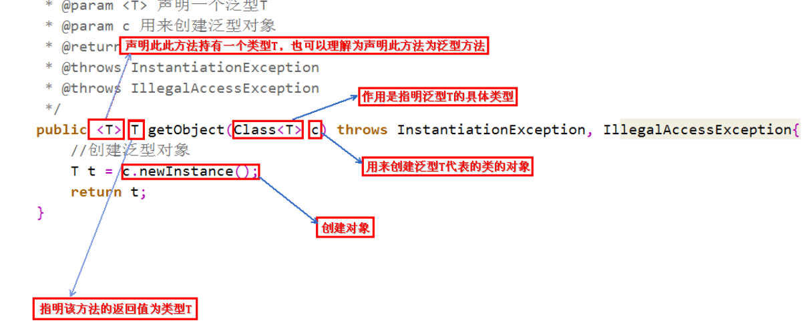
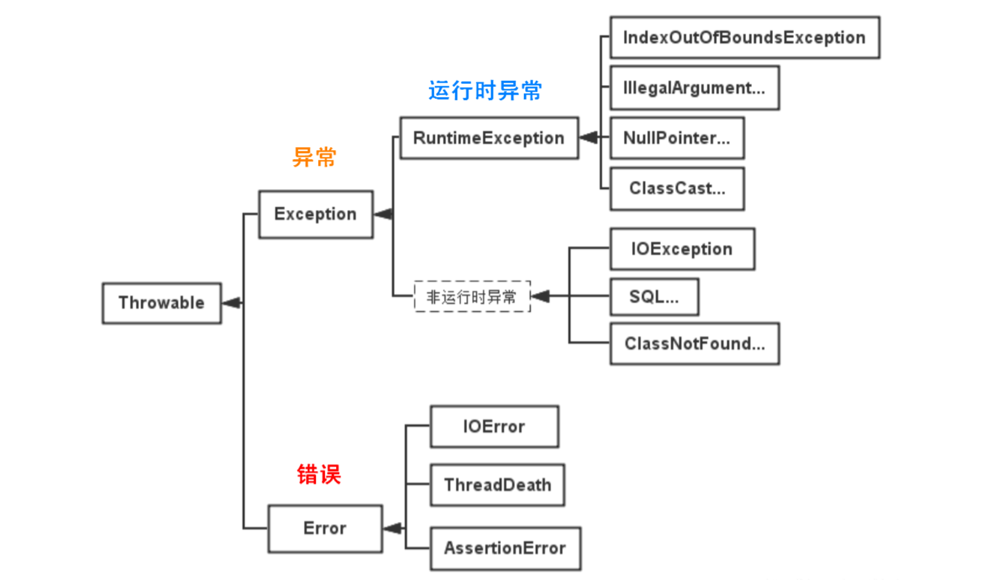
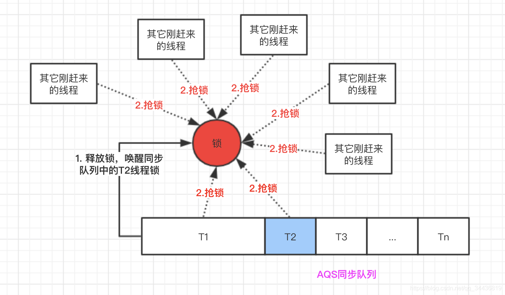

## Java 基础

### 1.语法基础

#### a = a + b 与 a += b 的区别

a += b 有隐式的类型转换, 将操作的结果强制转化为接收结果的类型

```java
        byte a = 127;
        byte b = 127;
        b = a + b; // 报错
        b = (byte) (a + b); // b = -2
        b += a;  // b = -2
```


#### 3 * 0.1 == 0.3 返回 true or false?

false, 浮点数的精度不能完全精确的表达出来


#### 能在 Switch 中使用 String 吗?

switch 只支持 byte, short, char, int. 甚至不支持 long, 因为 switch 设计的初衷是对那些少数几个值类型进行等值判断, 如果过于复杂还是 if 比较合适

从 java1.7 开始, 可以在 swtch 中使用 String, 1.7 之前 switch 里只能使用基本数据类型, 1.7 加入 String, 在内部使用的是 String 的 hashcode(), switch/case 的其实还是基本数据类型, 在 case 里使用 equals 做了进一步判断

```java
   switch(var2.hashCode()) {
        case 65: // 还是基本数据类型
            if (var2.equals("A")) {
                var3 = 0;
            }
            break;
        case 66:
            if (var2.equals("B")) {
                var3 = 1;
            }
   }
   // 两个 switch 解耦
   switch(var3) {
        case 0:
            System.out.println("A");
            break;
        case 1:
            System.out.println("B");
            break;
        default:
            System.out.println("F");
    }
```


#### 对 equals() 和 hashcoe() 的理解

- ##### 为什么重写 equals() 时要重写 hashcode()?

  因为要对应 equals() 的判断结果要和 hashCode() 的判断结果完全对应, 默认两者都是按照地址值进行判断, 最显而易见的就是 HashMap 进行比较的时候是先根据 hashcode 进行比较的, hashcode 判断结果和 equals 判断结果不一致的话, 这里我们重写的 equals 就没有意义了

- ##### 有没有可能两个不相等的对象有相同的 hashcode?

  有可能, 因为存在 hash 冲突

- ##### 两个相等的对象会有不同的 hashcode 吗?

  不会, 这样不符合规范, 相同的对象他们的 hash 值也应该相同

#### final, finalize 和 finally 的区别?

- final 是一个关键字, 可以修饰变量, 类和方法. final 修饰的基本数据类型变量为常量, 修饰的引用数据类型变量它的引用值不能再改变. 修饰方法后方法不能被重写. 修饰类后该类不能被继承
- finalize() 是一个方法,finalize() 方法在垃圾收集器释放对象所占用的内存空间之前被调用, 由于 GC 机制, finalize() 方法不能保证会及时的执行, 不确定性很大. 由于finalize() 有只会被调用一次的特性,可以用来延长对象的生命周期. JDK 9 之后已不建议使用
- finally 是一个关键字, 和 try catch 配合使用, finally 块一定会被执行.

#### String, StringBuilder, StringBuffer 的区别

String 是不可变的, String 里面的字符数组是由 final 修饰的, 这个引用不能再被改变, String 类内部没有提供修改字符数组的方法, String 类由 final 修饰, 防止通过子类继承修改字符数组.

StringBuilder 和 StringBuffer 是可变的, 对 StringBuilder 进行操作的时候改变的是对象本身, 不会生成新的对象.

由于 String 是不可变的, 所以它天然是线程安全的. StringBuilder 和 StringBuffer 的区别是 StringBuffer 是线程安全的.

#### String pool

字符串常量池保存着所有字符串字面量, 这些字面量在编译期间就已经确定. 会在字符串常量池创建字符串对象指向相应字面量

#### intern() 方法

当一个字符串调用 intern() 方法时，如果 String Pool 中已经存在一个字符串和该字符串值相等（使用 equals() 方法进行确定），那么就会返回 String Pool 中字符串的引用；否则，就会在 String Pool 中添加一个新的字符串，并返回这个新字符串的引用。

#### new String("abc") 会创建几个字符串对象

- 如果字符串常量池中还没有 "abc" 对象, "abc" 属于字符串字面量, 在编译时期会创建一个字符串对象指向这个 "abc" 字符串字面量

- 使用 new 关键字会在堆中创建一个字符串对象

```java
// 字符串对象的构造函数, 可以看到两个字符串对象指向的同一个 value 数组
public String(String original) {
    this.value = original.value;
    this.hash = original.hash;
}
```


#### 接口和抽象类的区别

- 一个类只能继承一个抽象类,但可以实现多个接口
- 抽象类可以有构造方法, 接口没有构造方法
- 抽象类可以有普通的成员变量, 接口只能定义静态常量
- 抽象类可以定义普通方法和抽象方法, 接口在 1.8 之前只能定义抽象方法, 1.8 后可以定义默认方法, 1.9 之后可以定义私有的普通方法
- 抽象类可以定义静态方法, 接口在 1.8 之后可以定义静态方法, 只能由接口调用


#### 为什么给接口添加默认方法?

因为牵一发而动全身, 给接口添加一个方法后需要更改它所有的实现类


#### this() 和 super() 在构造方法中的区别

- super 从子类调用父类构造, this 在同一类中调用其他构造器, 使用时两者都要写在第一行,否则编译报错
- super 和 this 只能用一个
- this 和 super 指的对象, 不能在 static 中使用


### 2.泛型

#### 为什么需要泛型

适用于多种数据结构类型执行相同的代码



#### 如何理解Java中的泛型是伪泛型？泛型擦除?

泛型中类型擦除, Java 中的泛型是在 1.5 之后加入的, 为了兼容之前的版本, Java 在语法上支持泛型, 但是在编译阶段会进行'泛型擦除', 所有泛型类型都被转换为 Object 类型, 看起来就像没有泛型一样. 有取值操作时,编译器编译时会加上强制转换操作,但在泛型擦除时**并不会将所有的泛型类型都擦除掉**,它只会**擦除运行时的泛型类型**，编译时类中定义的泛型类型是不会被擦除的.


### 3.注解

#### 注解的作用

注解是 JDK5 引入的一个特性, 用于对代码进行说明, 可以对类, 方法, 接口, 字段, 方法参数, 局部变量进行注解.作用主要有

- 生成文档, 通过代码里标识的元数据生成 Javadoc 文档.
- 编译检查, 通过代码里标识的元数据让编译器在编译期间进行检查验证.
- 编译时动态处理, 编译时通过代码里标识的元数据动态处理, 例如动态生成代码.
- 运行时动态处理, 运行时通过代码里标识的元数据动态处理, 例如反射注入实例

#### 注解分类

- Java 自带的标准注解, 例如 @Override, @Deprecated 用这些注解标明后编译器在编译期间会进行检查
- 元注解, 用于定义注解的注解,包括`@Retention`、`@Target`、`@Inherited`、`@Documented`
  - `@Retention`用于标明注解被保留的阶段
  - `@Target`用于标明注解使用的范围
  - `@Inherited`用于标明注解可继承
  - `@Documented`用于标明是否生成javadoc文档
- 自定义注解

### 4.异常

#### Java 异常的层次结构



- ##### Throwable 是 Java 中所有错误和异常的父类

  - Error 及其子类, 表示程序无法处理的错误, 表示应用程序出现了严重的错误, 不可恢复的
  - Exception 及其子类, 表示程序本身可以捕获并处理的异常. 异常又分为编译时异常和运行时异常

- ##### 运行时异常

  都是 RuntimeException 类及其子类, 如空指针异常, 下标越界异常这些异常时不可检查异常, 程序中不处理编译也能通过. 这些异常通常是由于程序逻辑错误引起的.

- ##### 编译时异常

  RuntimeException 以外的异常, 都属于 Exception 类及其子类.是必须处理的异常, 如果不处理编译就不能通过.

#### 可检查异常和不可检查异常的区别

- ##### 可检查异常

  编译器要求必须处理的异常, 除了 RuntimeException 及其子类以外的 Exception 类及其子类都是可检查异常, 这种异常必须用 try catch 捕获或者抛出, 否则编译不通过

- ##### 不可检查异常

  编译器不要求强制处理的异常, 运行时异常(RuntimeException)和错误(Error)


#### throw 和 throws 的区别

throws 用于异常的申明, 对于可检查异常如果不对其进行捕获, 就需要在头方法中显示的申明该异常. 告知方法的调用者此方法有异常. 

throw 用于异常的抛出, 对于可检查异常的抛出, 需要现在方法头中申明异常

#### Java 7 的 try-with-resource

对于实现了 AutoCloseable 接口的资源, 在 try 中打开资源.资源会在 try 中代码块执行完成或异常处理完成后自动关闭资源


#### 异常的底层

异常表中包含了一个或多个异常处理者(Exception Handler)的信息，这些信息包含如下

- **from** 可能发生异常的起始点
- **to** 可能发生异常的结束点
- **target** 上述from和to之前发生异常后的异常处理者的位置
- **type** 异常处理者处理的异常的类信息


### 5.反射

#### 什么是反射?

反射机制就是在运行状态中, 对于任意一个类, 都能够知道这个类的所有属性和方法. 这种动态获取信息以及动态调用对象的方法的功能称为反射机制


### 6.集合

Set 

- TreeSet 基于红黑树实现，支持有序性操作，例如根据一个范围查找元素的操作。但是查找效率不如 HashSet，HashSet 查找的时间复杂度为 O(1)，TreeSet 则为 O(logN)。
- HashSet 基于哈希表实现，支持快速查找，但不支持有序性操作。并且失去了元素的插入顺序信息，也就是说使用 Iterator 遍历 HashSet 得到的结果是不确定的。
- LinkedHashSet 具有 HashSet 的查找效率，且内部使用双向链表维护元素的插入顺序。

List 

- ArrayList 基于动态数组实现，支持随机访问。
- Vector 和 ArrayList 类似，但它是线程安全的。
- LinkedList 基于双向链表实现，只能顺序访问，但是可以快速地在链表中间插入和删除元素。不仅如此，LinkedList 还可以用作栈、队列和双向队列。

Queue 

- LinkedList 可以用它来实现双向队列。
- PriorityQueue 基于堆结构实现，可以用它来实现优先队列。

------


#### ArrayList 自动扩容

构造时:

- 使用默认构造器时, 初始化一个默认的`容量为0`空数组
- 使用带参数的构造器时, 会初始化一个`指定容量`的数组
- 使用参数为集合的构造器时, 会初始化一个`容量为参数集合容量`的数组

添加时:

- 添加一个元素的时候, 如果此时数组容量为0, 会直接扩容到10; 如果容量不为0, 会扩容为上次容量的1.5倍

- 添加集合时, 如果此时数组容量为0, 初次扩容会比较集合容量和 10 的大小,大的作为数组容量; 如果容量不为 0,比较实际元素总个数和此时容量的 1.5 倍, 大的作为数组容量

  

#### Fail-Fast

ArrayList 采用了快速失败的机制, ArrayList 中有一个 modCount 属性, 只要改变了 ArrayList 中元素的个数, modCount 就会随之改变, 迭代器内部有一个 expectedModCount, 在使用迭代器遍历集合的过程中会检查 expectedModCount 是否等于 modCount, 如果不等就抛出 并发修改异常

使用 CopyOnWriteArrayList, 写时复制的方式可以做到遍历的同时进行修改


#### ArrayList 和 LinkedList 比较

ArrayList 基于数组,需要连续内存,可以利用 CPU 缓存,运用局部性原理;LinkedList 基于双向链表, 占用内存大

ArrayList 随机访问能力强, 尾部插入删除能力强, 头部插入删除能力较弱, LinkedList 随机访问能力差,头尾插入删除能力强. 综合来看 LinkedList 只有在头部插入数据时性能要优于 ArrayList


#### Map

HashMap 1.7: 数组+链表 1.8: 数组+链表+红黑树, key 支持 null 值

Hashtable 类似于 HashMap, 但是它是线程安全的, key 不支持 null 值. 

LinkedHashMap 使用双向链表来维护元素的顺序,顺序为插入顺序


#### 树化与退化

**树化的意义**: 红黑树用来避免 Dos 攻击, 防止链表超长时性能下降, 树化的情况是及其偶然的, 如果 hash 足够随机,在负载因子为 0.75 的情况下, 出现长度超过 8 的链表的概率是千万分之一,树化阈值选为8就是为了让概率足够小

**树化规则**: 链表长度超过阈值 8,先尝试扩容来尝试减小链表长度,如果数组长度已经 >= 64, 才会进行树化

**退化规则**: 扩容时拆分树时树的长度 <= 6,退化为链表 或者 root, left, right, left.left 任意一个为null


#### 索引的计算

先计算对象的 hashCode(), 再调用 HashMap 的 hash() 方法进行二次哈希

- 二次哈希的过程是, 将哈希值与其`右移16位`之后的值进行`异或`操作, 这样做的目的是让哈希值的高16位也参与到运算中来,让哈希分布更为均匀

最后将 hash 值和数组容量进行 `与` 操作就得到了索引下标


#### 数组容量为什么是 2 的 n 次幂

首先, 在计算哈希值时, 如果容量是 2 的 n 次幂, 可以用位与操作代替取模操作

并且, 在扩容后重新计算索引时, 哈希值 & 原数组容量, 如果结果为 0, 则元素下标不变,如果结果为1,元素下标为当前下标+原数组容量. 因为扩容后计算下标的时候, hash 值不变, capacity 的二进制表示就是最高位从0变成了1,  哈希值 & 原数组容量为 0, 说明哈希值对应的那一位是 0, 与操作计算结果不变

> 二次 hash 是为了配合 **容量是 2 的 n 次幂** 这一设计前提，如果 hash 表的容量不是 2 的 n 次幂，则不必二次 hash

> **容量是 2 的 n 次幂** 这一设计计算索引效率更好，但 hash 的分散性就不好，需要二次 hash 来作为补偿，没有采用这一设计的典型例子是 Hashtable


#### 1.7 和 1.8 的区别

链表加入结点时, 1.7 是头插法, 1.8 是尾插法

1.7 大于阈值且没有空位时扩容, 1.8 大于阈值就扩容

1.7 并发扩容时存在死链风险


#### 对 key 的要求

实现 equals 和 hashCode() 方法,并且 key 的内容不能修改(如果修改了 key, 查询是会检索不到)


#### String 对象的 hashCode() 设计

- 目标是达到较为均匀的散列效果，每个字符串的 hashCode 足够独特
- 散列公式为： $S_0∗31^{(n-1)}+ S_1∗31^{(n-2)}+ … S_i ∗ 31^{(n-1-i)}+ …S_{(n-1)}∗31^0$

- 31 代入公式有较好的散列特性，并且 31 * h 可以被优化为 

  * 即 32 ∗  h - h

  * 即 2^5 ∗ h - h

  * 即 h≪5 - h


## Java 并发

### 并发基础

#### 多线程出现时为了解决什么问题?

- CPU, 缓存, IO 设备之间存在很大的速度差异, 为了合理利用其性能, CPU 增加了缓存, 均衡 CPU 和 内存之间的速度差异, 但是会存在可见性的问题. 

- 操作系统增加了线程和进程来提高CPU利用率,但是会带来原子性问题.

- 编译程序时优化指令的次序, 但也带来了有序性的问题


#### 实现线程安全有哪些思路?

1. 互斥同步, 即使用 synchronized, Lock
2. 非阻塞同步, CAS
3. 无同步方案, 如果一个方法本身不涉及数据共享, 那就无需任何同步措施.


#### 线程有哪几种状态

##### 在操作系统里线程被划分为 5 中状态, 分别是新建,就绪,运行,阻塞,死亡

就绪态是指线程已经获得除了 CPU 之外的所有资源,运行态指的是线程分到了 CPU 资源, 正在运行的状态

阻塞态是需要等待获取到某个资源才能去竞争 CPU

##### Java 将线程的状态划分为 6 种, 分别是新建,可运行, 阻塞,等待,超时等待,死亡

新建就是创建了线程对象但是还没有执行 start() 方法

可运行是就绪与运行的组合,调用 start 方法之后进入可运行状态

阻塞状态是在需要获取锁的情况下线程没获取到锁, 进入 Monitor 对象的阻塞队列中, 就由可运行状态转为阻塞态.当持有锁的线程释放锁之后会唤醒阻塞队列中的线程,唤醒后进入可运行状态. 

等待状态是已经获取锁的线程,由于某种条件不满足,主动调用了 wait() 方法, 进入 Monitor 对象的 waitset 中等待. 当其他持有锁的线程调用了 notify 或 notifyAll 方法后会唤醒等待集合中的线程,可以重新去竞争锁

超时等待分为两种情况, 一种是获取锁的线程主动调用带超时时间的 wait() 方法, 如果等待超时会直接恢复为可运行状态. 第二种情况是调用 sleep() 方法, 也会进入超时等待状态, 但是和 Monitor 对象无关,不会释放锁,会释放CPU. 超时时间到会恢复为可运行状态


#### 创建线程的方式

- 继承 Thread 类
- 实现 Runnable 接口
- 实现 Callable 接口, 配合 Future 完成异步调用
- 使用线程池


#### FutureTask 原理?

执行 future.get() 时, 如果线程还没执行完成, 则将当前线程封装成 NodeWait 以 CAS 的方式加入链表(头插法) waiters 中阻塞. 当任务执行完成后(正常执行完或者抛出异常) 回去唤醒 waiters 中阻塞的线程.


#### ThreadPoolExecutor 原理?

Java 线程池的原理是一个线程集合 WorkerSet 和一个阻塞队列 workQueue. 当用户向线程池提交一个任务时,线程池会先将任务放到 workQueue 中. workerSet 中的线程会不断的从 workQueue 中获取任务执行. 当 workQueue 中没有任务时 worker 就会阻塞等待对列中加入新任务


#### 线程池的核心参数

corePoolSize: 核心线程数目 - 保持活跃的最小线程数

maximumPoolSize: 最大线程数, 核心线程数加上急救线程数的最大值

keepAliveTime: 生存时间, 救急线程的生存时间, 生存时间内没有新任务线程会销毁

unit: 生存时间的单位

workQueue: 线程数超过核心线程数之后, 新增加的线程会放进该队列中排队, 队列也放满的话会创建救急线程执行任务

threadFactory: 线程工厂,可以定制线程对象的创建

handler: 拒绝策略, 当线程数达到最大线程数是, 对新加入线程的拒绝策略, 有四种拒绝策略

- 默认是丢弃并抛出异常

- 还有直接抛弃且不抛出异常

- 让当前调用线程执行任务,这种策略会降低对于新任务提交速度，影响程序的整体性能。

- 丢弃最早排队的任务, 将当前线程加入队列

  

#### Executors 工具类

提供了几种常见的线程池, 

##### newFixedThreadPool:

创建一个固定线程数的线程池, 核心线程数等于最大线程数,工作队列使用的是 LinkedBlockingQueue, 是一个无界队列(容量为 Integer.MAX_VALUE), 因为使用了无界对列,在任务较多时可能造成 OOM 内存溢出

##### newSingleThreadExecutor:

创建只有一个线程的线程池, 核心线程数和最大线程数都为1,工作队列为 LinkedBlockingQueue 无界队列, 可以保证所有的线程按顺序执行. 在任务较多时可能造成 OOM 内存溢出

##### newCacheThreadPool:

核心线程数为 0, 最大线程数为 Integer.MAX_VALUE, synchronousQueue 作为工作队列, 没有容量不存放线程.可能创建大量的线程导致 OOM 内存溢出.

#### 创建多大容量的线程池合适?

- CPU 密集型任务: N + 1

- IO 密集型任务: 2N

  

#### wait() 和 sleep()

wait 和 sleep 方法都可以使当前线程放弃 CPU 使用权, 进入阻塞状态

不同的是 wait 方法属于 Object 类, sleep 方法属于 Thread 类. 调用 wait 方法之前必须要先获取到锁, 并且调用 wait 方法之后会释放锁. sleep 方法不需要获取锁便可执行, 并且在 synchronized 块中执行的时候不会释放锁


#### synchronized 和 Lock

语法: 

- synchronized 是关键字, jvm 底层实现. Lock 是接口, 用 Java 代码实现

- 使用 synchronized 关键字时, 会自动释放锁, 使用 Lock 需要手动释放锁

功能:

- 二者都是悲观锁, 都支持基本的互斥, 同步, 可重入功能

- Lock 提供了一些 synchronized 不具备的功能, 它支持公平锁(按申请锁的顺序获取锁), 可打断(Lock 是可打断的, synchronized 不行), 锁超时(Lock 可以设置超时时间, synchronized 会一直阻塞等待), 可绑定多个条件变量(类似于 Monitor 中的 waitSet), 更细粒度的唤醒线程. 每个条件变量都包含一个等待队列.

性能:

* 在没有竞争时，synchronized 做了很多优化，如偏向锁、轻量级锁，性能不赖
* 在竞争激烈时，Lock 的实现通常会提供更好的性能

#### 公平锁和非公平锁

非公平锁: 不会查看阻塞队列是否有等待的线程, 直接尝试获取锁. 简单理解就是新来的可以插队,但是已经在阻塞队列中的线程,只能串行的执行




公平锁的公平体现

* **已经处在阻塞队列**中的线程（不考虑超时）始终都是公平的，先进先出
* 公平锁是指**未处于阻塞队列**中的线程来争抢锁，如果队列不为空，则老实到队尾等待
* 非公平锁是指**未处于阻塞队列**中的线程来争抢锁，`与队列头唤醒的线程去竞争`，谁抢到算谁的

#### happens-before

Java 内存模型具备一些先天的“有序性”，即不需要通过任何同步手段（volatile、synchronized 等）就能够得到保证的安全，这个通常也称为 happens-before 原则，它是可见性与有序性的一套规则总结

- 如果一个操作 happens-before 于另一个操作, 那么第一个操作的结果对后一个操作可见, 而且第一个操作的执行顺序排在第二个操作的前面

- 两个操作之间存在 happens-before 关系, 并不意味着必须按照 happens-before 的指定顺序来执行. 如果重排之后的结果和 happens-before 的结果一致, 那么这种重排序并不违法

#### volatile

**原子性** 

多线程下指令交错执行引起的混乱, volatile 不能保证原子性

##### volatile 如何保证可见性

对 volatile 变量的写操作后面会加入写屏障, 读操作前面会加上读屏障

写屏障保证在屏障前对共享变量的改变都写回主存中, 读屏障保证在屏障后对共享变量的读操作都从主存中读取

`通过 synchronized 和 Lock 也能够保证可见性，synchronized 和 Lock 能保证同一时刻只有一个线程获取锁然后执行同步代码，并且在释放锁之前会将对变量的修改刷新到主存当中。因此可以保证可见性。`

##### volatile 如何保证有序性

写屏障之前的操作不会跑到写屏障后, 读屏障之后的读操作不会跑到读屏障前. 但是不能保证共享变量前后的操作是有序的, 所以只能保证一定的有序性


#### 乐观锁和悲观锁

- 每次去拿数据的时候都认为别人会修改，所以每次在拿数据的时候都会上锁，这样别人想拿这个数据就会阻塞
- 悲观锁的代表是 synchronized 和 Lock 锁
  - 核心思想是只有线程占有了锁才能去操作共享变量, 每次只有一个线程占锁成功, 失败的线程都要停下来等待
  - 线程从运行到阻塞再到运行涉及上下文切换, 频繁发生会影响性能
    - tip: 实际上不管是 synchronized 还是 lock 在获取锁失败是都会做重试动作
- 每次去拿数据的时候都认为别人不会修改，所以不会上锁，但是在更新的时候会判断一下在此期间别人有没有去更新这个数据。**如果别人修改过，则获取现在最新的值，如果别人没修改过，直接修改共享数据的值**
- 乐观锁的代表是 cas
  - 核心思想是无需加锁, 每次只有一个线程改变共享变量, 失败的线程不用停止, 不断重试直到成功
  - 线程一直运行, 不需要阻塞, 不会频繁上下文切换

#### CAS 缺点

- 自旋CAS如果长时间不成功，会给CPU带来非常大的执行开销, 所以 CAS 线程一般不超过 CPU 核数
- 只能保证单个共享变量的原子性
- ABA 问题, 当进行获取主内存值时，该内存值在写入主内存时已经被修改了 N 次，但是最终又改成原来的值
  - 解决方法: 添加一个版本号, 在比较是不仅比较变量的值, 还要比较版本号是否一致


#### interrupt() 方法

interrupt() 可以打断正在阻塞或者正在运行的线程

- 当使用 interrupt() 方法打断运行时的线程时, 被打断的线程会继续运行, 但是打断标记会被更新为 true

- 当使用 interrupt() 方法打断阻塞中的线程时, 会抛出打断异常 interruptedException, (但是不能打断 IO 阻塞或 synchronized 锁阻塞, 如果线程正处于 IO 阻塞或同步阻塞的话, 执行 interrupt() 方法会打上打断标记, 和运行中打断的流程一样).

- interrupted() 是静态方法, 返回当前线程的打断状态,并且会清除打断状态

- isInterrupted() 是实例方法, 返回当前线程的打断状态且不会清除打断状态, 
  - 可以根据打断的特性执行两阶段终止模式(打断并不是终止), 执行一些终止前的善后工作

#### Executor 的中断操作

调用 Executor 的 shutdown() 方法会等待线程都**执行完毕后再关闭**, 如果调用 shutdownNow() 方法,会立即停止正在执行的线程并关闭

### JUC


#### AtomicInteger 底层实现?

AtomicInteger 是对 int 类型的一个封装, 提供原子性的访问和更新操作

- CAS + volatile
- volatile 保证内部 int 属性的可见性, 多线程并发时, 可以保证其他线程立马看到修改后的值
- CAS 保证数据更新的原子性

#### AtomicStampedReference 是怎么解决ABA的?

AtomicStampedReference 主要维护包含一个对象引用以及一个可以自动更新的整数 stamp 来解决 ABA 问题。


#### Object.wait() 和 Condition.await() 的区别?

Object.wait() 方法依赖于 Monitor 对象, JVM 底层实现, Condition.await() 底层调用 LockSupport.park() 实现.


#### Object.wait() 和 Support.park() 的区别?

二者都会阻塞当前线程的运行, 

1. 不同的是 wait() 方法需要在同步代码块中执行, park() 方法可以在任意地方执行
2. 调用了 wait() 方法后执行中断会抛出异常, park() 方法不会超出异常, 只会打上中断标记
3. unpark() 的唤醒粒度更小, 可以具体到线程
4. unpark() 可以在 park() 之前调用, 不会阻塞直接运行. 但是 notify() 不能在 wait() 之前调用, notify() 不会起作用, 线程将阻塞


#### 什么是 AQS?

AQS(抽象队列同步器) 是一个用来构建锁和同步器的框架, 使用 AQS 可以简单高效的构建出同步器. 很多同步类的实现都是基于 AQS 的.

AQS 的核心思想是, 如果请求的共享资源空闲, 则将当前请求的资源设置为有效的工作线程. 并且将共享资源设置为锁定状态. 如果请求的共享资源被占用, 就需要一套线程阻塞等待和被唤醒时的锁分配机制. 这个机制 AQS 利用 CLH 队列实现的, 即将暂时获取不到锁的线程加入到队列中.

AQS 底层数据结构是使用一个虚拟的双向队列(不存在队列实例, 仅存在结点之间的关联关系). 将每一个线程封装成一个结点来实现锁分配. 同步队列是双向链表, 包含 head, tail 结点. 而 Condition 是一个单向链表,只有使用 Condition 时才会使用此链表. 并且可以存在多个 Condition queue

```java
Node{
   waitStatus // 标志当前结点处于什么状态
   prev // 同步队列中用到, 前置结点
   next // 同步队列中用到, 后置结点
   thread // 存储线程信息
   nextWaiter // 在 Condition 条件队列中用到, 保存后置结点, 条件队列是单向链表// 同步队列和条件队列不是同一个
}
```


#### AQS 有哪些核心方法?

```java
isHeldExclusively()//该线程是否正在独占资源。只有用到condition才需要去实现它。
tryAcquire(int)//独占方式。尝试获取资源，成功则返回true，失败则返回false。
tryRelease(int)//独占方式。尝试释放资源，成功则返回true，失败则返回false。
tryAcquireShared(int)//共享方式。尝试获取资源。负数表示失败；0表示成功，但没有剩余可用资源；正数表示成功，且有剩余资源。
tryReleaseShared(int)//共享方式。尝试释放资源，成功则返回true，失败则返回false。
```


#### AQS 定义什么样的资源获取方式?

定义了独占和共享两种获取资源的方式

- 独占式,只有一个线程可以访问资源, 根据是否顺序执行又分为公平锁和非公平锁
- 共享式, 多个线程课同时执行访问, (Semaphore, CountDownLatch, CyclicBarrier)
  - ReentrantReadWriteLock 可看做组合式, 它的读锁是共享锁. 写锁是独占锁

#### ReentrantLock 的核心是 AQS, 它是怎么来实现的, 继承吗?

通过聚合的方式

ReentrantLock 内部有三个内部类, Sync, FairSync, NoFairSync. FairSync 和 NoFairSync 都继承自 Sync, Sync 类继承自 AQS.


#### 什么是 CountDownLatch ?

用来进行线程间的同步协作, 用来控制一个或多个任务等待其他一组任务的完成, 有两个主要方法 await() 和 countDwon(), 当调用了 await() 方法后会让当前线程阻塞等待. 每次调用 countDown() 方法计数器减一, 当计数器减到 0 的时候唤醒等待的线程. 初始化的时候指定计数器.

应用: 同步等待多个远程调用结束

#### CountDownLatch 原理?

CountDownLatch 内部利用 AQS 的 state 来做计数器功能. 初始化时对 state 进行初始化. 调用 await() 方法时会判断 state 是否已经为 0, 不为 0 就挂起当前线程, 加入 AQS 的阻塞队列中. 每次CountDown 时计数器减一, 并且尝试去唤醒阻塞的线程, statue 为 0 是唤醒成功


#### 什么是 CyclicBarrier?

用来进行线程间的同步协作, 等待线程满足某个计数, 才能触发自己的操作. 和 CountDownLatch 功能类似, 都是通过计数器实现. 线程调用 await 方法通知 CyclicBarrier 本线程已经到达屏障

#### CountDownLatch 和 CyclicBarrier 对比?

- CountDownLatch 减计数, CyclicBarrier 加计数
- CountDownLatch 是一次性的, CyclicBarrier 可以复用


#### 什么是 Semaphore?

信号量, 允许多个线程同时访问某个资源. 用来限制能同时访问资源的线程数量, 不可重入.


#### 什么是 ThreadLocal?

ThreadLocal 实现了资源对象的线程隔离, 为每个线程创建一个单独的副本. 让每个线程使用自己的资源对象, 避免争用引发的线程安全问题. 同时 ThreadLocal 实现了线程内部的共享


#### ThreadLocal 原理? 

每个线程内有一个 ThreadLocalMap 类型的成员变量, 用来存储资源对象

- 调用 set 方法, 就是以 ThreadLocal 自己作为 key, 资源对象作为 value, 放入当前线程的 ThreadLocalMap 集合中
- 调用 get 方法, 以 ThreadLocal 自身作为 key, 获取到 value


#### ThreadLocal 弱引用 key?

Thread 可能会长期运行, 如果 key 长期不使用, 浪费了空间, 使得线程很臃肿, 上下文切换开销大.所以设置为弱引用.

但是引发的问题是 key 被回收之后 value 就寻找不到了, 造成内存泄漏. 解决方法是: 每次调用完 ThreadLocal 及时的 remove(). 同时在调动 get(), set(), remove() 方法的时候会扫描临近的 key, 并清除 key 为 null 的 value


### 集合类

#### CurrentHashMap 原理?

JDK 1.7 中采用了分段锁技术, 将整张表分为了多个数组(segment), 每个 segment 又是一个类似 HashMap 的数据结构. Segment 是一种可重入锁, 继承自 ReentrantLock. 并发时锁住的是每个 Segment. 并发度即为 segment 数组大小, Segment 数组不能扩容, 并发度在创建时就固定, 默认是 16 个. Segment 自己是可以扩容的.

JDK 1.8 中 采用了数组 + 链表/红黑树, CAS + synchronized 保证线程安全. 数组的每个槽位作为锁, 并发时锁住的是每一个槽位, 并发度为数组大小

- get 逻辑
  - JDK 1.7 : 先计算 Segment 下标, 在根据 Hash 值获取定位 HashEntry 对象(先找到一个map, 在这个map里找)
- put 逻辑
  - 如果定位到的 Node 为 null, 通过 CAS 添加
  - 不为 null 则 锁住该结点添加

- 扩容: 扩容时以链表为单位,从后往前迁移链表, 迁移完成的将旧数组头标记为 forwardingNode, 如果迁移的链表长度大于 1, 如果链表长度大于 1, 并且链表迁移后结点索引值会改变, 那么会复制结点, 这是为了解决并发 get() 问题
  - 如果在扩容时并发 get, 根据是否为 forwardingNode 来决定在新数组还是在原数组中查找. 在扩容的过程中如果有线程 get 元素, 并且这个元素恰好在链表里面, 而这个链表还没有完全迁移,假如链表里面的部分元素迁移后的索引不一样了(有的在原下标,有的原下标+oldCap),那我们根据头结点就没法找到链表后面的元素的,所以在迁移链表元素的时候要新建链表元素复制过去,这时候有 get 的话在原链表里面可以找到相应的值
  - 扩容过程中进行 put() 操作
    - 如果当前位置正在迁移, 那么会阻塞 put() 线程
    - 如果当前位置还没有开始迁移, 那么可以并发执行
    - 如果当前位置已经迁移成功, 那么 put() 线程协助扩容


#### CurrentHashMap get() 方法不需要加锁?

因为 Node 的元素 value 和指针 next 是用 volatile 修饰的，在多线程环境下线程A修改节点的 value 或者新增节点的时候是对线程B可见的。


#### ConcurrentHashMap 不支持 key 或者 value 为 null 的原因？

因为 get(key) 获取的结果为 null, 不能判断是 value 为 null, 还是不存在该 key. 

单线程下的 HashMap, get(key) 为 null 了可以根据 contains() 判断是不包含 key 还是 value 为 null.

在我们调用 ConcurrentHashMap.get(key)方法之后，containsKey方法之前，线程B执行了ConcurrentHashMap.put(key, null)的操作。那么我们调用containsKey方法返回的就是 true 了，这就与我们的假设的真实情况不符合了，这就有了二义性。


#### CopyOnWriteArrayList 原理?

核心思想是写时复制, 增删改操作时将底层数据拷贝一份, 在新数组上执行操作, 不影响其他线程的并发读"读写分离". 使用 ReentrantLock 保证线程安全.

CopyOnWriteArraySet 是对 CopyOnWriteArrayList 的封装

迭代器: 返回迭代器时创建一个内部数组的当前快照, 此时其他线程的添加修改对此快照是不可见的, 属于弱一致性


#### 常见的阻塞队列 BlockingQueue?

ArrayBlockingQueue, DelayBlockingQueue, LinkedBlockingQueue, SynchronousQueue

- ArrayBlockingQueue 一旦创建容量不能再改变, 并发控制采用可重入锁 ReentrantLock, 插入和读取都要获取锁.
- LinkedBlockingQueue 底层基于单向链表实现的阻塞队列, 可以当做无界队列也可以当做有界队列使用
- PriorityBlockingQueue 支持优先级的无界阻塞队列, 默认情况按自然顺序
- SynchronousQueue 同步队列, 本身没有容量大小, put 必须等到 take 才能执行


### 锁优化

#### synchronized 原理?

Java 中每一个对象都可以关联一个 Monitor 对象, 当使用 synchronized 给对象上锁之后, 该对象的对象头中的标记字段改为指向 Monitor 对象的指针, 对象头中原有的标记字段信息被保存在线程栈中的锁记录中, Monitor 对象中的 owner 指针指向当前线程, 代表当前线程拥有锁. 这时有其他线程来获取锁发现锁已经被其他线程获取, 就会进入 Monitor 对象的阻塞队列里(一个双向链表). 当持有锁的线程执行完成, 会执行释放锁的操作, 把 Monitor 对象的 owner 指针置为 null, 恢复对象头中标记字段的信息. 唤醒阻塞队列中的线程来竞争锁, 竞争过程是非公平的这时候如果有新来的线程获取锁可能会直接获取成功. 如果当前已经获得锁线程调用了 wait() 方法, 就会进入 Monitor 对象的 waitSet 集合中进入等待状态.


#### 什么是锁升级

synchronized 是重量级锁, 可以对其进行优化. 随着竞争的增加锁的升级过程为: 无锁->偏向锁->轻量级锁->重量级锁


#### 什么是偏向锁? 偏向锁原理?

偏向锁的思想是偏向于第一个获取锁的线程, 这个线程之后获取该锁就不再需要进行同步操作. 

Java 对象的对象头中有一个偏向锁标记和锁标志位, 当锁对象第一次被线程获取时, 进入偏向状态, 偏向锁记录置为 1, 锁标志位置为 01, 同时用 CAS 替换对象头中的 Mark Word 标记变量为线程 ID. 如果 CAS 成功, 这个线程再次进入这个锁相关的同步块时就无需在进行同步操作. 当有其他线程也来获取锁时, 撤销偏向锁状态, 升级为轻量级锁. 调用 hashcode 方法后也会导致偏向锁被撤销


#### 什么是轻量级锁? 轻量级锁原理?

一个对象有多个线程要加锁, 但加锁的时间是错开的(没有竞争),没有竞争表示不需要 Monitor 对象的阻塞队列. 可以使用轻量级锁来优化.

一个线程获取锁时, 在线程栈中创建锁记录, 并在锁记录中存储锁定对象的 Mark Word 标记字段, 让锁记录中的对象指针指向锁对象, 并通过 CAS 操作替换锁对象的标记字段为锁记录地址. 当前线程执行锁重入时就再创建一个锁记录


#### 什么是锁膨胀?

在尝试加轻量级锁的过程中, CAS 操作失败, 可能是其他线程给对象加上了轻量级锁, 这是进入锁膨胀, 膨胀为重量级锁. 当加了轻量级锁的线程执行完后尝试 CAS 恢复对象头时发现替换失败, 这时会进入重量级锁的解锁过程


#### 什么是自旋锁? 什么是自适应锁?

重量级锁竞争时,尝试获取锁失败的线程不会立即阻塞, 而是会自旋(默认10次)来进行优化,采用循环的方式去尝试获取锁. 在多核时自旋锁才能发挥优势, 单核 CPU 自旋就是浪费时间, 因为同一时刻只能运行一个线程. JDK6 之后的自旋次数是自适应的, 上一次自旋成功就会多自旋几次.


#### 什么是锁消除? 什么是锁粗化?

锁消除是 JVM 的优化, 对于被检测出不可能存在竞争的共享数据锁进行锁消除. 锁消除通过逃逸分析来支持.

逃逸分析: 如果堆上的共享数据不可能被其他线程访问到, 那就可以把它当做私有数据对待

如果一系列操作对同一个对象反复的加锁解锁, 会造成性能损耗, 可以使用锁粗化方式优化. 将加锁的范围扩展到整个操作序列的外部


#### 什么是死锁? 死锁的条件?

多个线程因为竞争资源造成的阻塞, 都在等待某个资源的释放而无限期的阻塞下去

死锁的条件: 

- 互斥: 同一时间只能有一个线程占有资源

- 请求和保持: 在请求其他资源的同时占有原有资源
- 不可剥夺: 已经占有的资源不能被强制剥夺, 只能主动释放
- 循环等待: 对资源的等待形成了一条环路


#### 什么是活锁?

任务没有阻塞, 但是由于有些条件没能满足导致无法结束. 两个线程互相改变对方的结束条件, 最后都无法结束


## JVM  

### Jvm 内存结构?

#### 内存结构了解吗?

线程私有:

- 程序计数器: 用来存储下一条指令的地址.不会内存溢出
- 虚拟机栈: 以线程为单位, 每一个线程对应一个虚拟机栈. 线程中的每一个方法的调用对应栈中的一个栈帧, 栈帧中存储着方法的局部变量, 操作数栈, 返回值地址等. 当前正在执行的方法的栈帧成为活动栈帧.
- 本地方法栈: 和虚拟机栈类似, 但是本地方法栈是为本地方法服务, 本地方法只那些用其他语言实现的方法.

线程共享:

- 堆: 创建的对象都在堆中存储. 现代垃圾回收器基本采用分代回收的算法, 堆被分为新生代和老年代两块
- 方法区: 用于存放已经被加载的类的信息, 常量, 静态变量等. 方法区是一种规范, 不同的实现所在的位置不同, 1.8 之前在永久代, 1.8 之后在元空间(本地内存), 静态变量和字符串常量池移动到了堆中


#### 什么是运行时常量池?

运行时常量池是方法区的一部分, 就想是一张信息表记录了该类的一些信息, 包括字面量和符号引用

字面量就是字面上的意思, 一眼就能看出来是什么. 符号引用是类的完全限定名. 因为这时候还不知道它们的真实地址, 先用符号引用替代


#### 什么是直接内存?

从操作系统划分出的一份缓冲区, java 代码可以直接访问, 速度大大提高


#### 栈内存溢出?

栈帧过多会导致栈内存溢出, 例如在递归调用时没有做好退出条件方法不会退出就会造成栈内存 StackOverFlow

栈进行动态扩展时申请不到内存会 OutOfMemoty


#### 堆内存溢出?

堆内存不足是会 OutOfMemeryError


#### 所有的对象都在堆内存吗?

并不一定, 通过分析逃逸分析结果, 如果发现一个对象只会在线程内部使用的话就无需把它在放在堆里, 会考虑栈上分配, 对对象进行标量替换.


### 垃圾回收?


#### 垃圾回收涉及那些区域?

垃圾回收主要是针对堆和方法区进行. 程序计数器只是存储一条指令, 虚拟机栈和本地方法栈是线程私有的, 只存在于线程的生命周期内, 线程结束后就会消失, 不需要垃圾回收进行管理

方法区的垃圾收集主要回收两部分内容:**常量池中废弃的常量和不再使用的类型。**


#### 如何判断对象可以回收?

1. 引用计数法: 给对象添加一个引用计数器, 当对象的引用增加是引用计数器加一, 当引用失效时引用减一. 引用计数为0的对象可以被回收. 存在的问题两个对象相互引用, 无法对他们进行回收
2. 可达性分析: 通过 GC Root 对象为起始点进行搜索, 能够到达的对象不被回收, 不能到达的对象可以被回收. GC Root 对象一般包括: 虚拟机栈中引用的对象, 本地方法栈中引用的对象, 方法区中的静态变量和常量引用的对象


#### 对象有哪些引用类型?

- 强引用: 使用 new 关键字创建的对象都是强引用. 只有 GC Root 不可达时强引用对象才会被回收

- 软引用: 软引用关联的对象在内存不足是会被回收

  - ```java
    SoftReference<byte[]> softReference = new SoftReference<>(new byte[_4MB]);
    ```

- 弱引用: 弱引用关联的对象只要发生垃圾回收就会被回收

  - ```java
    WeakReference<byte[]> weakReference = new WeakReference<>(new byte[_4MB]);
    ```

- 虚引用: 虚引用对引用对象是无感知的, 虚引用主要用来跟踪对象的垃圾回收活动, 当垃圾回收器准备回收一个对象时, 如果发现它还有虚引用, 就会在垃圾回收之前把这个虚引用加入到与它相关联的队列中. 程序如果发现某个虚引用被加入了引用队列, 就可以在引用对象被回收之前采取一些行动.


#### 垃圾回收算法?

- 标记-清除: 在垃圾回收过程中, 先通过可达性分析算法标记确定可回收的对象, 然后垃圾回收器根据标识清除相应的内容.(这里的清除并不是字节清零, 而是记录这段内存的起始地址, 下次分配时直接覆盖) 
  - 缺点: 容易产生大量的内存碎片, 无法给大对象分配内存. 导致频繁的 gc
- 标记-整理: 通过可达性分析算法标记可回收对象, 然后让所有的对象都向一端移动, 这样就不会产生内存碎片了
  - 缺点: 需要移动大量的对象, 处理效率很低
- 复制: 将内存分成大小相等的两块, 每次只使用其中的一块, 垃圾回收时只要把不需要回收的对象移动到另一块内存区域中. 这样也可以避免内存碎片
  - 缺点: 只使用了一半的内存空间


#### 分代垃圾回收?

将堆内存分为新生代和老年代, 新生代区域分为伊甸园, from, to 三个区域, 新创建的对象都被放在新生代的伊甸园区, 当伊甸园空间不足时, 进行一次 Minor GC, 将伊甸园区和 From 区中存活的对象放进幸存区 To 中, 让其寿命加一,再交换两个幸存区. 对象的分代年龄达到阈值就会被放进老年代里(默认值是15). 如果新生代和老年代内存都满了, 就会出发 Full GC, 对新生代和老年代中的对象都进行回收. 当遇到一个大对象时, 新生代伊甸园区为空也放不下的话会直接加入老年代. 


#### 垃圾回收器?

**serial 收集器, 新生代垃圾收集器**: 单线程的垃圾回收器, 采用复制算法, 在进行垃圾回收时会 stop the world, 优点是简单高效, 在单线程环境下效率很高.

**serial old 收集器, 老年代垃圾收集器**: serial 的老年代版本, 采用标记整理算法

**ParNew 收集器, 新生代垃圾收集器**: 是 Serial 垃圾收集器的多线程版本, 它是多线程的, 在垃圾回收时也会 stop the world

**Parallel Scavenge 收集器, 新生代垃圾收集器**: 和吞吐量密切相关, 也叫做吞吐量优先垃圾收集器, 采用复制算法. 吞吐量就是垃圾回收时间占程序运行时间的占比, 垃圾回收时间占比越低吞吐量越高. 适合在后台运行不需要很多交互的场景. 可以开启自适应调节策略, 无需手动指定各项参数.

**Parallel Old 收集器, 老年代垃圾收集器**: 是 Parallel Scavenge 的老年代版本, 采用标记整理算法. 可以和 Parallel 收集器配合使用达到高的吞吐量

**CMS 收集器, 老年代垃圾收集器**: 并发标记清除, 它是多线程的, 追求响应时间的的垃圾收集器, 尽可能的让单次的 stw 时间短一点. 让用户进程和垃圾回收进程并发执行.适合追求响应速度的场景.

运行过程有四步: 

1. 初始标记: 过程很短仅仅是标记 GC Root 可以直接到达的对象, 存在 stw
2. 并发标记: 找出存活的对象并且可以和用户线程并发执行
3. 重新标记: 修正并发标记阶段发生改变的一部分对象, 存在 stw
4. 并发清除: 对标记的对象进行清除, 和用户线程并发执行

缺点: 吞吐量低, 高响应是以低吞吐量为代价的. 标记清除算法存在内存碎片

**G1 垃圾收集器, 新生代和老年代垃圾收集器**: JDk 9 之后的默认垃圾回收器, 同时注重吞吐量和响应时间.采用了分区的思想, 将整个堆内存分成多个大小相等的独立区域, 新生代和老年代不在隔离. 每一个分区都可以承担各个角色. 整体上来看是标记整理算法, 两个区域之间是复制算法. 适用于大容量堆内存环境. 垃圾回收时间不能超过最大停顿时间, 如果超时未完成会停止垃圾回收, 会在有限的时间内回收最有回收价值的对象

每一个 region 都有一个 remeberset 来记录该 region 对象中的引用所在的 region. 在扫描是避免全堆扫描

G1 运行过程: 

1. 初始标记
2. 并发标记
3. 最终标记: 修复并发标记过程中发生变动的对象
4. 筛选回收: 回收那些最有回收价值的对象


#### JVM 内存分配策略?

- 对象优先在伊甸园分配
- 大对象直接进入老年代
- 长期存活的对象进入老年代


#### 什么情况会发生 Full Gc?

- 调用 System.gc() 建议虚拟机执行 full gc, 但是并不一定会执行
- 空间担保失败, 在进行 minor gc 之前需要老年代做空间担保
- 老年代空间不足时
- JDK 1.7 之前永久代空间不足时


#### Java 对象在堆中的生命周期?

- 当创建一个新对象时, 优先分配在伊甸园区
- 当伊甸园内空间不足时新生代进行垃圾回收, 存活的对象加入幸存者区
- 当对象分代年龄达到阈值会加入老年代


#### 三色标记法?

用三种颜色表示对象的标记状态

黑色: 已标记 灰色: 当前对象已经被标记过, 但是还存在没有标记的引用 白色: 未标记

并发多标和漏标问题: 本该被回收去却没回收-> 浮动垃圾(可以等到下次 GC 回收), 不该回收却回收了->危险, 不能允许

漏标必须要同时满足以下两个条件：

1. 赋值器`插入`了一条或者多条从`黑色对象到白色`对象的新引用；

2. 赋值器`删除`了全部从`灰色对象到该白色`对象的直接或间接引用。

   > 黑色对象引用的白色对象只能来自灰色对象, 因为黑色对象已经处理完了. 也不可能来自白色对象, 因为白色对象没有程序栈 

解决方法: 

1. 增量更新法, 当一个白色被一个黑色对象引用时, 将黑色对象重新标记为灰色, 重新标记阶段会从灰色对象处重新处理. 关注的是引用关系的增加, CMS 的做法
2. 原始快照法: 当灰色对象要删除指向白色对象的引用时, 就把白色对象记录下来, G1 的具体做法是当灰色断开白色对象的引用时就把白色对象变为灰色, 虽然有可能是浮动垃圾, 但是下次回收即可.


#### 什么是 TLAB?

TLAB 是虚拟机在堆中的伊甸园区给每个线程划分出一块私有的内存. 使用 TLAB 可以避免一系列线程安全问题

### 类加载机制


#### 类加载的生命周期?

类的生命周期 `加载`-> `验证->准备->解析` ->`初始化`->使用->卸载

加载阶段: `查找并加载类的二进制数据, 并生成 Class 的实例`. 获取类的二进制数据流, 将类的二进制数据流解析为运行时方法区内, 并且在堆中创建与之关联的 Class 对象, 作为这个类的各种数据的访问入口

验证: 验证类加载符合 JVM 规范, 不会出现安全问题

准备: 为静态变量分配内存并初始化默认值, 并为静态常量赋值, 使用的是方法区的内存

解析: 将符号引用替换为直接引用, 解析过程可能在初始化之后执行, `在动态代理时会发生动态绑定`

初始化: 初始化阶段才开始真正执行 Java 代码, JVM 将静态成员变量的赋值语句和静态代码块合并生成一个初始化方法, 并由 JVM 调用. 虚拟机会保证初始化方法的线程安全


#### 类的初始化时机?

- main 方法所在的类先被加载
- 首次访问类的静态属性或静态方法时
- 子类初始化时父类还未初始化, 会先初始化父类
- new 一个对象, 如果类还未加载

注: 访问静态常量不会触发初始化, Class.class 不会,创建该类的数组时不会


#### 类加载器的作用?

所有类都是由类加载器加载的, 类加载器负责将类的二进制信息流加载进 JVM 内部.


#### 类加载器?

双亲委派机制, 类加载器分为 启动类加载器, 扩展类加载器, 应用程序类加载器, 自定义类加载器.

- 启动类加载器是顶层类加载器, 加载核心库,扩展类加载器和应用程序类加载器都是启动类加载器去加载, 用 C++ 编写, 是虚拟机自身的一部分, Java 程序无法直接引用

- 扩展类加载器, 用来加载 Java 的扩展库, 用 Java 语言编写, 开发者可以直接使用

- 应用程序类加载器, 负责加载用户类路径下的类, 开发者可以直接使用, 如果没有自定义类加载器, 它一般就是默认的类加载器

- 自定义类加载器, Java 自带的类加载器只能加载本地文件中的内容,通过自定义类加载器可以加载数据库中或网络中的类

  

#### 双亲委派模型?

类加载器之间有父子关系, 这里的父子关系是通过组合来实现的, 子类类加载器中有父类加载器的引用, 除了启动类加载器之外, 其他的类加载器都要有自己的父类加载器. 如果所有类加载器都加载失败会抛出 ClassNotFoundException. 

类加载器收到类加载请求时, 会先把请求委托给父类加载器, 只有父类加载器无法加载时才自己尝试去加载. 这样做的好处是避免类的重复加载,确保一个类的全局唯一性. 保护核心 API 不被篡改(因为可以保证核心类优先被加载, 后面有同名的想篡改的就不会被加载)


