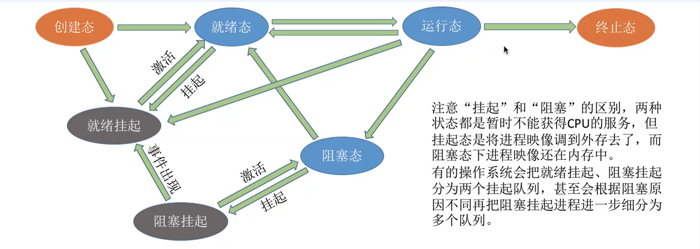

# 进程调度

### 概念

当有一堆任务要处理，但由于资源有限，这些事情没法同时处理。这就需要确定某种规则来决定处理
这些任务的顺序，这就是“调度”研究的问题。

在多道程序系统中，进程的数量往往是多于处理机的个数的，这样不可能同时并行地处理各个进程。
处理机调度，就是从就绪队列中**按照一定的算法选择-一个进程并将处理机分配给它运行**，以实现进程
的并发执行。

### 调度的三个层次

#### 高级调度

由于内存空间有限，有时无法将用户提交的作业全部放入内存，因此就**需要确定某种规则来决定，将作业调入内存的顺序。**

高级调度(作业调度)。**按一定的原则从外存上处于后备队列的作业中挑选一个(或多个)作业，给他们分配内存等必要资源，并建立相应的进程(建立PCB)，以使它(们)获得竞争处理机的权利。**

**高级调度是辅存(外存)与内存之间的调度**。每个作业只调入- -次，调出一-次。作业调入时会建立相应的PCB，作业调出时才撤销PCB。高级调度主要是指调入的问题，因为只有调入的时机需要操作系统来确定，但调出的时机必然是作业运行结束才调出。

#### 中级调度

引入了虚拟存储技术之后，可将**暂时不能运行的进程调至外存等待**。等它重新具备了运行条件且内存又稍有空闲时，再重新调入内存。
这么做的目的是为了**提高内存利用率和系统吞吐量。**

暂时**调到外存等待的进程状态为挂起状态。**值得注意的是，**PCB并不会一起调到外存**， 而是会常驻内存。PCB中会记录进程数据在外存中的存放位置，进程状态等信息，操作系统通过内存中的PCB来保持对各个进程的监控、管理。被挂起的进程PCB会被放到的挂起队列中。

中级调度: **将哪个处于挂起状态的进程重新调入内存**

**七状态模型**

#### 低级调度(进程调度)

低级调度(进程调度)，其主要任务是**按照某种方法和策略从就绪队列中选取一个进程， 将处理**
**机分配给它。**
进程调度是操作系统中最基本的一种调度，在一般的操作系统中都必须配置进程调度。
进程调度的频率很高，一般几十毫秒- - 次。

比较

### 进程调度的时机

**临界资源**: 一个时间段内只允许一个进程使用的资源,各进程需要互斥地访问临界资源

**临界区**: 访问临界资源的那段代码

### 进程调度的方式

#### 非抢占式

只允许进程主动放弃处理机。在运行过程中即便有更紧迫的任务到达，当前进程依然会继续使用处理机，直到该进程终止或主动要求进入阻塞态。

无法及时处理一些紧急任务,适合早期的批处理系统

#### 抢占式

当一个进程正在处理机上执行时，如果有一个更重要或更紧迫的进程需要使用处理机，则立即暂停正在执行的进程，将处理机分配给更重要紧迫的那个进程。

### 调度算法

#### 先来先服务

#### 短作业优先

#### 高响应比优先

**注**:这几种算法主要关心对用户的公平性、平均周转时间、平均等待时间等评价系统整体性能的指标，但
是不关心“响应时间”，也并不区分任务的紧急程度，因此对于用户来说，交互性很糟糕。因此这三种算
法一般适合用于早期的批处理系统，当然，FCFS算法也常结合其他的算法使用，在现在也扮演着很重要的
角色。而适合用于交互式系统的调度算法将在下个小节介绍...

### 交互式系统的调度

#### 轮转调度

#### 优先级调度

注: 相同优先级内部采用轮转调度

#### 多级反馈队列

**比较**

