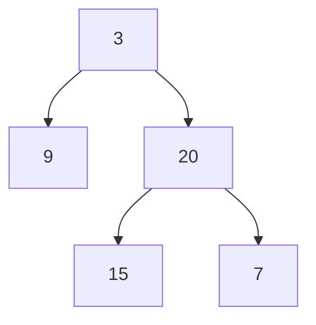
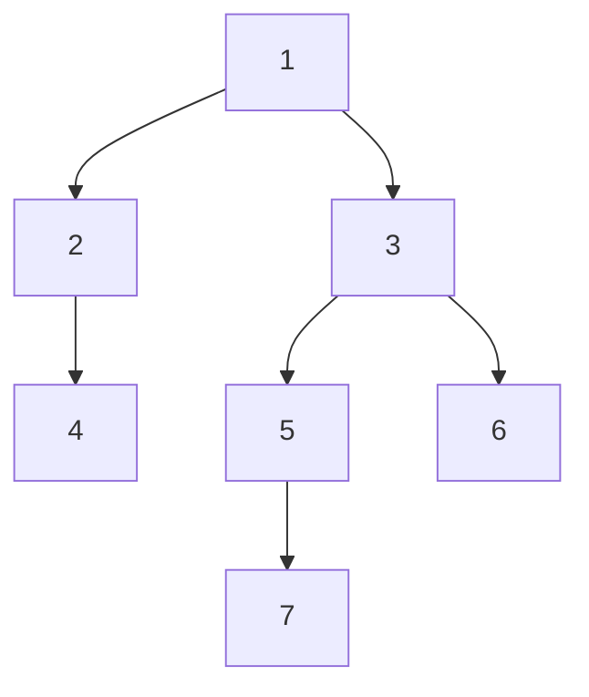

## 结点

```java
public class TreeNode {
    int val;
    TreeNode left;
    TreeNode right;

    public TreeNode() {
    }

    public TreeNode(int val) {
        this.val = val;
    }

    public TreeNode(int val, TreeNode left, TreeNode right) {
        this.val = val;
        this.left = left;
        this.right = right;
    }
}
```


## 前中后的递归遍历

### 前序遍历

> 递归条件: 
>
> 1.确定递归函数的参数和返回值: 参数为一个结点和保存结点的 list 集合
>
> 2.确定终止条件: 当current为null的时候终止递归
>
> 3.确定单层的递归逻辑: 前序遍历是中左右的循序，所以在单层递归的逻辑，是要先取中节点的数值，代码如下：
>
> ```cpp
> list.add(cur.val);    // 中
> traversal(cur.left, list);  // 左
> traversal(cur.right, list); // 右
> ```


```java
    public void traversal(TreeNode current, List<Integer> list) {
        if (current == null) {
            return;
        }
        list.add(current.val);
        traversal(current.left, list);
        traversal(current.right, list);
    }

    // 测试
    public List<Integer> preorderTraversal(TreeNode root) {
        List<Integer> list = new ArrayList<>();
        traversal(root, list);
        return list;
    }
```


### 中序遍历

```java
 public void traversal(TreeNode current, List<Integer> list) {
        if (current == null) {
            return;
        }
        traversal(current.left, list);
        list.add(current.val);
        traversal(current.right, list);
    }

    public List<Integer> preorderTraversal(TreeNode root) {
        List<Integer> list = new ArrayList<>();
        traversal(root, list);
        return list;
    }
```


### 后序遍历

```java
    public void traversal(TreeNode current, List<Integer> list) {
        if (current == null) {
            return;
        }
        traversal(current.left, list);
        traversal(current.right, list);
        list.add(current.val);
    }

    public List<Integer> preorderTraversal(TreeNode root) {
        List<Integer> list = new ArrayList<>();
        traversal(root, list);
        return list;
    }
```


## 前中后序迭代遍历

### 前序遍历

> 每出栈一个元素,将其右结点,左节点按顺序入栈(如果有右左结点)
>
> 每次出栈栈顶元素,每出栈一个结点,将其放入结果集,将其右左结点依次放入栈中(如果有右左结点)
>
> 先右再左入栈,出栈时就是先左再右,前序遍历顺序为中->左->右,所以出栈一个结点后将其右左结点入栈
> 
> 


```java
 /**
     * 迭代前序遍历二叉树
     *
     * @param root
     * @return
     */
    public List<Integer> preorderTraversal1(TreeNode root) {
        Stack<TreeNode> stack = new Stack<>();
        List<Integer> result = new ArrayList<>();
        if (root == null) {
            return result;
        }
        stack.push(root);
        while (!stack.isEmpty()) {
            // 每出栈一个结点,将其放入结果集,将其右左结点依次放入栈中(如果有右左结点),
            // 先右再左出栈时就是先左再右,前序遍历顺序为中->左->右,所以出栈一个结点后将其右左结点入栈
            TreeNode node = stack.pop();
            result.add(node.val);

            if (node.right != null) {
                stack.push(node.right);
            }
            if (node.left != null) {
                stack.push(node.left);
            }
        }

        return result;
    }
```


### 中序遍历


> 先判断左节点,左结点非 null 入栈,当遍历到左结点为 null 时,将中间结点放入结果集,然后判断中间结点的右结点.对右结点重复以上步骤 左->中->右 ->左->中->右
>
> 不同于前序遍历,中序遍历需要一个指针来标识当前处理结点,因为中序遍历结点出栈顺序和遍历结果不同


```java
    /**
     * 迭代中序遍历二叉树
     *
     * @param root
     * @return
     */
    public List<Integer> inorderTraversal(TreeNode root) {
        TreeNode cur = root;
        Stack<TreeNode> stack = new Stack<>();
        List<Integer> result = new ArrayList<>();

        while (cur != null || !stack.isEmpty()) {
            //遍历左结点
            while (cur != null) {
                stack.push(cur);
                cur = cur.left;
            }
            
            //处理中间结点,转到右结点
            if (!stack.isEmpty()) {
                cur = stack.pop();
                result.add(cur.val);
                cur = cur.right;
            }
        }
        return result;
    }
```


### 后序遍历

对前序遍历的结果reverse


## 层序遍历


> 每当从队头取出一个元素,就将其左右结点按序放入队列中,以层为单位处理
> 当某一层结点全部出队时下一层的元素刚好全部入队


```java
    public List<List<Integer>> levelOrder(TreeNode root) {
        Queue<TreeNode> queue = new LinkedList<>();
        List<List<Integer>> result = new ArrayList<>();

        if (root == null) {
            return result;
        }
        
        queue.add(root);
        while (!queue.isEmpty()) {
            //当前层的结点个数即为当前队列的大小
            int size = queue.size();
            List<Integer> list = new ArrayList<>();

            for (int i = 0; i < size; i++) {
                TreeNode node = queue.poll();
                //出栈一个元素将其放入结果集
                list.add(node.val);
                //左右结点入栈
                if (node.left != null) {
                    queue.add(node.left);
                }
                if (node.right != null) {
                    queue.add(node.right);
                }
            }

            result.add(list);
        }

        return result;
    }
```


## 二叉树的锯齿形层序遍历

[103]

给你二叉树的根节点 `root` ，返回其节点值的 **锯齿形层序遍历** 。（即先从左往右，再从右往左进行下一层遍历，以此类推，层与层之间交替进行）。

```
输入：root = [3,9,20,null,null,15,7]
输出：[[3],[20,9],[15,7]]
```


> 可以按照正常层序遍历二叉树的方式去遍历它,只需要在添加结点进 list 的时候稍加改动,如果需要从右往左,只需要把元素倒着添加进 list 即可,第一个元素添加到下标为 size-1, 第二个元素添加到 size -2 ... 不过这里用 LinkedList 可以更方便的调用 addFirst(); 即可每次添加到最前面


代码:

```java
        public List<List<Integer>> zigzagLevelOrder(TreeNode root) {
            if (root == null) return Collections.emptyList();
            List<List<Integer>> result = new ArrayList<>();
            Queue<TreeNode> queue = new LinkedList<>();
            queue.add(root);
            // 标志变量,加头还是加尾
            boolean flag = true;
            while (!queue.isEmpty()) {
                int size = queue.size();
                LinkedList<Integer> list = new LinkedList<>();
                for (int i = 0; i < size; i++) {
                    TreeNode node = queue.poll();
                    
                    if (flag) {
                        list.addLast(node.val);
                    } else {
                        list.addFirst(node.val);
                    }

                    if (node.left != null) {
                        queue.add(node.left);
                    }
                    if (node.right != null) {
                        queue.add(node.right);
                    }
                }
                result.add(list);
                flag = !flag;
            }
            return result;
        }

```


## 翻转二叉树

给你一棵二叉树的根节点 `root` ，翻转这棵二叉树，并返回其根节点。

左右翻转


> 前序 or 后序 or 层序 遍历二叉树,并交换左右见地结点


```java
   //层序
   public TreeNode invertTree(TreeNode root) {
        if (null == root) {
            return null;
        }
        Queue<TreeNode> queue = new LinkedList<>();
        queue.add(root);
        while (!queue.isEmpty()) {
            int len = queue.size();
            for (int i = 0; i < len; i++) {
                TreeNode node = queue.poll();

                TreeNode temp = node.right;
                node.right = node.left;
                node.left = temp;

                if (node.left != null) {
                    queue.add(node.left);
                }
                if (node.right != null) {
                    queue.add(node.right);
                }
            }
        }

        return root;
    }
```


## 对称二叉树

给你一个二叉树的根节点 `root` ， 检查它是否轴对称。

[101. 对称二叉树 - 力扣（LeetCode）](https://leetcode.cn/problems/symmetric-tree/)


> 就是判断根节点的左右子树是否轴对称, 左子树的左结点和右子树的右结点比较,左子树的右结点和右子树的左结点比较,可以用递归或者迭代法
>
> 递归: 每次先判断当前结点是否符合标准,符合的话判断子结点
>
> 迭代: 每次将左子树的结点和右子树的结点放入队列,每次取出两个,分别属于左右子树,比较就好


递归:

```java
  public boolean isSymmetric1(TreeNode root) {
        if (root == null) {
            return true;
        }

        return judge(root.left, root.right);
    }


    public boolean judge(TreeNode leftTree, TreeNode rightTree) {
        //判断自身情况
        if (leftTree == null && rightTree == null) {
            return true;
        } else if (leftTree == null && rightTree != null) {
            return false;
        } else if (leftTree != null && rightTree == null) {
            return false;
        } else if (leftTree.val != rightTree.val) {
            return false;
        }

        // 自身情况都通过,判断孩子
        boolean inside = judge(leftTree.right, rightTree.left);
        boolean outside = judge(leftTree.left, rightTree.right);
        return inside && outside;
    }
```


迭代:

```java
    public boolean isSymmetric2(TreeNode root) {
        if (root == null) {
            return true;
        }
        Queue<TreeNode> queue = new LinkedList<>();
        queue.add(root.left);
        queue.add(root.right);

        while (!queue.isEmpty()) {
            // 每次从队列中取两个,分别属于左子树和右子树
            TreeNode leftnode = queue.poll();
            TreeNode rightnode = queue.poll();

            if (leftnode == null && rightnode == null) {
                continue;
            }

            if ((leftnode != null && rightnode == null) || (leftnode == null && rightnode != null) || (leftnode.val != rightnode.val)) {
                return false;
            }
            
            
            queue.add(leftnode.right);
            queue.add(rightnode.left);
            queue.add(leftnode.left);
            queue.add(rightnode.right);
        }

        return true;
    }
```


## 二叉树深度

给定一个二叉树，找出其最大深度。

二叉树的深度为根节点到最远叶子节点的最长路径上的节点数。

说明: 叶子节点是指没有子节点的节点。

示例：
给定二叉树 [3,9,20,null,null,15,7]，

        3
       / \
      9  20
        /  \
       15   7
    返回它的最大深度 3 。
来源：力扣（LeetCode）
链接：https://leetcode.cn/problems/maximum-depth-of-binary-tree


> 递归: 1.如果我们知道了左子树和右子树的最大深度 l 和 r，那么该二叉树的最大深度即为
>
> max(l,r) + 1. 左子树和右子树的深度也可以用同样的方法计算,这是逐渐求高度的递归
>
> ​     2.还可以回溯逐渐向下求深度
>
> 迭代: 即层序遍历,每增加一层深度加一


递归:

```java
    public int maxDepth1(TreeNode root) {
        return maxHeight(root);
    }

    public int maxHeight(TreeNode root) {
        if (root == null) {
            return 0;
        }
        return Math.max(maxDepth1(root.left), maxHeight(root.right)) + 1;
    }
```

递归2:

```java
    int maxDeep = 0;

    public int maxDeep(TreeNode root){
        if (root == null) return 0;
        int deep = 0;
        getDeep(root,deep);
        return maxDeep;
    }

    public void forDepth(TreeNode root, int deep) {
        if (root != null) {
            deep++;
            maxDeep = Math.max(deep, maxDeep);
            // deep 值传递,所以不用执行完后deep--;
            forDepth(root.left, deep);
            forDepth(root.right, deep);
        }
    }
```

迭代:

```java
    public int maxDepth(TreeNode root) {
        if (root == null) {
            return 0;
        }
        int deep = 0;
        Queue<TreeNode> queue = new LinkedList<>();
        queue.add(root);
        while (!queue.isEmpty()) {
            deep++;
            int size = queue.size();
            for (int i = 0; i < size; i++) {
                TreeNode node = queue.poll();
                if (node.left != null) {
                    queue.add(node.left);
                }
                if (node.right != null) {
                    queue.add(node.right);
                }
            }
        }

        return deep;
    }
```


## 二叉树最小深度


> 1.同样可以用层序遍历迭代,很简单
>
> 2.递归: 和最大深度不同的是,递归到某一个结点时不能直接求min(left,right),因为当left或right为null时min会返回0,但是如果另外一个不为null,并不能说它就是最小深度,所以当left为null时,当前结点最小深度其实是右子树的最小深度


递归:

```java
    public int minDepth(TreeNode root) {
        if (root == null) return 0;
        return getMinDeep(root);
    }

    public int getMinDeep(TreeNode root) {
        if (root == null) {
            return 0;
        }
        if (root.left == null) {
            return getMinDeep(root.right) + 1;
        }
        if (root.right == null) {
            return getMinDeep(root.left) + 1;
        }
        return Math.min(getMinDeep(root.left), getMinDeep(root.right)) + 1;
    }
```


迭代:

```java
public int minDepth(TreeNode root) {
    if (root == null) {
        return 0;
    }
    Queue<TreeNode> queue = new LinkedList<>();
    queue.add(root);
    int deep = 0;

    while (!queue.isEmpty()) {
        deep++;
        int len = queue.size();
        for (int i = 0; i < len; i++) {
            TreeNode node = queue.poll();
            if (node.left == null && node.right == null) {
                return deep;
            }
            if (node.left != null) {
                queue.add(node.left);
            }
            if (node.right != null) {
                queue.add(node.right);
            }
        }
    }

    return deep;
}
```


## 计算完全二叉树结点数


给你一棵 完全二叉树 的根节点 root ，求出该树的节点个数。

完全二叉树 的定义如下：在完全二叉树中，除了最底层节点可能没填满外，其余每层节点数都达到最大值，并且最下面一层的节点都集中在该层最左边的若干位置。若最底层为第 h 层，则该层包含 1~ 2h 个节点。

来源：力扣（LeetCode）
链接：https://leetcode.cn/problems/count-complete-tree-nodes

> 当做普通二叉树来算: 递归或迭代

> 满二叉树结点数 : 2^n - 1,完全二叉树只是最后一层右边少结点,可以利用满二叉树结点计算规则,判断是否为满二叉树,如果是直接计算返回,如果不是递归其左右结点是不是,判断是否为满二叉树: 左右高度相同


```java
    public int countNodes(TreeNode root) {
        return getCount(root);
    }

    public int getCount(TreeNode root) {
        // 如果为 null ,返回0
        if (root == null) {
            return 0;
        }

        int leftCount = 0;
        int rightCount = 0;

        TreeNode left = root.left;
        TreeNode right = root.right;
        while (left != null) {
            leftCount++;
            left = left.left;
        }
        while (right != null) {
            rightCount++;
            right = right.right;
        }
        // 如果是满二叉树,直接计算返回
        if (leftCount == rightCount) {
            return (2 << leftCount) - 1;
        }

        // 如果不是满二叉树,则看它的左右子树
        return getCount(root.left) + getCount(root.right) + 1;
```


## 判断二叉树是否为平衡二叉树

给定一个二叉树，判断它是否是高度平衡的二叉树。

本题中，一棵高度平衡二叉树定义为：

> 一个二叉树*每个节点* 的左右两个子树的高度差的绝对值不超过 1 。


```
输入：root = [3,9,20,null,null,15,7]
输出：true
```


> 根据左右子树高度可以递归判断,注意的是当子节点已经不平衡时就可以判定为不平衡了,所以可以返回一个 -1 标记,如果结点返回-1就无需进行高度计算


代码:

```java
    public boolean isBalanced(TreeNode root) {
        int height = height(root);
        if (height == -1) {
            return false;
        }
        return true;
    }

    public int height(TreeNode root) {
        if (root == null) {
            return 0;
        }
        // 计算左子树高度
        int leftHeight = height(root.left);
        // 如果左子树不平衡了直接返回-1
        if (leftHeight == -1) {
            return -1;
        }
        //计算右子树高度
        int rightHeight = height(root.right);
        //如果右子树不平衡了直接返回-1
        if (rightHeight == -1) {
            return -1;
        }

        // 当前结点不平衡了直接返回-1
        if (Math.abs(leftHeight - rightHeight) > 1) {
            return -1;
        }
        //仍然平衡返回结点高度
        return Math.max(leftHeight, rightHeight) + 1;
    }
```


## 二叉树所有路径


给你一个二叉树的根节点 `root` ，按 **任意顺序** ，返回所有从根节点到叶子节点的路径。

**叶子节点** 是指没有子节点的节点。


```
示例:
输入：root = [1,2,3,null,5]
输出：["1->2->5","1->3"]
```


来源: 力扣(LeetCode)

链接: https://leetcode.cn/problems/binary-tree-paths/)


> 前序遍历会有根节点到所有叶子结点的过程,可以通过递归+回溯,来完成
>
> 递归函数参数有所改变,参数为结点,根节点到当前结点路径,和结果集合,当前结点满足为叶子结点条件时将路径加入结果集
>
> 将当期那结点值加入路径中,判断是否为叶子结点,非叶子结点的话判断左右孩子,左右孩子不为null的递归判断,递归完要回溯(关键),即将孩子结点的val值从路径中移除


递归代码: 

```java
    public List<String> binaryTreePaths(TreeNode root) {
        if (root == null) {
            return Collections.emptyList();
        }
        List<String> result = new ArrayList<>();

        path(root, new StringBuilder(), result);

        return result;
    }

    public void path(TreeNode root, StringBuilder string, List<String> list) {
        if (root == null) {
            return;
        }
        if (string.length() != 0) {
            string.append("->").append(root.val);
            //string = string + "->" + root.val;
        } else {
            string.append(root.val);
            //string = "" + root.val;
        }

        if (root.left == null && root.right == null) {
            list.add(string.toString());
            return;
        }

        if (root.left != null) {
            path(root.left, string, list);
            string.delete(string.lastIndexOf("->"), string.length());
        }
        if (root.right != null) {
            path(root.right, string, list);
            string.delete(string.lastIndexOf("->"), string.length());
        }

    }
```


## 求二叉树所有左叶子结点和

给定二叉树的根节点 `root` ，返回所有左叶子之和。

示例:




```
输入: root = [3,9,20,null,null,15,7] 
输出: 24 
解释: 在这个二叉树中，有两个左叶子，分别是 9 和 15，所以返回 24
```

来源：力扣（LeetCode）
链接：https://leetcode.cn/problems/sum-of-left-leaves

> 可以用前中后序遍历,注意条件, 左叶子结点,判断是否为左叶子结点需要用到左叶子结点的父节点,那判断条件可以确定为 root.left.left == null && root.left.right ==null ,这时候root的left结点就是左叶子结点,只需要在此时计算即可


递归:

```java
    public int sumOfLeftLeaves(TreeNode root) {
        if (root == null) {
            return 0;
        }
        int[] sum = new int[1];
        sum(root, sum);
        return sum[0];
    }

    public void sum(TreeNode root, int[] sum) {

        if (root.left != null && root.left.left == null && root.left.right == null) {
            sum[0] = sum[0] + root.left.val;
        }

        if (root.left != null) {
            sum(root.left, sum);
        }
        if (root.right != null) {
            sum(root.right, sum);
        }
    }
```


迭代(就是遍历一遍,把符合条件的加进去即可): 

```java
    public int sumOfLeftLeaves(TreeNode root) {
        if (root == null) return 0;
        Stack<TreeNode> stack = new Stack<> ();
        stack.add(root);
        int result = 0;
        while (!stack.isEmpty()) {
            TreeNode node = stack.pop();
            if (node.left != null && node.left.left == null && node.left.right == null) {
                result += node.left.val;
            }
            if (node.right != null) stack.add(node.right);
            if (node.left != null) stack.add(node.left);
        }
        return result;
    }
```


## 找树左下角的值


给定一个二叉树的 **根节点** `root`，请找出该二叉树的 **最底层 最左边** 节点的值。

假设二叉树中至少有一个节点。

示例:



```
输入: [1,2,3,4,null,5,6,null,null,7]
输出: 7
```


链接: [513. 找树左下角的值](https://leetcode.cn/problems/find-bottom-left-tree-value/)


> 层序遍历: 每一层第一个数就好
>
> 递归: 最后一层肯定深度最深的一层,所以用深度来计算是可行的,定义全局变量 maxdeep 当深度大于maxdeep 时赋值给result,但是要注意这里递归的顺序要保证每一层最左边的结点会先递归到,前序或中序都可以


层序:

```java
    public int findBottomLeftValue(TreeNode root) {
        Queue<TreeNode> queue = new LinkedList<>();
        queue.add(root);
        int val = 0;
        while (!queue.isEmpty()) {
            int size = queue.size();
            for (int i = 0; i < size; i++) {
                TreeNode node = queue.poll();
                if (i == 0) {
                    val = node.val;
                }

                if (node.left != null) {
                    queue.add(node.left);
                }
                if (node.right != null) {
                    queue.add(node.right);
                }
            }

        }

        return val;
    }
```


递归:

```java
    public int findBottomLeftValue1(TreeNode root) {
        int[] num = new int[1];
        find(root, 0, num);
        return num[0];
    }

    int maxDeep1 = 0;

    public void find(TreeNode root, int deep, int[] num) {
        if (root == null) {
            return;
        }

        deep++;
        if (deep > maxDeep1) {
            maxDeep1 = deep;
            num[0] = root.val;
        }

        find(root.left, deep, num);
        find(root.right, deep, num);
    }
```


## 路径总和

给你二叉树的根节点 root 和一个表示目标和的整数 targetSum 。判断该树中是否存在 根节点到叶子节点 的路径，这条路径上所有节点值相加等于目标和 targetSum 。如果存在，返回 true ；否则，返回 false 。

叶子节点 是指没有子节点的节点。

来源：力扣（LeetCode）
链接：https://leetcode.cn/problems/path-sum


> 递归思路: 前序遍历的顺序会完整的走完每一条路径,加一些判断条件即可,注意这里只要有一条路径符合就无需在判断其他路径,所以加一个判断下一层递归返回值的条件
>
> 迭代: 迭代用栈模拟时加一个Integer 存放到达每一个结点的sum, Stack<TreeNode> stack; Stack<integer> stack;


递归:

```java
    public boolean hasPathSum(TreeNode root, int targetSum) {
        if (root == null) {
            return false;
        }
        boolean has = has(root, targetSum, 0);
        return has;
    }

    public boolean has(TreeNode root, int target, int sum) {

        sum = sum + root.val;
        if (sum == target && root.left == null && root.right == null) {
            return true;
        }


        if (root.left != null) {
            boolean leftSum = has(root.left, target, sum);
            if (leftSum) {
                return true;
            }
        }


        if (root.right != null) {
            boolean rightSum = has(root.right, target, sum);
            if (rightSum) {
                return true;
            }

        }

        return false;
    }
```


### 路径总和II

给你二叉树的根节点 root 和一个整数目标和 targetSum ，找出所有 从根节点到叶子节点 路径总和等于给定目标和的路径。

叶子节点 是指没有子节点的节点。

来源：力扣（LeetCode）
链接：https://leetcode.cn/problems/path-sum-ii

> 将判断转为了找到所有路径,那么判断条件不用改变,只是要遍历完整个树在把符合的路径添加上去即可,这里要注意一下回溯


```java
    public List<List<Integer>> pathSum(TreeNode root, int targetSum) {
        if (root == null) {
            return Collections.emptyList();
        }
        List<List<Integer>> result = new ArrayList<>();
        List<Integer> list = new ArrayList<>();
        pathS(root, 0, targetSum, list, result);

        return result;
    }

    public void pathS(TreeNode root, int sum, int target, List<Integer> list, List<List<Integer>> result) {

        sum = sum + root.val;
        list.add(root.val);

        if (sum == target && root.left == null && root.right == null) {
            //直接添加回溯会被删除掉
            result.add(new ArrayList<>(list));
        }

        if (root.left != null) {
            pathS(root.left, sum, target, list, result);
            list.remove(list.size() - 1);
        }
        if (root.right != null) {
            pathS(root.right, sum, target, list, result);
            list.remove(list.size() - 1);
        }

    }
```


## 从中序与后序遍历序列构造二叉树


给定两个整数数组 inorder 和 postorder ，其中 inorder 是二叉树的中序遍历， postorder 是同一棵树的后序遍历，请你构造并返回这颗二叉树 。

来源：力扣（LeetCode）
链接：https://leetcode.cn/problems/construct-binary-tree-from-inorder-and-postorder-traversal

> 思路: `后续遍历的最后一个值可以确定根节点,中序遍历里知道根节点之后就能知道其左边的是左子树结点,右边的数是右子树结点,`那我们可以根据中序遍历的结果把树再分成左右子树,只要知道根节点的下标.根据中序结果分好之后,我们可以根据左右子树中序结点个数,从根节点后续遍历结果中的出左右子树的后序遍历结果
>
> `左右子树的中序遍历和后序遍历的元素个数相同,只是次序不同`
>
> `有没有左右子树的判断条件是中序遍历的根节点左右有没有元素`
>
> `后续遍历确定当前结点,中序遍历确定左右子树,和分割左右子树递归调用`
>
> 例如: 
>
> 后续遍历: 9,15,7,20,3
>
> 中序遍历: 9,3,15,20,7
>
> 1.根据后序的得出根节点 `3` 
>
> 2.在中序结果中找到 3, 那左子树中序遍历结果为 `9`, 左子树后续遍历结果`9`
>
> 3.右子树中序遍历结果为 `15,20,7`,后序遍历结果为 `15,7,20`
>
> 4.如果中序结果中找到的根节点左边没有元素,那说明它没有左子树,右边亦然


递归代码:

```java
    public TreeNode buildTree(int[] inorder, int[] postorder) {
        TreeNode root = new TreeNode();
        build(root, inorder, postorder);
        return root;
    }

    public void build(TreeNode root, int[] inorder, int[] postorder) {
        // 后续最后一个元素为根节点
        root.val = postorder[postorder.length - 1];

        // 在中序遍历中找到根节点位置
        int tag = 0;
        for (; tag < inorder.length; tag++) {
            if (root.val == inorder[tag]) {
                break;
            }
        }
        
        // tag > 0,说明有左子树
        if (tag > 0) {
            root.left = new TreeNode();
            build(root.left,
                    Arrays.copyOfRange(inorder, 0, tag),
                    Arrays.copyOfRange(postorder, 0, tag));
        }
        
        // tag < len - 1,说明有右子树
        if (tag < inorder.length - 1) {
            root.right = new TreeNode();
            build(root.right,
                    Arrays.copyOfRange(inorder, tag + 1, inorder.length),
                    Arrays.copyOfRange(postorder, tag, postorder.length - 1));
        }

    }
```


`上面代码中用到了Arrays.copyOfRange(),复制数组,这个方法的效率不是很高,放在这里易于理解,改进办法是用下标直接表示,还有每一次从中序序列中找根节点也很耗时,改进方法是用一个map存储所有结点的下标`

改进:

```java
    public TreeNode buildTree(int[] inorder, int[] postorder) {
        TreeNode root = new TreeNode();
        build(root, inorder, 0, inorder.length, postorder, 0, postorder.length);
        return root;
    }

    public void build(TreeNode root, int[] inorder, int start1, int end1, int[] postorder, int start2, int end2) {
        root.val = postorder[end2 - 1];

        int tag = start1;
        for (; tag < end1; tag++) {
            if (root.val == inorder[tag]) {
                break;
            }
        }

        //算出偏移量
        int offset = tag - start1;
        if (tag > start1) {
            root.left = new TreeNode();
            build(root.left, inorder, start1, tag, postorder, start2, start2 + offset);
        }

        if (tag < end1 - 1) {
            root.right = new TreeNode();
            build(root.right, inorder, tag + 1, end1, postorder, start2 + offset, end2 - 1);
        }

    }
```


## 最大二叉树

给定一个不重复的整数数组 nums 。 最大二叉树 可以用下面的算法从 nums 递归地构建:

- 二叉树的根是数组中的最大元素。

- 左子树是通过数组中最大值左边部分构造出的最大二叉树。

- 右子树是通过数组中最大值右边部分构造出的最大二叉树。

  

来源：力扣（LeetCode）
链接：https://leetcode.cn/problems/maximum-binary-tree

> 构造的过程和上一题的构造过程相似,都是将数组构建为二叉树,不过找根节点的方式变成了数组中的最大值,左边左子树右边右子树这一点和上一题的中序遍历结果相似


递归:

```java
    public TreeNode constructMaximumBinaryTree(int[] nums) {
        if (nums.length == 0){
            return null;
        }
        TreeNode root = new TreeNode();
        create(root, nums);
        return root;
    }

    public void create(TreeNode root, int[] nums) {
        //找到最大值
        int max = Integer.MIN_VALUE;
        int index = -1;
        for (int i = 0; i < nums.length; i++) {
            if (nums[i] > max) {
                max = nums[i];
                index = i;
            }
        }

        root.val = max;
        if (index > 0) {
            root.left = new TreeNode();
            //分割数组
            create(root.left, Arrays.copyOfRange(nums, 0, index));
        }

        if (index < nums.length - 1) {
            root.right = new TreeNode();
            //分割数组
            create(root.right, Arrays.copyOfRange(nums, index + 1, nums.length));
        }
    }
```


`这里的改进仍然是数组分割的问题,用下标表示而不是新建一个数组`

改进:

```java
    public TreeNode constructMaximumBinaryTree(int[] nums) {
        if (nums.length == 0) {
            return null;
        }
        TreeNode root = new TreeNode();
        create(root, nums, 0, nums.length);
        return root;
    }

   public void create(TreeNode root, int[] nums, int start, int end) {
        int max = Integer.MIN_VALUE;
        int index = -1;
        for (int i = start; i < end; i++) {
            if (nums[i] > max) {
                max = nums[i];
                index = i;
            }
        }
        int offset = index - start;

        root.val = max;
        if (index > start) {
            root.left = new TreeNode();
            create(root.left, nums, start, start + offset);
        }

        if (index < end - 1) {
            root.right = new TreeNode();
            create(root.right, nums, start + offset + 1, end);
        }
    }

```


## 合并二叉树

给你两棵二叉树： root1 和 root2 。

想象一下，当你将其中一棵覆盖到另一棵之上时，两棵树上的一些节点将会重叠（而另一些不会）。你需要将这两棵树合并成一棵新二叉树。合并的规则是：如果两个节点重叠，那么将这两个节点的值相加作为合并后节点的新值；否则，不为 null 的节点将直接作为新二叉树的节点。

返回合并后的二叉树。

注意: 合并过程必须从两个树的根节点开始。

来源：力扣（LeetCode）
链接：https://leetcode.cn/problems/merge-two-binary-trees

> 用递归,比较好做,有一个为 null ,直接返回另一个结点,都不为 null,值相加返回 


递归:

```java
    public TreeNode mergeTrees(TreeNode root1, TreeNode root2) {
        return merge(root1, root2);
    }

    public TreeNode merge(TreeNode root1, TreeNode root2) {
        //如果一个结点为 null 了,那么新子树就是另一个
        if (root1 == null)
            return root2;
        if (root2 == null)
            return root1;

        TreeNode node = new TreeNode();
        node.left = merge(root1.left, root2.left);
        node.right = merge(root1.right, root2.right);


        node.val = root1.val + root2.val;
        return node;
    }
```


## 二叉搜索树搜索

给定二叉搜索树（BST）的根节点 root 和一个整数值 val。

你需要在 BST 中找到节点值等于 val 的节点。 返回以该节点为根的子树。 如果节点不存在，则返回 null 。

来源：力扣（LeetCode）
链接：https://leetcode.cn/problems/search-in-a-binary-search-tree

> 递归或者迭代都比较简单


递归:

```java
    public TreeNode search(TreeNode root, int target) {
        if (root == null) {
            return null;
        }
        if (root.val == target) {
            return root;
        }

        if (target < root.val) {
            return search(root.left, target);
        } else {
            return search(root.right, target);
        }

    }
```


迭代:

```java
    public TreeNode searchBST(TreeNode root, int val) {
        while (root != null) {
            if (root.val == val){
                return root;
            }
            if (val < root.val) {
                root = root.left;
            } else {
                root = root.right;
            }
        }
        
        return null;
    }
```


## 判断二叉搜索树

给你一个二叉树的根节点 root ，判断其是否是一个有效的二叉搜索树。

有效 二叉搜索树定义如下：

节点的左子树只包含 小于 当前节点的数。
节点的右子树只包含 大于 当前节点的数。
所有左子树和右子树自身必须也是二叉搜索树。

来源：力扣（LeetCode）
链接：https://leetcode.cn/problems/validate-binary-search-tree

> 二叉搜索树的一个性质: 中序遍历二叉搜索树得到的结果是有序且递增的
>
> 用递归中序遍历树,定义一个最大值并不断更新,如果不递增了返回false
>
> 注: 二叉搜索树不能出现重复数
>
> 迭代法和递归相同,更改一下迭代法的中序遍历就好


递归:

```java
public boolean isValidBST(TreeNode root) {
    return bst(root);
}

long maxValue = Long.MIN_VALUE;

// 根据二叉搜索树的特性,中序遍历二叉搜索树得到的数值是递增的,定义一个全局变量为上一个最大值,中序遍历的当前值只能比它大不能比它小
public boolean bst(TreeNode root) {

    if (root == null) {
        return true;
    }
    // 左
    boolean left = bst(root.left);
    // 中
    if (root.val > maxValue) {
        maxValue = root.val;
    } else {
        return false;
    }
    // 右
    boolean right = bst(root.right);
    return left && right;
}
```


迭代: 

```java
    public boolean isValidBST(TreeNode root) {
        Stack<TreeNode> stack = new Stack<>();
        TreeNode cur = root;
        long maxVal = Long.MIN_VALUE;
        while (cur != null || !stack.isEmpty()) {
            if (cur != null) {
                stack.push(cur);
                cur = cur.left;
            } else {
                cur = stack.pop();
                // 判断是否递增
                if (maxVal != Long.MIN_VALUE && cur.val < maxVal) return false;
                // 更改标记值
                maxVal = cur.val;

                //处理完中间结点处理右结点
                cur = cur.right;
            }
        }
        return true;
    }
```


## 二叉搜索树的最小绝对差

给你一个二叉搜索树的根节点 `root` ，返回 **树中任意两不同节点值之间的最小差值** 。

差值是一个正数，其数值等于两值之差的绝对值。


链接: https://leetcode.cn/problems/minimum-absolute-difference-in-bst


> 根据二叉搜索树性质,中序遍历的结果有序递增,那么最小差值一定在中序遍历的相邻两个元素里
>
> 和判断二叉搜索树相同,用中序遍历

递归:

```java
    public int getMinimumDifference(TreeNode root) {
        return minDifference(root);
    }

    TreeNode preNode;
    public int minDifference(TreeNode root) {
        if (root == null) {
            return Integer.MAX_VALUE;
        }
        // 左
        int dLeft = minDifference(root.left);
        // 处理中间结点
        int d = Integer.MAX_VALUE;
        if (preNode != null) {
            d = Math.abs(preNode.val - root.val);
        }
        preNode = root;
        // 右
        int dRight = minDifference(root.right);

        return Math.min(d, Math.min(dLeft, dRight));
    }
```


迭代:

```java
    public int getMinimumDifference(TreeNode root) {
        Stack<TreeNode> stack = new Stack<>();
        TreeNode cur = root;
        TreeNode preNode = null;
        int dif = Integer.MAX_VALUE;
        while (cur != null || !stack.isEmpty()) {
            if (cur != null) {
                stack.push(cur);
                cur = cur.left;
            } else {
                //处理中间结点 or 左结点
                cur = stack.pop();
                if (preNode != null) {
                    dif = Math.min(Math.abs(preNode.val - cur.val), dif);
                }
                preNode = cur;
                //处理右结点
                cur = cur.right;
            }
        }
        return dif;
    }
```


## 二叉搜索树中的众数

给你一个含重复值的二叉搜索树（BST）的根节点 root ，找出并返回 BST 中的所有 众数（即，出现频率最高的元素）。

如果树中有不止一个众数，可以按 任意顺序 返回。

假定 BST 满足如下定义：

结点左子树中所含节点的值 小于等于 当前节点的值
结点右子树中所含节点的值 大于等于 当前节点的值
左子树和右子树都是二叉搜索树

来源：力扣（LeetCode）
链接：https://leetcode.cn/problems/find-mode-in-binary-search-tree


> 依据二叉搜索树的特性,中序遍历有序,用一个指针标记上一个结点,count 和 maxcount 分别表示当前结点频率和最大频率,count = maxcount 时加入结果集,当 count > maxcount 时清空结果集,更新 maxcount 加入结果集


递归:

```java
    public int[] findMode(TreeNode root) {
        List<Integer> result = new ArrayList<>();
        more(root, result);
        int[] nums = new int[result.size()];
        for (int i = 0; i < result.size(); i++) {
            nums[i] = result.get(i);
        }
        return nums;
    }

    int maxCount = 0;
    int count = 0;
    TreeNode preNode1;

    public void more(TreeNode root, List<Integer> result) {
        if (root == null) {
            return;
        }

        more(root.left, result);

        if (preNode1 == null || preNode1.val != root.val) {
            count = 1;
        } else {
            count++;
        }

        if (count > maxCount){
            result.clear();
            maxCount = count;
            result.add(root.val);
        }else if (count == maxCount){
            result.add(root.val);
        }
        //存留上一个结点
        preNode1 = root;

        more(root.right, result);
    }
```


迭代:

```java
    public int[] findMode(TreeNode root) {
        Stack<TreeNode> stack = new Stack<>();
        TreeNode cur = root;
        TreeNode preNode = null;
        int count = 0;
        int maxCount = 0;
        List<Integer> result = new ArrayList<>();
        while (cur != null || !stack.isEmpty()) {
            if (cur != null) {
                stack.push(cur);
                cur = cur.left;
            } else {
                cur = stack.pop();

                // 处理count逻辑
                if (preNode == null || preNode.val != cur.val) {
                    count = 1;
                } else {
                    count++;
                }

                if (count > maxCount) {
                    result.clear();
                    maxCount = count;
                    result.add(cur.val);
                } else if (count == maxCount) {
                    result.add(cur.val);
                }
                preNode = cur;

                cur = cur.right;
            }
        }
        int[] nums = new int[result.size()];
        for (int i = 0; i < result.size(); i++) {
            nums[i] = result.get(i);
        }

        return nums;
    }
```


## 二叉树的最近公共祖先

给定一个二叉树, 找到该树中两个指定节点的最近公共祖先。

百度百科中最近公共祖先的定义为：“对于有根树 T 的两个节点 p、q，最近公共祖先表示为一个节点 x，满足 x 是 p、q 的祖先且 x 的深度尽可能大（一个节点也可以是它自己的祖先）。”

 

来源：力扣（LeetCode）
链接：https://leetcode.cn/problems/lowest-common-ancestor-of-a-binary-tree

> 找公共祖先,显然用后序遍历会妥当,因为祖先肯定在上层,不能从上往下找,要先知道子孙才能往上找祖先
>
> 找一个结点的祖先,如果这个祖先不是自己或者不是自己的父节点,那么这个祖先也是父节点的祖先,到最后,两个相差很远的结点的祖先其实都是两个左右兄弟结点的父结点,用两个全局变量标记两个结点,当当他们本身不是结果的时候,把他们的父节点标记为新的要找祖先的结点


递归:

```java
public TreeNode lowestCommonAncestor(TreeNode root, TreeNode p, TreeNode q) {
    node1 = p;
    node2 = q;
    return ancestor(root);
}

TreeNode node1;
TreeNode node2;

public TreeNode ancestor(TreeNode root) {
    if (root == null) {
        return null;
    }

    TreeNode left = ancestor(root.left);
    if (left != null) {
        return left;
    }
    TreeNode right = ancestor(root.right);
    if (right != null) {
        return right;
    }

    if ((root.left == node1 && root.right == node2)
            || (root.left == node2 && root.right == node1)
            || (root == node2 && (root.left == node1 || root.right == node1))
            || (root == node1 && (root.left == node2 || root.right == node2))) {
        return root;
    }
    
    if (root.left == node1 || root.right == node1) {
        node1 = root;
    }

    if (root.left == node2 || root.right == node2) {
        node2 = root;
    }

    return null;
}
```


`精简: 后序遍历在遍历了左右结点后,去判断左右结点是否包含我们要找的结点,如果都包含,返回当前结点,如果不包含返回null,如果包含一个返回那一个`

递归:

```java
    public TreeNode anc(TreeNode root, TreeNode p, TreeNode q) {
        if (root == null || root == p || root == q) {
            return root;
        }

        TreeNode leftNode = anc(root.left, p, q);
        TreeNode rightNode = anc(root.right, p, q);

        if (leftNode == null && rightNode == null) {
            return null;
        } else if (leftNode != null && rightNode != null) {
            return root;
        } else if (rightNode != null) {// r 包含,l不包含
            return rightNode;
        } else {//leftNode != null //l包含,r不包含
            return leftNode;
        }
    }
```


## 二叉搜索树的最近公共祖先

给定一个二叉搜索树, 找到该树中两个指定节点的最近公共祖先。

百度百科中最近公共祖先的定义为：“对于有根树 T 的两个结点 p、q，最近公共祖先表示为一个结点 x，满足 x 是 p、q 的祖先且 x 的深度尽可能大（一个节点也可以是它自己的祖先）。”

例如，给定如下二叉搜索树:  root = [6,2,8,0,4,7,9,null,null,3,5]

来源：力扣（LeetCode）
链接：https://leetcode.cn/problems/lowest-common-ancestor-of-a-binary-search-tree

> 从上到下遍历的时候，cur 节点是数值在 [p, q] 区间中则说明该节点cur就是最近公共祖先了。


递归:

```java
    public TreeNode lowestCommonAncestor1(TreeNode root, TreeNode p, TreeNode q) {
        return searchAnc(root, p, q);
    }
    //  先序遍历
    public TreeNode searchAnc(TreeNode root, TreeNode p, TreeNode q) {
        if (root == null) {
            return null;
        }

        if ((root.val >= p.val && root.val <= q.val)
                || (root.val >= q.val && root.val <= p.val)) {
            return root;
        }
        TreeNode leftNode = searchAnc(root.left, p, q);
        if (leftNode != null) {
            return leftNode;
        }

        TreeNode rightNode = searchAnc(root.right, p, q);
        if (rightNode != null) {
            return rightNode;
        }

        return null;
    }
```


层序1:

```java
    public TreeNode lowestCommonAncestor(TreeNode root, TreeNode p, TreeNode q) {
        if (root == null) {
            return null;
        }
        Queue<TreeNode> queue = new LinkedList<>();
        queue.add(root);

        while (!queue.isEmpty()) {
            int size = queue.size();
            for (int i = 0; i < size; i++) {
                TreeNode node = queue.poll();
                int val = node.val;
                if ((val >= p.val && val <= q.val) || (val >= q.val && val <= p.val)) {
                    return node;
                }
                if (node.left != null) {
                    queue.add(node.left);
                }
                if (node.right != null) {
                    queue.add(node.right);
                }
            }
        }
        return null;
    }
```

二叉搜索树迭代:

```java
    public TreeNode lowestCommonAncestor1(TreeNode root, TreeNode p, TreeNode q) {
        int val1 = p.val;
        int val2 = q.val;
        if (val1 > val2) {
            int tmp = val2;
            val2 = val1;
            val1 = tmp;
        }
        while (root != null) {
            if (root.val < val1) {
                root = root.right;
            } else if (root.val > val2) {
                root = root.left;
            } else {
                return root;
            }
        }
        return null;
    }
```


## 二叉搜索树新增结点


给定二叉搜索树（BST）的根节点 root 和要插入树中的值 value ，将值插入二叉搜索树。 返回插入后二叉搜索树的根节点。 输入数据 保证 ，新值和原始二叉搜索树中的任意节点值都不同。

注意，可能存在多种有效的插入方式，只要树在插入后仍保持为二叉搜索树即可。 你可以返回 任意有效的结果 。

来源：力扣（LeetCode）
链接：https://leetcode.cn/problems/insert-into-a-binary-search-tree

> 插入较为简单,和 当前 cur 比较,大的话cur = cur.right; 小的话 cur = cur.left; 用两个指针标记前一个结点,或者加条件判断是否到最后


```java
   public TreeNode insertIntoBST(TreeNode root, int val) {
        if (root == null){
            return new TreeNode(val);
        }
        TreeNode cur = root;
        while (true) {
            if (val < cur.val) {
                if (cur.left != null) {
                    cur = cur.left;
                } else {
                    cur.left = new TreeNode(val);
                    break;
                }
            }
            if (val > cur.val) {
                if (cur.right != null) {
                    cur = cur.right;
                } else {
                    cur.right = new TreeNode(val);
                    break;
                }
            }
        }
        return root;
    }
```


## 二叉搜索树删除结点


给定一个二叉搜索树的根节点 root 和一个值 key，删除二叉搜索树中的 key 对应的节点，并保证二叉搜索树的性质不变。返回二叉搜索树（有可能被更新）的根节点的引用。

一般来说，删除节点可分为两个步骤：

首先找到需要删除的节点；
如果找到了，删除它。

来源：力扣（LeetCode）
链接：https://leetcode.cn/problems/delete-node-in-a-bst


> 删除二叉搜索树的一个结点,如果是左右子树都不为空的中间结点, 将结点的左子树放到右子树的左结点的最后(当前结点右转一直向左直到 cur.left == null),并返回右子树
>
> 用递归模拟上述过程,遍历到一个结点时,判断它的值和key的值的大小,不相等说明在其子树下进行删除,这里用root.left = 子树递归结果 ,接收子树的值,当遍历到要删除的结点时,返回我们删除后的子树的根节点即可 如果当前结点不是要删除结点,返回本身就好,如果是要删除结点,返回删除后剩余的结点的根节点
>
> 迭代: 迭代过程要删除的话就需要用一个 preNode 保存要删除结点的上一个结点,相当于递归调用的 root.left = 子树递归结果; 


递归:

```java
       public TreeNode deleteNode(TreeNode root, int key) {

        if (root == null) return null;

        if (key < root.val) {
            root.left = deleteNode(root.left, key);
        } else if (key > root.val) {
            root.right = deleteNode(root.right, key);
        } else {
            //删除的逻辑
            if (root.right == null) return root.left;
            if (root.left == null) return root.right;

            TreeNode cur = root.right;
            while (cur.left != null) {
                cur = cur.left;
            }
            cur.left = root.left;

            return root.right;
        }

        return root;
    }
```


迭代:

```java
   public TreeNode deleteNode(TreeNode root, int key) {
        TreeNode parent = null;
        TreeNode cur = root;
        while (cur != null && cur.val != key) {
            parent = cur;
            if (cur.val < key) {
                cur = cur.right;
            } else if (cur.val > key) {
                cur = cur.left;
            }

        }
        // key 不存在直接返回
        if (cur == null) {
            return root;
        }
        // 删除的结点是根节点
        if (parent == null) {
            return removeNode(root);
        }

        // 删除结点, parent 标记父节点
        if (parent.right != null && parent.right.val == key) {
            parent.right = removeNode(cur);
        } else if (parent.left != null && parent.left.val == key) {
            parent.left = removeNode(cur);
        }

        return root;
    }

    // 包含了所有中间结点和叶子结点的情况,删除 key 后,key 以下的树结构
    public TreeNode removeNode(TreeNode root) {
        if (root == null) {
            return null;
        }


        // 右结点为空,直接返回左结点 //如果是叶子结点,这里就直接返回 null 了
        if (root.right == null) {
            return root.left;
        }

        // 左结点为空,直接返回右结点
        if (root.left == null) {
            return root.right;
        }

        // 左右结点都不为空,把左孩子放到有孩子右转左转的最下面
        TreeNode cur = root.right;
        while (cur.left != null) {
            cur = cur.left;
        }
        cur.left = root.left;

        return root.right;
    }

```


## 修剪二叉树

给你二叉搜索树的根节点 root ，同时给定最小边界low 和最大边界 high。通过修剪二叉搜索树，使得所有节点的值在[low, high]中。修剪树 不应该 改变保留在树中的元素的相对结构 (即，如果没有被移除，原有的父代子代关系都应当保留)。 可以证明，存在 唯一的答案 。

所以结果应当返回修剪好的二叉搜索树的新的根节点。注意，根节点可能会根据给定的边界发生改变。

来源：力扣（LeetCode）
链接：https://leetcode.cn/problems/trim-a-binary-search-tree

> 和上一题删除结点的过程有一点点相似,当前结点不符合的时候,它的左右结点不一定不符合,但是可以确定是哪一个不符合,通过后序遍历,从底部开始,当前结点不符合,那就返回它的左结点或者右结点,这样自底向上遍历一遍后所有的结点就都是符合条件的结点了
>
> `当前结点的左结点和右结点接收符合条件的左结点和右结点` 这里和上一题的思想比较相似,


递归:

```java
    public TreeNode trim(TreeNode root, int low, int high) {

        if (root == null) return null;


        root.left = trim(root.left, low, high);
        root.right = trim(root.right, low, high);

        // 如果当前太小不符合,那其左子树一定也不符合
        if (root.val < low) {
            return root.right;
        }

        // 如果当前结点太大不符合,那其右子树一定不符合
        if (root.val > high) {
            return root.left;
        }

        return root;
    }
```


## 将有序数组转换为二叉搜索树


给你一个整数数组 nums ，其中元素已经按 升序 排列，请你将其转换为一棵 高度平衡 二叉搜索树。

高度平衡 二叉树是一棵满足「每个节点的左右两个子树的高度差的绝对值不超过 1 」的二叉树。


来源：力扣（LeetCode）
链接：https://leetcode.cn/problems/convert-sorted-array-to-binary-search-tree

>和根据中序,后序构造二叉树,最大二叉树一样是去构造二叉树,规律就是找到根节点,找到它的左子树元素,它的右子树元素,对左右子树递归调用构造方法


递归:

```java
    public TreeNode sortedArrayToBST(int[] nums) {
        return toBst(nums);
    }

    public TreeNode toBst(int[] nums) {
        if (nums.length == 0) {
            return null;
        }
        // 构造了根节点
        int index = nums.length / 2;
        TreeNode node = new TreeNode(nums[index]);
        
        // 根节点的左子树
        node.left = toBst(Arrays.copyOfRange(nums, 0, index));
        // 根节点的右子树
        node.right = toBst(Arrays.copyOfRange(nums, index + 1, nums.length));
        
        return node;
    }
```


## 把二叉搜索树转换为累加树

给出二叉 搜索 树的根节点，该树的节点值各不相同，请你将其转换为累加树（Greater Sum Tree），使每个节点 node 的**新值等于原树中大于或等于 node.val 的值之和。**

来源：力扣（LeetCode）
链接：https://leetcode.cn/problems/convert-bst-to-greater-tree

> 用反中序遍历,得到的序列就是从大到小的一个序列,比每一个结点大的数之和就是当前结点之前的数的和,用一个 sum 全局变量标记当前合,反中序遍历更改每一个结点的值


递归:

```java
   public TreeNode convertBST(TreeNode root) {
        convert(root);
        return root;
    }

    int sum = 0;

    public void convert(TreeNode root) {
        if (root == null) return;

        // 右
        convert(root.right);
        
        // 中
        sum += root.val;
        root.val = sum;
        
        // 左
        convert(root.left);
    }
```


迭代:

```java
    public TreeNode convertBST(TreeNode root) {
        Stack<TreeNode> stack = new Stack<>();
        TreeNode cur = root;
        int sum = 0;
        while (cur != null || !stack.isEmpty()) {
            if (cur != null) {
                stack.push(cur);
                cur = cur.right;
            } else {
                cur = stack.pop();
                sum += cur.val;
                cur.val = sum;

                cur = cur.left;
            }
        }

        return root;
    }
```


## 二叉树中的最大路径和

[124]

路径 被定义为一条从树中任意节点出发，沿父节点-子节点连接，达到任意节点的序列。同一个节点在一条路径序列中 至多出现一次 。该路径 至少包含一个 节点，且不一定经过根节点。

路径和 是路径中各节点值的总和。

给你一个二叉树的根节点 root ，返回其 最大路径和 。

来源：力扣（LeetCode）
链接：https://leetcode.cn/problems/binary-tree-maximum-path-sum

> 路径和中一定有一个根节点,这个根节点的值加上两边子树的和为最大值,但是两边子树智能选取一边加进里面,这时候就分出两种情况:
>
> 1.当前结点为路径中根节点的情况
>
> 2.当前结点为路径中非根节点的情况
>
> 通过后续遍历,计算以当前结点为根节点时的路径和,但是这个路径和不能作为返回值,因为要返回意味着当前结点是非根节点,只能延一条路径出发,选取左右结点中较大的那一个加上当前结点的值作为返回值,如果返回值小于零了,那当前结点及其以下对上面的和已经没有积极贡献了,直接返回零


代码:

```java
        public int maxPathSum(TreeNode root) {
            getMax(root, 0);
            return max;
        }

        int max = Integer.MIN_VALUE;

        public int getMax(TreeNode root, int sum) {
            if (root == null) return 0;
            // 如果 sum 小于零了,从本结点往下开始算,因为之前结点不能做有用的贡献了

            int left = getMax(root.left, sum);
            int right = getMax(root.right, sum);

            // 以当前结点为根节点的情况,拿他算最大值
            int val = root.val + left + right;
            max = Math.max(max, val);

            // 保证返回的都是正值,是相加后是负值的话对上层无贡献,直接置为零
            return Math.max(root.val + Math.max(left, right), 0);
        }
```


## 树的子结构

[剑指offer 26]

输入两棵二叉树A和B，判断B是不是A的子结构。(约定空树不是任意一个树的子结构)

B是A的子结构， 即 A中有出现和B相同的结构和节点值。


> 判断当前结点及其以下是不是和B一样,如果一样返回 true,不一样则递归调用判断左右结点是否和B一样,左或右一样则返回true,结点为 null 时返回 false
>
> 另起一个方法从根节点开始判断两个树是否一样


代码:

```java
    public boolean isSubStructure(TreeNode A, TreeNode B) {
       if(A == null || B == null) return false;
       // 当前结点是否可行
       boolean sub = issub(A,B);
       if(sub) return true;
       // 子节点是否可行
       boolean left = isSubStructure(A.left,B);
       boolean right = isSubStructure(A.right,B);

       return left || right;
    }

    public boolean issub(TreeNode r1, TreeNode r2){
        if(r2 == null) return true;
        if(r1 == null || r1.val != r2.val) return false;

        boolean left = issub(r1.left, r2.left);
        boolean right = issub(r1.right, r2.right);

        return left && right;
    }
```


## 二叉搜索树的后序遍历序列

[剑指offer 33]

输入一个整数数组，判断该数组是不是某二叉搜索树的后序遍历结果。如果是则返回 `true`，否则返回 `false`。假设输入的数组的任意两个数字都互不相同。


> 二叉搜索树后续遍历特征: 最后一个结点为根节点,根节点之前结点可以分为左右两部分,左边部分小于根节点,右边部分大于根节点. 因为后序遍历顺序为左右根,而二叉搜索树的左右结点又有特征


代码:

```java
    public boolean verifyPostorder(int[] postorder) {
        return verify(postorder);
    }

    public boolean verify(int[] postorder){
        if(postorder.length == 0 || postorder.length == 1) return true;
        int index = postorder.length - 1;
        int rootVal = postorder[index--];

        // 可以将数组分为两份,右边大于根节点,左边小于根节点
        // 遍历比根节点大的值
        while(index >= 0 && postorder[index] > rootVal){
            index--;
        }
        int rStart = index + 1;
        // 左边应该都小于根节点
        while(index >= 0 && postorder[index] < rootVal){
            index--;
        }
        // 如果 index 不等于 -1 则左边有大于根节点的值
        if(index >= 0) return false;

        boolean left = verify(Arrays.copyOfRange(postorder,0,rStart));
        boolean right = verify(Arrays.copyOfRange(postorder,rStart, postorder.length - 1));

        return left && right;
    }
```


## 序列化二叉树

[剑指offer 37]

请实现两个函数，分别用来序列化和反序列化二叉树。

你需要设计一个算法来实现二叉树的序列化与反序列化。这里不限定你的序列 / 反序列化算法执行逻辑，你只需要保证一个二叉树可以被序列化为一个字符串并且将这个字符串反序列化为原始的树结构。

提示：输入输出格式与 LeetCode 目前使用的方式一致，详情请参阅 LeetCode 序列化二叉树的格式。你并非必须采取这种方式，你也可以采用其他的方法解决这个问题。

来源：力扣（LeetCode）
链接：https://leetcode.cn/problems/xu-lie-hua-er-cha-shu-lcof

> 题目中说序列化后的字符串无所谓,所以序列化的结果并不重要,重要的是根据序列化的字符串反序列化还原树结构.尝试前序遍历一遍得到了一个前序遍历后的字符串,这个字符串有什么特征?  在之前我们根据中序和前序还原二叉树的时候都是可以根据当前根节点将序列划分为左右两边的,但是这里我们只能得到第一个是根节点,第二个呢? 根结点的左孩子还是右孩子? 我们不得而知. 它的左子树为空的话我怎么知道呢? 这其实就要求我们不能只遍历有值的结点.当左子结点或者右子结点为空的时候我们不能忽视将其跳过,而是做一个标记.标记当这是个空节点,然后我们得到的序列就会是像 1,null,2,3,null,null,null 这样的先序序列. 这时候就能发现,我们只要再次根据先序遍历的流程,构造二叉树,遇到 null 值说明当前分支结束.这样我们就能够反序列化出二叉树了.
>
> 例如 1,null,2,3,null,null,null 这个序列. 
>
> 1. 先构造结点 1 
>
> 2. 递归到 1 的左子节点
>
> 3. 发现左子节点为 null 返回 null
>
> 4. 递归到 1 的右子节点 2
>
> 5. 递归到 2 的左子节点 3
>
> 6. 递归到 3 的左子节点 null, 返回 null
>
> 7. 递归到 3 的右子节点 null, 返回 null
>
> 8. 递归到 2 的右子节点 null, 返回 null
>
>    递归结束,返回结点 1


代码:

```java
        StringBuilder str = new StringBuilder();

        // Encodes a tree to a single string.
        public String serialize(TreeNode root) {
            if (root == null) return "[]";
            serial(root);
            return str.deleteCharAt(str.length() - 1).toString();
        }

        public void serial(TreeNode root) {
            if (root == null) {
                str.append("null").append(",");
                return;
            }
            str.append(root.val).append(",");
            serial(root.left);
            serial(root.right);
        }

        // Decodes your encoded data to tree.
        public TreeNode deserialize(String data) {
            if (data.length() == 0 || data.equals("[]")) return null;
            LinkedList<String> list = new LinkedList<>(Arrays.asList(data.split(",")));

            return deSerial(list);
        }

        public TreeNode deSerial(LinkedList<String> list) {
            if (list.getFirst().equals("null")) {
                list.removeFirst();
                return null;
            }

            TreeNode root = new TreeNode(Integer.parseInt(list.getFirst()));
            list.removeFirst();

            root.left = deSerial(list);
            root.right = deSerial(list);

            return root;
        }
```


> 层序遍历也可以做本题,也是需要把为 null 的左右结点都标记出来,在用一个队列辅助


代码:

```java
    public String serialize(TreeNode root) {
        if(root == null) return "[]";
        StringBuilder res = new StringBuilder("[");
        Queue<TreeNode> queue = new LinkedList<>() {{ add(root); }};
        while(!queue.isEmpty()) {
            TreeNode node = queue.poll();
            if(node != null) {
                res.append(node.val + ",");
                queue.add(node.left);
                queue.add(node.right);
            }
            else res.append("null,");
        }
        res.deleteCharAt(res.length() - 1);
        res.append("]");
        return res.toString();
    }

    public TreeNode deserialize(String data) {
        if(data.equals("[]")) return null;
        String[] vals = data.substring(1, data.length() - 1).split(",");
        TreeNode root = new TreeNode(Integer.parseInt(vals[0]));
        Queue<TreeNode> queue = new LinkedList<>() {{ add(root); }};
        int i = 1;
        while(!queue.isEmpty()) {
            TreeNode node = queue.poll();
            if(!vals[i].equals("null")) {
                node.left = new TreeNode(Integer.parseInt(vals[i]));
                queue.add(node.left);
            }
            i++;
            if(!vals[i].equals("null")) {
                node.right = new TreeNode(Integer.parseInt(vals[i]));
                queue.add(node.right);
            }
            i++;
        }
        return root;
    }
```


## 二叉搜索树的第 k 大结点

[剑指 offer 54]

给定一棵二叉搜索树，请找出其中第 `k` 大的节点的值。

**示例 1:**

```
输入: root = [3,1,4,null,2], k = 1
   3
  / \
 1   4
  \
   2
输出: 4
```


> 反向中序遍历得到的结果就是逆序排序的序列,只需要在特定点退出即可


代码:

```java
        public int kthLargest(TreeNode root, int k) {
            this.tag = k;
            inorder(root);
            return result;
        }

        int tag, result;

        public void inorder(TreeNode root) {
            if (root == null || tag == 0) return;

            inorder(root.right);
            if (--tag == 0) {
                result = root.val;
                return;
            }
            inorder(root.left);
        }
```

