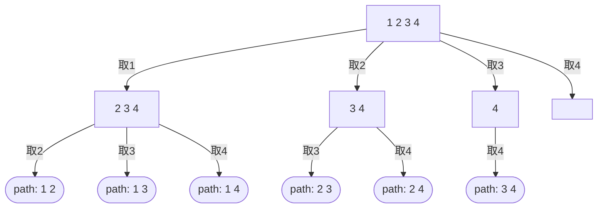

## 前言

`回溯的本质是穷举,并不是高效的算法,但是有些问题只能用穷举法去解决,穷举出所有可能选出我们想要的答案	`


回溯法的基本模块

```java
void backtracking(参数) {
    if (终止条件) {
        存放结果;
        return;
    }

    for (选择：本层集合中元素（树中节点孩子的数量就是集合的大小）) {
        处理节点;
        backtracking(路径，选择列表); // 递归
        回溯，撤销处理结果
    }
}
```



如上图,for循环是横向在遍历集合,递归是纵向遍历每一条路径,当路径中积累的值满足条件之后就可以将这条路径的值放入结果集了


## 组合

给定两个整数 n 和 k，返回范围 [1, n] 中所有可能的 k 个数的组合。

你可以按 任何顺序 返回答案。

 

示例 1：

输入：n = 4, k = 2
输出：
[[2,4],[3,4],[2,3],[1,2],[1,3],[1,4]]


来源：力扣（LeetCode）
链接：https://leetcode.cn/problems/combinations

> 回溯三部曲,for 循环中选择, 选择当前数字范围中的第 i 个,循环处理. 处理当前结点就是将选择的数添加进结果集,然后下一层的选择范围就是从 i+1 到 n 了,下一层也是从第一个开始循环,递归


代码:

```java
List<List<Integer>> result = new ArrayList();
List<Integer> path = new ArrayList();

public List<List<Integer>> combine(int n, int k){
	backtracking(1, n, k);
	return result;
}

// 当前课选择范围是 start - n
public void backtracking(int start, int n, int k){
    // 减枝
    if(n - start + 1 + path.size() < k){
        return;
    }
    // 退出条件
    if(path.size() == k){
        result.add(new ArrayList(path));
    }
    
    for(int val = start;val <= n; val++){
    	path.add(val);
        backtracking(i+1,n,k);
        path.remove(path.size() - 1);
    }
}
```


## 组合总和

找出所有相加之和为 n 的 k 个数的组合，且满足下列条件：

只使用数字1到9
每个数字 最多使用一次 
返回 所有可能的有效组合的列表 。该列表不能包含相同的组合两次，组合可以以任何顺序返回。

 

示例 1:

输入: k = 3, n = 7
输出: [[1,2,4]]
解释:
1 + 2 + 4 = 7
没有其他符合的组合了。

来源：力扣（LeetCode）
链接：https://leetcode.cn/problems/combination-sum-iii


> 和组合相似,只是限制了结果集中元素和要为 n ,范围固定在 1-9


代码:

```java
    public List<List<Integer>> combinationSum3(int k, int n) {
        backtracking(1, n, k);
        return result1;
    }

    List<List<Integer>> result1 = new ArrayList<>();
    List<Integer> path1 = new ArrayList<>();
    int sum = 0;
    int count = 0;

    public void backtracking(int start, int n, int k) {
        //减枝
        if (sum > n || path1.size() > k) {
            return;
        }
        // 和为n且为k个元素
        if (sum == n && path1.size() == k) {
            result1.add(new ArrayList<>(path1));
        }

        for (int i = start; i <= 9; i++) {
            // 一样的遍历过程,只是处理过程多了处理 sum
            path1.add(i);
            sum += i;
            backtracking(i + 1, n, k);
            path1.remove(path1.size() - 1);
            sum -= i;
        }
    }
```


## 电话号码的字母组合


给定一个仅包含数字 2-9 的字符串，返回所有它能表示的字母组合。答案可以按 任意顺序 返回。

给出数字到字母的映射如下（与电话按键相同）。注意 1 不对应任何字母。

来源：力扣（LeetCode）
链接：https://leetcode.cn/problems/letter-combinations-of-a-phone-number


> 和组合问题有点相似,从 集合1(第一个数字代表的字符集) 中选一个数,再从 集合2 中选一个数
>
> 从集合中选择数的过程,可以使用 for 循环遍历,那么一层一层选择集合的过程,可以使用递归
>
> 根据回溯的模块,选择过程就是从一个集合中选一个字符出来,递归的时候就是从下一个集合中选取下一个字符,也可以画出它的树形结构
>
> ```mermaid
> graph TD;
> node[a b c]--选a-->node1[d e f]
> node[a b c]--选b-->node2[d e f]
> node[a b c]--选c-->node3[d e f]
> node1[d e f]--选d-->node4[g h i]
> node1[d e f]--选e-->node5[g h i]
> node1[d e f]--选f-->node6[g h i]
> node2[d e f]--选d-->node7[g h i]
> node2[d e f]--选e-->node8[g h i]
> node2[d e f]--选f-->node9[g h i]
> node3[d e f]--选d-->node10[g h i]
> node3[d e f]--选e-->node11[g h i]
> node3[d e f]--选f-->node12[g h i]
> ```


 代码:

```java
    public List<String> letterCombinations(String digits) {
        if (digits.length() == 0){
            return Collections.emptyList();
        }
        map.put('2', new char[]{'a', 'b', 'c'});
        map.put('3', new char[]{'d', 'e', 'f'});
        map.put('4', new char[]{'g', 'h', 'i'});
        map.put('5', new char[]{'j', 'k', 'l'});
        map.put('6', new char[]{'m', 'n', 'o'});
        map.put('7', new char[]{'p', 'q', 'r', 's'});
        map.put('8', new char[]{'t', 'u', 'v'});
        map.put('9', new char[]{'w', 'x', 'y', 'z'});
        back(digits.toCharArray(), 0);
        return resultList;
    }

    Map<Character, char[]> map = new HashMap<>();
    StringBuilder str = new StringBuilder();
    List<String> resultList = new ArrayList<>();

    public void back(char[] digits, int index) {
        if (index == digits.length) {
            resultList.add(str.toString());
            return;
        }

        char digit = digits[index];
        char[] chars = map.get(digit);
        for (char alphabet : chars) {
            str.append(alphabet);
            back(digits, index + 1);
            str.delete(str.length() - 1, str.length());
        }
    }
```


## 组合总和

给你一个 无重复元素 的整数数组 candidates 和一个目标整数 target ，找出 candidates 中可以使数字和为目标数 target 的 所有 不同组合 ，并以列表形式返回。你可以按 任意顺序 返回这些组合。

candidates 中的 同一个 数字可以 无限制重复被选取 。如果至少一个数字的被选数量不同，则两种组合是不同的。 

对于给定的输入，保证和为 target 的不同组合数少于 150 个。

 

来源：力扣（LeetCode）
链接：https://leetcode.cn/problems/combination-sum

> 和上一个组合总和差不错,和组合也差不多,只是这里的组合是可以重复的,那么当选择了一个数之后,还可以选这个数,那么当在第一层选了第i个数之后,第二层也从i开始选择,这是和上面有所不同的地方,所以本质上只要改动递归调用参数开始的 startIndex 即可


代码:

```java
    public List<List<Integer>> combinationSum(int[] candidates, int target) {
        backSum(candidates,0,target);
        return resultSum;
    }

    List<List<Integer>> resultSum = new ArrayList<>();
    List<Integer> pathSum = new ArrayList<>();
    int theSum = 0;

    public void backSum(int[] candidate, int start, int target) {
        if (theSum > target || candidate.length == 0) {
            return;
        }
        if (theSum == target) {
            resultSum.add(new ArrayList<>(pathSum));
            return;
        }

        for (int i = start; i < candidate.length; i++) {
            pathSum.add(candidate[i]);
            theSum += candidate[i];
            backSum(candidate, i, target);
            pathSum.remove(pathSum.size() - 1);
            theSum -= candidate[i];
        }
    }
```


## 组合总和II

给定一个候选人编号的集合 candidates 和一个目标数 target ，找出 candidates 中所有可以使数字和为 target 的组合。

candidates 中的每个数字在每个组合中只能使用 一次 。

注意：解集不能包含重复的组合。 

来源：力扣（LeetCode）
链接：https://leetcode.cn/problems/combination-sum-ii


> 这个题,首先它的集合里面有重复的元素,这些重复元素可以同时存在,直接像上面一样求的话会有重复,想到给它来排个序,拍个序后发现,还是会有重复,重复的点在哪? 关键在于:同一层里面如果有两个连续相同的数,第一个数和后面的数配对完,第二个数和后面的数配对势必会和第一个数第二层的选择相同(画图会清晰很多); 那我们容易想到,一层选择过后遇到相同的给它跳过! if(i>0 && candidate[i] == candidate[i-1]) continue; 可是运行后发现还是有问题,怎么少了? 问题出在,第一个数加入集合,进入递归,递归里面第一个数和上一层的数相同,像1123,第一层选1,递归到第二层第一个数是1,但是会被跳过去...靠...怎么办呢,其实是if条件有点问题,我们让它不跳第一个就好, 因为只有第一个数会和上一层冲突,到第二个数的时候已经是同一层之间的问题了,如果第二个数和上一层相同那说明它和它前一个数相同,就该被跳过,那么我们可以将条件改为 if(i > start && candidate[i] == candidate[i-1]) continue;


代码:

```java
    public List<List<Integer>> combinationSum2(int[] candidates, int target) {
        Arrays.sort(candidates);
        backtracking2(candidates, 0, target);
        return result2;
    }

    List<List<Integer>> result2 = new ArrayList<>();
    List<Integer> path2 = new ArrayList<>();
    int sum2 = 0;

    public void backtracking2(int[] candidate, int start, int target) {
        if (candidate.length == 0 || sum2 > target) {
            return;
        }
        if (sum2 == target) {
            result2.add(new ArrayList<>(path2));
            return;
        }

        for (int i = start; i < candidate.length; i++) {
            // 减枝
            if (sum2 + candidate[i] > target){
                break;
            }
            if (i > start && candidate[i] == candidate[i - 1]) {
                continue;
            }
            path2.add(candidate[i]);
            sum2 += candidate[i];
            backtracking2(candidate, i + 1, target);
            path2.remove(path2.size() - 1);
            sum2 -= candidate[i];
        }
    }
```


## 切割回文串

给你一个字符串 s，请你将 s 分割成一些子串，`使每个子串都是 回文串` 。返回 s 所有可能的分割方案。

回文串 是正着读和反着读都一样的字符串。

 

示例 1：

```
输入：s = "aab"
输出：[["a","a","b"],["aa","b"]]
```


来源：力扣（LeetCode）
链接：https://leetcode.cn/problems/palindrome-partitioning

> 仔细审题,题目要求将字符串分割成一些子串,每个子串都是回文串,不是说找字符串里有哪些回文串,是先分割成几段,这几段都是回文串,那么这几段就放入一个结果集里面
>
> 怎么分割呢,从一个cut开始,[cut,cut+1],[cut+2,cut+3]...这是一个组的,在树里面就是一个树枝的
>
> 那么像[cut,cut+1],[cut,cut+2],[cut,cut+3] 这就是同一层的,同一层最后并不在一个结果集里面,所以可以重复
>
> 第一层从分割了[cut,cut+1],那么第二层可以分割的只剩[cut+1,len]的部分了
>
> 很明显,同一层的用for循环遍历,不同层用递归


代码:

```java
    public List<List<String>> partition(String s) {
        backtracking3(s, 0);
        return result3;
    }

    List<List<String>> result3 = new ArrayList<>();
    List<String> path3 = new ArrayList<>();
    StringBuilder strPath = new StringBuilder();

    public void backtracking3(String strs, int cut) {

        if (cut == strs.length()) {
            result3.add(new ArrayList<>(path3));
            return;
        }

        for (int i = cut; i < strs.length(); i++) {
            // 从 cut 点开始切割,切到i, 剩余可以切割的就是[i+1,len]
            String substring = strs.substring(cut, i + 1);
            if (isPalindromic(substring)) {
                path3.add(substring);
            } else {
                continue;
            }
            // 子串为 [i+1,len]
            backtracking3(strs, i + 1);
            path3.remove(path3.size() - 1);
        }
    }
    
    //判断回文数
    public boolean isPalindromic(String str) {
        int start = 0;
        int end = str.length() - 1;
        while (start < end) {
            if (str.charAt(start) != str.charAt(end)) {
                return false;
            }
            start++;
            end--;
        }
        return true;
    }
```


## 子集

给你一个整数数组 nums ，数组中的元素 互不相同 。返回该数组所有可能的子集（幂集）。

解集 不能 包含重复的子集。你可以按 任意顺序 返回解集。

 

示例 1：

```
输入：nums = [1,2,3]
输出：[[],[1],[2],[1,2],[3],[1,3],[2,3],[1,2,3]]
```

来源：力扣（LeetCode）
链接：https://leetcode.cn/problems/subsets

> 子集其实类似于组合,组合问题里面我们求的是固定位数的组合,其实是固定取;叶子结点的值,子集就不一样了,子集没有固定几个元素,那么所有的结点都可以是集合的子集,那其实就是把树里面的所有结点都放入结果集里面.
>
> ```mermaid
> graph TD;
> node[a b c]--选a-->node1[结果集: a 剩余: b c]
> node[a b c]--选b-->node2[结果集: b 剩余: c ]
> node[a b c]--选c-->node3[结果集: c 剩余: null]
> node1[结果集: a 剩余: b c ] --选b-->node6[结果集: a b 剩余: c]
> node1[结果集: a 剩余: b c ] --选c-->node8[结果集: a c 剩余: null]
> node6[结果集: a b 剩余: c]--选c-->node10[结果集: a b c 剩余: null]
> node2[结果集: b 剩余: c ] --选c-->node4[结果集: b c 剩余: null]
> 
> ```


代码:

```java
    public List<List<Integer>> subsets(int[] nums) {
        result5.add(Collections.emptyList());
        backtracking5(nums, 0);
        return result5;
    }

    List<List<Integer>> result5 = new ArrayList<>();
    List<Integer> path5 = new ArrayList<>();

    public void backtracking5(int[] nums, int startIndex) {
                if (!path5.isEmpty()) {
            result5.add(new ArrayList<>(path5));
        }
        if (startIndex == nums.length) {
            return;
        }

        for (int i = startIndex; i < nums.length; i++) {
            path5.add(nums[i]);
            backtracking5(nums, i + 1);
            path5.remove(path5.size() - 1);
        }
    }
```


## 子集II

给你一个整数数组 nums ，其中可能包含重复元素，请你返回该数组所有可能的子集（幂集）。

解集 不能 包含重复的子集。返回的解集中，子集可以按 任意顺序 排列。

 

示例 1：

输入：nums = [1,2,2]
输出：[[],[1],[1,2],[1,2,2],[2],[2,2]]

来源：力扣（LeetCode）
链接：https://leetcode.cn/problems/subsets-ii

> 子集II 和子集相似,区别是它有重复的元素,和组合总和比较相似,同一层之间需要去重,不同层之间不需要


代码:

```java
    public List<List<Integer>> subsetsWithDup(int[] nums) {
        Arrays.sort(nums);
        backtracking6(nums,0);
        return result6;
    }


    List<List<Integer>> result6 = new ArrayList<>();
    List<Integer> paths = new ArrayList<>();

    public void backtracking6(int[] nums, int start) {
        result6.add(new ArrayList<>(paths));
        if (start == nums.length) {
            return;
        }
        for (int i = start; i < nums.length; i++) {
            if (i > start && nums[i] == nums[i - 1]) {
                continue;
            } else {
                paths.add(nums[i]);
            }
            backtracking6(nums, i + 1);
            paths.remove(paths.size() - 1);
        }
    }
```


## 递增子序列

给你一个整数数组 nums ，找出并返回所有该数组中不同的递增子序列，递增子序列中 至少有两个元素 。你可以按 任意顺序 返回答案。

数组中可能含有重复元素，如出现两个整数相等，也可以视作递增序列的一种特殊情况。

 

示例 1：

输入：nums = [4,6,7,7]
输出：[[4,6],[4,6,7],[4,6,7,7],[4,7],[4,7,7],[6,7],[6,7,7],[7,7]]

来源：力扣（LeetCode）
链接：https://leetcode.cn/problems/increasing-subsequences

> 和子集问题相似,不过要求子集得是递增的并且长度大于等于2, 那这里面要做的就是判断递增和去重问题了,同样的这里的去重是在同一层上的,但是这里重复的元素不一定相邻,并且不能排序,那我们给每一层设一个map集合来记录某个数有没有操作过就好了


代码:

```java
    public List<List<Integer>> findSubsequences(int[] nums) {
        backtracking7(nums, 0);
        return sortResult;
    }

    List<List<Integer>> sortResult = new ArrayList<>();
    List<Integer> sortPath = new ArrayList<>();

    public void backtracking7(int[] nums, int start) {
        if (sortPath.size() >= 2) {
            sortResult.add(new ArrayList<>(sortPath));
        }
        if (start == nums.length) {
            return;
        }
        Map<Integer, Integer> map = new HashMap<>();
        for (int i = start; i < nums.length; i++) {
            if (map.get(nums[i]) == null && (sortPath.isEmpty() || nums[i] >= sortPath.get(sortPath.size() - 1))) {
                sortPath.add(nums[i]);
                map.put(nums[i], 1);
            } else {
                continue;
            }
            backtracking7(nums, i + 1);
            sortPath.remove(sortPath.size() - 1);
        }
    }
```


## 全排列

给定一个不含重复数字的数组 nums ，返回其 所有可能的全排列 。你可以 按任意顺序 返回答案。

 

示例 1：

```
输入：nums = [1,2,3]
输出：[[1,2,3],[1,3,2],[2,1,3],[2,3,1],[3,1,2],[3,2,1]]
```

来源：力扣（LeetCode）
链接：https://leetcode.cn/problems/permutations


> 全排列的时候就不需要 startIndex 了,画出它的树就知道了,关键点是第一层选择结点后下一层不能在选择了,这里需要做去重工作,用一个 used 数组,记录每一个位置的使用情况即可
>
> 注意,对位置的去重和对数的去重是不一样的,对位置的去重更像是对层与层之间的去重,对数的去重是每一层里的元素的去重,对位置的去重是一个位置选择了之后下一层不能在重复选择,对数的去重是当前层选了某个数后面有重复的话不能在选这个数, 层与层之间的去重需要回溯的,当前层的去重不需要回溯


代码:

```java
      public List<List<Integer>> permute(int[] nums) {
        used = new int[nums.length];
        backtracking9(nums);
        return result9;
    }

    List<List<Integer>> result9 = new ArrayList<>();
    List<Integer> path9 = new ArrayList<>();

    int[] used;

    public void backtracking9(int[] nums) {
        if (path9.size() == nums.length) {
            result9.add(new ArrayList<>(path9));
            return;
        }

        for (int i = 0; i < nums.length; i++) {
            if (used[i] == 0) {
                path9.add(nums[i]);
                used[i] = 1;
            } else {
                continue;
            }
            backtracking9(nums);
            path9.remove(path9.size() - 1);
            used[i] = 0;
        }
    }
```


## 全排列II

给定一个可包含重复数字的序列 nums ，按任意顺序 返回所有不重复的全排列。

 

示例 1：

```
输入：nums = [1,1,2]
输出：
[[1,1,2],
 [1,2,1],
 [2,1,1]]
```

来源：力扣（LeetCode）
链接：https://leetcode.cn/problems/permutations-ii

> 在全排列的基础上多了重复元素,所以要做同一层间的去重


代码:

```java
  public List<List<Integer>> permuteUnique(int[] nums) {
        uused = new int[nums.length];
        backtracking10(nums);
        return result10;
    }

    List<List<Integer>> result10 = new ArrayList<>();
    List<Integer> path10 = new ArrayList<>();

    int[] uused;

    public void backtracking10(int[] nums) {
        if (path10.size() == nums.length) {
            result10.add(new ArrayList<>(path10));
            return;
        }

        Map<Integer, Integer> map = new HashMap<>();
        for (int i = 0; i < nums.length; i++) {
            if (uused[i] == 0 && map.get(nums[i]) == null) {
                path10.add(nums[i]);
                uused[i] = 1;
                map.put(nums[i], 1);
            } else {
                continue;
            }
            backtracking10(nums);
            path10.remove(path10.size() - 1);
            uused[i] = 0;
        }
    }
```


`改进: 只用一个 used 数组判断同一层和一条路径上的重复`


```java
    public List<List<Integer>> permuteUnique(int[] nums) {
        Arrays.sort(nums);
        uused = new boolean[nums.length];
        backtracking10(nums);
        return result10;
    }

    List<List<Integer>> result10 = new ArrayList<>();
    List<Integer> path10 = new ArrayList<>();

    boolean[] uused;

    public void backtracking10(int[] nums) {
        if (path10.size() == nums.length) {
            result10.add(new ArrayList<>(path10));
            return;
        }

        for (int i = 0; i < nums.length; i++) {
            if (i > 0 && nums[i] == nums[i - 1] && !uused[i - 1]) {
                continue;
            }
            if (!uused[i]) {
                path10.add(nums[i]);
                uused[i] = true;
            } else {
                continue;
            }
            backtracking10(nums);
            path10.remove(path10.size() - 1);
            uused[i] = false;
            
        }
    }
```


## 重新安排行程

给你一份航线列表 tickets ，其中 tickets[i] = [fromi, toi] 表示飞机出发和降落的机场地点。请你对该行程进行重新规划排序。

所有这些机票都属于一个从 JFK（肯尼迪国际机场）出发的先生，所以该行程必须从 JFK 开始。如果存在多种有效的行程，请你按字典排序返回最小的行程组合。

例如，行程 ["JFK", "LGA"] 与 ["JFK", "LGB"] 相比就更小，排序更靠前。
假定所有机票至少存在一种合理的行程。且所有的机票 必须都用一次 且 只能用一次。

来源：力扣（LeetCode）
链接：https://leetcode.cn/problems/reconstruct-itinerary


> 搞得人脑阔疼的一道题
>
> 步骤	
>
> 1. 首先,用一个 map 存放每一个机场和它的所有目的地该机场要去往该目的地的次数 Map<String,Map<String,Integer>>
>
>     		2. 然后就是用用 key 找出一个机场的所有目的地,给目的地排个序
>   		3. 目的地作为 key 重复上面的步骤
>   		4. 终止条件是 所有的机场都走了一遍,即结果集长度等于机场数


```java
public List<String> findItinerary(List<List<String>> tickets) {
        for (List<String> ticket : tickets) {
            String begin = ticket.get(0);
            String end = ticket.get(1);

            Map<String, Integer> to = tickMap.getOrDefault(begin, new HashMap<>());

            to.put(end, to.getOrDefault(end, 0) + 1);

            tickMap.put(begin, to);
        }

        resultTick.add("JFK");
        backtracking10("JFK", tickets.size());

        return resultTick;
    }

    Map<String, Map<String, Integer>> tickMap = new HashMap<>();
    List<String> resultTick = new ArrayList<>();

    public boolean backtracking10(String key, int count) {
        if (resultTick.size() == count + 1) {
            return true;
        }

        Map<String, Integer> map = tickMap.get(key);
        if (map == null) {
            return false;
        }

        Set<String> ticks = map.keySet();
        List<String> collect = ticks.stream().sorted().collect(Collectors.toList());
        for (String tick : collect) {
            int time;
            if ((time = tickMap.get(key).get(tick)) > 0) {
                resultTick.add(tick);
                tickMap.get(key).put(tick, time - 1);
            } else {
                continue;
            }
            boolean b = backtracking10(tick, count);
            if (b) {
                return true;
            }
            resultTick.remove(resultTick.size() - 1);
            tickMap.get(key).put(tick, time);
        }

        return false;
    }

```


## N 皇后问题

按照国际象棋的规则，皇后可以攻击与之处在同一行或同一列或同一斜线上的棋子。

n 皇后问题 研究的是如何将 n 个皇后放置在 n×n 的棋盘上，并且使皇后彼此之间不能相互攻击。

给你一个整数 n ，返回所有不同的 n 皇后问题 的解决方案。

每一种解法包含一个不同的 n 皇后问题 的棋子放置方案，该方案中 'Q' 和 '.' 分别代表了皇后和空位。

来源：力扣（LeetCode）
链接：https://leetcode.cn/problems/n-queens

> 也是一个回溯的问题, 选择第一行,进入第二行,判断是否能放,不能的话下一个
>
> 最主要的是判断这里的逻辑,可以直接定义二维数组,每一次递归指定行去进行判断


```java
    public List<List<String>> solveNQueens(int n) {
        backN(n, 0);
        return resultN;
    }


    List<List<String>> resultN = new ArrayList<>();
    List<Integer> pathN = new ArrayList<>();

    public void backN(int n, int row) {
        if (n == row) {
            List<String> list = new ArrayList<>();

            for (Integer integer : pathN) {
                StringBuilder build = new StringBuilder();
                for (int i = 0; i < integer; i++) {
                    build.append(".");
                }
                build.append("Q");
                for (int i = integer + 1; i < n; i++) {
                    build.append(".");
                }
                list.add(build.toString());
            }
            resultN.add(new ArrayList<>(list));
            return;
        }

        for (int i = 0; i < n; i++) {
            if (isLegal(i, row, n)) {
                pathN.add(i);
                backN(n, row + 1);
                pathN.remove(pathN.size() - 1);
            }
        }
    }

    // row 行 col 列
    public boolean isLegal(int col, int row, int n) {
        // pathN.get(row) == colI ---> 判断列
        for (Integer colN : pathN) {
            if (col == colN) {
                return false;
            }
        }

        // pathN.get(row) == col ---> 判断对角线 45 度
        for (int coli = col - 1, rowi = row - 1; coli >= 0 && rowi >= 0; rowi--, coli--) {
            // pathN.get(row); ===> 第 row 行的皇后在那一列
            if (pathN.get(rowi) == coli) {
                return false;
            }
        }

        // path.get(row) == col ---> 判断对角线 135 度
        for (int coli = col + 1, rowi = row - 1; coli < n && rowi >= 0; rowi--, coli++) {
            if (pathN.get(rowi) == coli) {
                return false;
            }
        }
        return true;
    }
```


用二维数组:

```java
 List<List<String>> res = new ArrayList<>();

    public List<List<String>> solveNQueens(int n) {
        char[][] chessboard = new char[n][n];
        for (char[] c : chessboard) {
            Arrays.fill(c, '.');
        }
        backTrack(n, 0, chessboard);
        return res;
    }


    public void backTrack(int n, int row, char[][] chessboard) {
        if (row == n) {
            res.add(Array2List(chessboard));
            return;
        }

        for (int col = 0;col < n; ++col) {
            if (isValid (row, col, n, chessboard)) {
                chessboard[row][col] = 'Q';
                backTrack(n, row+1, chessboard);
                chessboard[row][col] = '.';
            }
        }

    }


    public List Array2List(char[][] chessboard) {
        List<String> list = new ArrayList<>();

        for (char[] c : chessboard) {
            list.add(String.copyValueOf(c));
        }
        return list;
    }


    public boolean isValid(int row, int col, int n, char[][] chessboard) {
        // 检查列
        for (int i=0; i<row; ++i) { // 相当于剪枝
            if (chessboard[i][col] == 'Q') {
                return false;
            }
        }

        // 检查45度对角线
        for (int i=row-1, j=col-1; i>=0 && j>=0; i--, j--) {
            if (chessboard[i][j] == 'Q') {
                return false;
            }
        }

        // 检查135度对角线
        for (int i=row-1, j=col+1; i>=0 && j<=n-1; i--, j++) {
            if (chessboard[i][j] == 'Q') {
                return false;
            }
        }
        return true;
    }
```


## 解数独

编写一个程序，通过填充空格来解决数独问题。

数独的解法需 遵循如下规则：

数字 1-9 在每一行只能出现一次。
数字 1-9 在每一列只能出现一次。
数字 1-9 在每一个以粗实线分隔的 3x3 宫内只能出现一次。（请参考示例图）
数独部分空格内已填入了数字，空白格用 '.' 表示。

来源：力扣（LeetCode）
链接：https://leetcode.cn/problems/sudoku-solver

> 双重 for 循环加递归...看代码去吧


```java
    public void solveSudoku(char[][] board) {
        sudoBack(board);
    }

    private boolean sudoBack(char[][] board) {
        //「一个for循环遍历棋盘的行，一个for循环遍历棋盘的列，
        // 一行一列确定下来之后，递归遍历这个位置放9个数字的可能性！」
        for (int i = 0; i < 9; i++) { // 遍历行
            for (int j = 0; j < 9; j++) { // 遍历列
                if (board[i][j] != '.') { // 跳过原始数字
                    continue;
                }
                for (char k = '1'; k <= '9'; k++) { // (i, j) 这个位置放k是否合适
                    if (isValid(k, board, i, j)) {
                        board[i][j] = k;
                        if (sudoBack(board)) { // 如果找到合适一组立刻返回
                            return true;
                        }
                        board[i][j] = '.';
                    }
                }
                // 9个数都试完了，都不行，那么就返回false
                return false;
                // 因为如果一行一列确定下来了，这里尝试了9个数都不行，说明这个棋盘找不到解决数独问题的解！
                // 那么会直接返回， 「这也就是为什么没有终止条件也不会永远填不满棋盘而无限递归下去！」
            }
        }
        // 遍历完没有返回false，说明找到了合适棋盘位置了
        return true;
    }
    /**
     * 判断棋盘是否合法有如下三个维度:
     * 同行是否重复
     * 同列是否重复
     * 9宫格里是否重复
     */
    private boolean isValid(char val, char[][] board, int row, int col) {
        // 同行是否重复
        for (int i = 0; i < 9; i++) {
            if (board[row][i] == val) {
                return false;
            }
        }
        // 同列是否重复
        for (int j = 0; j < 9; j++) {
            if (board[j][col] == val) {
                return false;
            }
        }
        // 9宫格里是否重复
        int startRow = (row / 3) * 3;
        int startCol = (col / 3) * 3;
        for (int i = startRow; i < startRow + 3; i++) {
            for (int j = startCol; j < startCol + 3; j++) {
                if (board[i][j] == val) {
                    return false;
                }
            }
        }
        return true;
    }
```


## 括号生成

[22]

**示例 1：**

```
输入：n = 3
输出：["((()))","(()())","(())()","()(())","()()()"]
```


> 用递归调用, 每次先生成做扩号, 再生成右括号
>
> ```java
> generate(String str, int left, int right){
>     // 递归生成左括号
>    if(left > 0) generate(str + "(", left - 1, right);
>     // 递归生成右括号
>    if(right > 0) generate(str + ")", left, right - 1);
> }
> ```
>
> 那退出条件是什么?
>
> 左右括号都用完,即 left == 0 && right == 0;
>
> ```java
> generate(String str, int left, int right){
>    if(left == 0 && right == 0) {
>        result.add(str);
>        return;
>    }
>     // 递归生成左括号
>    if(left > 0) generate(str + "(", left - 1, right);
>     // 递归生成右括号
>    if(right > 0) generate(str + ")", left, right - 1);
> }
> ```
>
> 但是这样生成的括号是所有左右括号随机组合, 生成的括号并不规范, 我们需要来剪枝. 
>
> 在已经生成的括号中, 左括号数量一定大于右括号数量, 否则一定不能生成规范的括号组合. 那么,剩余的括号中, 右括号的数量一定要大于左括号数量, 才有可能组成规范括号, 所以在每次生成之前判断现在还有没有可能生成规范的括号,如果不可能生成规范括号了就直接return;
>
> ```java
> if(right < left) return;
> ```
>
> 

最终代码:

```java
        List<String> result = new LinkedList<>();

        private void generate(String str, int left, int right) {
            if (left == 0 && right == 0) {
                result.add(str);
                return;
            }

            // 还未生成完整的括号的情况下, 已生成的括号中, 左括号数量一定是大于右括号数量的
            // 那么剩余的右括号数量一定是大于左括号数量的, 否则不可能生成完整括号
            if (right < left) return;

            if (left > 0) generate(str + "(", left - 1, right);

            if (right > 0) generate(str + ")", left, right - 1);
        }
```

由于存在大量拼接, 可以用 StringBuilder 代替,但是需要手动回溯

```java
        List<String> result = new LinkedList<>();

        private void generate(StringBuilder str, int left, int right) {
            if (left == 0 && right == 0) {
                result.add(str.toString());
                return;
            }

            if (right < left) return;

            if (left > 0) {
                generate(str.append('('), left - 1, right);
                str.deleteCharAt(str.length() - 1);
            }

            if (right > left){
                generate(str.append(')'), left, right - 1);
                str.deleteCharAt(str.length() - 1);
            }
        }
```

